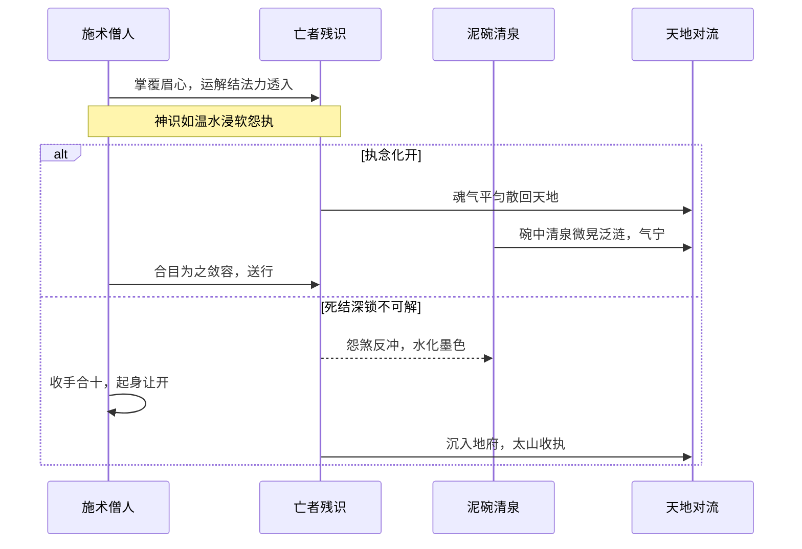
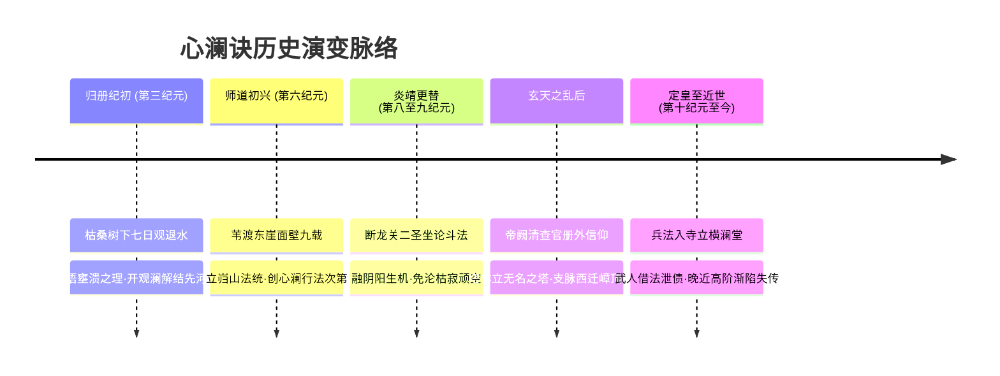

# 照空解结·[[心澜诀]]

#九州 #法术 #佛门 #心法 #岿山

[[岿山寺]] [[觉圣-枯桑]] [[业]] [[帝网]] [[玄黄内经]]

## 概述

[[心澜诀]]是九州佛门法脉的立宗心法与施术总纲，由[[岿山寺]]历代高僧依初祖[[觉圣-枯桑]]北麓观水之悟归纳演进而来。它修的不是吞吐造化的霸道威势，也不是焚山煮海的杀伐玄奇，而是修者自身的“识海空照”与天地形意对流的“消滞还流”。寻常术法讲求以法力聚形、夺天地灵机以壮自身，[[心澜诀]]却逆其道而行，将神识放沉、放虚，令修者如同一方沉静无澜的渊潭，在照见自身形意妄滞的同时，将外来狂暴的冲撞顺势浸软、化解、引归平流。

这门法术初修极冷，如残冬浸在深井里的青石，不起微尘，不动声色；行持既久，身心周匝又会泛出一股如春汛退尽后的温润泥腥与宁定生机。世间万般法术多以“立”为胜，唯有[[心澜诀]]以“散”为宗。它让修者在汹涌杀局与浊世纷争中照破执相、解散郁结；可这套心法若被执着向死者偏用，修者也极易在层层消解中枯寂生机，将自身化作一截永不发芽的焦木。

## 核心设定

[[心澜诀]]之所以能够立宗数万年，全在四条根本法则：

- **照空见澜**：形与意本是天地对流的一进一退。修者常陷于形受、气滞、识攀、执名、造作五重妄滞，误将一时聚敛之相认作永恒法身。以清净神识内照五重妄滞，照见其内无自性、本自虚空，便能于神识深处洞察[[业]]痕起伏之细澜。
- **两不增减**：天地形意总对流本是一口呼吸，生是聚，死是散，天地何尝平添一分、折损一分。世间毁誉、尊卑、位序，皆是[[帝网]]勾连交错之暂设幻影。心澜无偏，不迎不拒，不争不夺，外来狂暴法威落入空相，如击虚空之水，无着力处。
- **解结还流**：空不是死灰枯寂之断灭，空是为了消滞、解结、还流。执念拧结则意脉受阻，取而不还则江河壅塞。施术者以大空为低口，接纳壅塞、浸软死结，使凝滞之冤煞戾气重新散为活泼泼的天地对流，生在死中，死在生中。
- **无挂无滞**：意脉断绝贪求妄取，自身便不再锚定为必须永存的实体。修者心无挂碍，正对[[业]]痕回流与天时应力亦坦然自若，不为幻象所骇，不为死生所拘，远离颠倒狂乱之境。

天下术式多以争胜为功，[[心澜诀]]却以归还为本。只要世间仍有取而不还的壅塞，这套法术便始终有其施展之基。

## 法统与术源

[[心澜诀]]的根芽，发自第三纪元归册纪大洪之后的枯桑之下。

[[3.册皇]]以治水总图册定天下地貌，彼时万年堤口溃决余震未消，[[河梁州]]平畴泽国一片。初祖[[觉圣-枯桑]]痛失家室桑田，抱朽木漂至岿山北麓，于一株枯死多年的老桑下默坐七日。他所见的不是惊涛骇浪之威，而是大水退去时滩涂一寸寸裸露的实相：凡截流争水之处，退水皆呜咽发闷；凡顺其自然冲开低口之处，水声平匀从容。初祖当下彻悟：**取而不还则壅，壅极则溃**。[[业]]之反冲不是天帝记账，而是天地呼吸必受回流之必然。初祖未立文字，仅以坐禅行脚散送亡魂、按水解执，种下了心澜法门最初的种子。

两万年后，二祖苇渡头陀自西方绝域东来，感念初祖观水遗泽，在岿山青黑东崖前面壁九载，形留石壁，方始将初祖散漫的观澜体悟整理为口传心授的法度印诀。至此，[[心澜诀]]由单纯的看水解结，蜕变为一套层层递进的佛门正宗法术。

此法在历史长河中数经磨砺。[[8.炎皇]]末年天下大乱，烽火延烧十三州，死尸覆野，煞气冲天。初祖驻锡断龙关，以无边大空化解漫天冤煞，适逢[[道圣-石朴]]携水尺旧磨而至。二圣席地论辩斗法，详见[[历史报告-道觉论道考]]。那一役中，[[觉圣-枯桑|枯桑]]以大寂灭空澜定住天地形意，[[道圣-石朴|石朴]]则于顽空深处运转玄黄阴阳、借死生化甘霖。初祖经此一战，方知纯粹断灭并非至道，唯有“生在死中、死在生中、一衣之表里”，空方能现出大千生机。寺中代代相承时遂将这份阴阳互化之机融会入诀，使[[心澜诀]]免去了沦为顽空死水之弊。

待[[9.靖皇]]受道觉二圣启迪定鼎天下，崇尚轻徭薄赋、顺天应人，[[心澜诀]]名扬九州。即便后来经历玄天动乱（[[历史报告-玄天动乱考]]）后的官册查验、谱牒焚佚、乃至法脉西迁雪域，这一卷不立在纸上的心澜真传，仍在青灯黄卷之外默默流布。

## 施术与修习总纲

[[心澜诀]]之施展不假符箓，不凭外物，全在心念呼吸与神识开阖之间。整套行法共有四步次第：


### 一、闭目照心

修者盘坐调息，舌抵上腭，双眼垂帘，外息由粗转细，直至耳畔不闻外音。此时将神识倒悬，反照体内五重形意妄滞：一照形受之假，体察皮囊不过借地水火风暂聚；二照气滞之偏，体察灵力流转有无强求霸占之痕；三照识攀之乱，切断向外攀附声色虚妄之念；四照执名之锁，散去功名位序等外设假相；五照造作之累，止息妄动贪取之机。五滞既空，识海自如明镜当台，寒波不起。

### 二、观澜辨滞

心湖彻底澄清之后，方可睁开“神识之眼”透视身心与外部天地。寻常修士对敌，先看对方攻势何等凌厉；心澜修士施术，唯察形意对流有何处“打结”。在澄澈空照之下，敌方的霸烈刀芒、法宝重压，或是亡者残留的冤魂厉煞，皆化作水面上凸起或凹陷的歪扭波澜。施术者须在电光石火间寻出其意脉中那一处“只取不还”的死核——即壅塞之源。

### 三、神识浸软

辨明死结所在，施术者不迎头对撞，亦不施法轰击，而是将自身心神化作至虚、至柔、至沉的一汪凉水，轻缓包裹覆盖上去。以自身修持的纯净空相，浸润对方紧绷狂暴的意脉。敌劲如烈火，遇此空水则无柴可燃；敌怨如顽铁，浸此深寒则渐渐酥软。修者如手探冰水，以耐性与定力将那股拧成死扣的执念一缕缕抽丝剥茧，化其锋芒。

### 四、抽手还流

待死结解开、敌势冲撞已被化为虚澜，施术者不可贪揽这股沛然之力，须于刹那间撤回自身神识，放开低口，称作“抽手”。让那股原本被截留、积聚的暴烈气机，顺着山川地脉与天地大势自然散逸回还，重归清宁。取天地一瓢，还天地一瓢，自身在对流之中不染微尘。

## 入门条件与修持代价

### 适修之人

- **性情沉毅耐寒者**：能耐得住经年累月的孤寂枯坐，心念如古井深潭，不易被外物引动喜怒。
- **神识敏锐且知止者**：天生对形意微澜感知纤细，知进知退，明白何时当松手还流，不贪图法力充盈的虚幻快意。
- **历经丧乱大悲者**：亲见家国倾覆、亲友云散，早早看透世相无常，心中无过多骄慢贪执，极易契入“空相”真义。

### 难成之人

- **性燥求速者**：习惯以暴制暴、执迷于杀伐威风之人，修此法必觉手脚受缚、空洞无味，甚至会因强行压服心火而自焚识海。
- **贪图功名位序者**：将宗门排位、官册封号、法宝占有视为根本之人，心结密布，五滞缠身，绝无可能照见空明。
- **意脉偏狭好斗者**：动辄以胜负论道、誓不低头之人，遇逆境不知顺化低伏，修持心澜不仅无法回澜，反会在初次受冲时震碎经络。

### 修持代价

修习[[心澜诀]]绝非毫无代价的坦途，其耗损多在潜移默化之中侵蚀修者身心：

- **盲目之累**：神识长期注视形意对流与[[业]]痕变形，肉眼必受不可逆之反噬。高深修者眼中常如覆薄霜，看人如隔沉水，晚年目力往往退化甚至全盲。
- **承滞之痛**：施展回澜之法替外物开低口，庞杂的浊流戾煞须先自施术者身心经过。即便即刻送散，亦有微细滞气沉淀于脏腑骨节之间。修者晨起常觉右肩沉重如披浸水桑蓑，呼吸间偶带泥腥苦涩。
- **顽空之险**：过度勘破一切相，修者情感极易日渐凉薄，视亲友生离死别如秋叶飘零，渐失生机活气。若不能悟透道觉二圣“生在死中”之妙，便会自行锁死生机，化为枯桑焦木般的废人。

## 心澜九境

[[心澜诀]]本无繁琐阶梯，全凭心证。为了与当世通行之[[修士境界]]相参互照，寺中先德将修持次第划分为九重境界：

| 境界名称 | 对应修士境界 | 突破核心变化 | 典型法术能力 | 关键修持限制 | 异化人格体感 |
| :--- | :--- | :--- | :--- | :--- | :--- |
| **照心** | 炼气期 | 识海初开，能于闭目默坐中内照自身五滞，杂念稍歇。 | **澄念术**：止息周身气机躁裂，抚平初阶走火入魔。 | 仅能自照，无法外照；强视外力会立破定境。 | 寡言少语，面容渐趋沉冷，厌闻喧闹人声。 |
| **澄波** | 筑基期 | 丹田真元化作极平深潭，呼吸深长，触碰微澜不惊。 | **安澜指**：点触对手翻腾气机，使其真元骤然迟滞。 | 遇到纯粹刚猛之肉身横练巨力难以顺化。 | 举止极缓，如在深水中行走，对冷热感知迟钝。 |
| **解结** | 金丹期 | 丹转虚丹，神识如温水延展，能辨他人意脉之死结。 | **送亡解结**：抚平凡人与低阶修士执念，引魂魄归天地。 | 每次解结须以自身意脉短暂分担对方余怨。 | 眼神浮起一层水光，神情温和却极难真正动情。 |
| **空相** | 元婴期 | 结成空明法相，照见诸法空相，身心不生不灭之意初显。 | **空水无痕**：受高阶法术轰击时，躯体虚化如水泄劲。 | 无法抵御专伤神魂之阴毒诅咒与煞刃直刺。 | 呼吸几近于无，体温渐低，望之如石窟古像。 |
| **见网** | 洞虚期 | 神识突破肉眼藩篱，能真切俯瞰方圆百里[[帝网]]勾连之虚影。 | **观澜望气**：预判周遭数日内形意对流暴动与灾异。 | 目力骤降，白日视物模糊，神识极度畏光。 | 视世人如丝网悬偶，常生浮生若梦之疏离感。 |
| **回澜空域** | 化神期 | 周身三丈化作绝对低口，外力攻入如泥牛入海。 | **回澜印**：强行接引方圆百丈狂暴术法，导引入地。 | 脏腑承受庞大浊气冲刷，容易咳出血丝泥痰。 | 肤色泛青，衣袍常带湿润泥气，右肩常年倾斜。 |
| **珠影无碍** | 合体期 | 自身与[[帝网]]交汇无碍，一念动而借万珠相映之势。 | **大化千澜**：分化神识解散大阵灵脉，崩解城池禁制。 | 耗损寿算生机，不可频施，否则法身有崩解之虞。 | 说话声调平直无起伏，旁人与其对视如临绝渊。 |
| **度苦厄** | 渡劫期 | 照破生死大限，直面天劫雷霆时身如虚空不挂一丝业火。 | **大解脱手**：徒手拆解雷劫应力，还流于四野山川。 | 若心存一丝一毫贪生畏死之念，大空立破化飞灰。 | 忘却尘世名姓过往，骨节微鸣如枯木在风中摇曳。 |
| **寂照还流** | 大乘期 | 达至[[觉圣-枯桑|初祖]]与[[道圣-石朴|石朴]]默会之绝境，大空之中活泼泼生机周流不息。 | **大寂照还流界**：天地为一衣表里，生灭随心，万煞化甘霖。 | 自身已成天地低口，不得轻易动杀念，动则网结崩塌。 | 望之与乡野桑农老叟无异，神光内敛，踏雪无痕。 |

## 术法与仪轨

[[心澜诀]]之日常功用，不仅在于修士防身退敌，更在于维系山门道统与安抚四方生灵。其核心术法与修持仪轨主要有四：

### 日常坐禅课

每日寅卯之交，天地晨光微熹、水汽自平野蒸腾而上之时，[[岿山寺|岿山僧众]]齐聚东崖面壁石壁之下。

```
整肃僧衣，不燃明香，不击钟磬。
众僧取素草席席地而坐，闭目垂帘，依式行调息照心法。
先澄自身形、气、识、名、作五滞；
再令神识延展至山门石阶、外围桑田与山下河渠。
感察晨风穿透草木之细响，体察地脉水汽升降之节律。
凡坐满两个时辰，方可起身进粗粝早膳。
此课数万年无一日废弛，为入门筑基之铁律。
```

### 解结送散仪

专用于送归含冤暴亡、执念凝聚不散之修士或生灵，是[[岿山寺]]塔林首座世代相传之秘术。

施术者不备牲牢，不设道场经幡，仅于亡者身侧置一泥碗清泉，旁插一枝枯桑新条。施术者盘膝坐于亡者头侧，以右手掌心轻覆其眉心泥丸，运化金丹以上之解结法力。神识如温水缓透其残余识海，细细寻觅其临死前攥紧不放之那一缕怨怼、仇恨或不甘。施术者口中默诵解澜真言，将其拧结之意脉一点点浸软顺平，直至亡者紧握之拳掌自然松开、眉宇郁结之黑煞化为轻烟散逸。若水碗微晃而干涸，说明执意已随对流消散回还；若水色化墨、枯桑枝折断，施术者则合十起身让开，任其沉入幽冥归太山之底（[[地府]]），绝不再强留。



### 止狂还流印

两军对垒或遭遇外敌狂暴围攻时武僧所结之防御重印。

施术者双足下沉，如老树盘根，左手捏心澜印当胸，右手虚按向下如按退水。丹田真元在一息之内放空成渊，形成“空相低口”。敌方打来之凌厉飞剑、雷火符箓、裂空罡风，一入低口三尺之内，其前冲之势顿被空水化解。狂暴法力如击入厚泥棉絮，锋芒被寸寸剥除，内蕴之真气被印势牵引旋转半圈，顺着施术者足底直接卸入大地深层。施术者受印时面不改色，唯足下青石往往在无声中化作细碎齑粉。

### 横澜化煞阵

多用于平息大水大灾后积聚之瘟煞厉气，需九位金丹境界以上僧人合力施展。

众僧依九宫方位各持一根削制光滑之枯桑木棍，棍尾入地三寸，双手按伏棍首。阵枢居中者高举法印，引动九人之心神连结成一体，构筑起一座笼罩方圆数里的“横澜法界”。阵法运转时不发霞光，唯见空气中浮现如水波倒退之虚影。四野翻滚之浓重血煞、疫疠阴气被法界层层过滤，暴戾被大空吸纳，生机被玄黄引导，化作清冷白雾散入泥土，使焦土重获生发之力。

## 心法思想

[[心澜诀]]不仅是一套行气运术之法，更深深塑造了修持者的立身风骨与世相观照。

在九州万千修士穷极一生争抢灵药福地、排定宗门位阶之浊流中，修持心澜之人显出一种极奇异的沉静。他们不争胜，非因怯懦，而是明晰胜负名位皆是[[帝网]]勾连拉扯之暂设假相。彼处争得愈烈，意脉便绷得愈紧，积压之[[业]]便愈沉，溃决反噬之日便愈惨烈。是以心澜修者立身处世，如水往低处流，处众人之所恶，居卑下之所归。

面对生死大限，常人视死为万劫不复之深渊，心澜修者则视生为聚、视死为散。聚散乃形意呼吸之常理，生不为盈，死不为亏。大空之中，本无一物可失，亦无一物可得。这种通透使他们行走世间时心无挂碍，既无对寂灭之恐惧，亦无对苟活之执妄。即便面对刀锯临颈、宗庙倾覆之巨劫，亦能坦然端坐，如观退潮。

更难能可贵者，在于断龙关二圣斗法后确立之“不入顽空”之念。真正的[[心澜诀]]绝非斩断七情六欲的枯槁绝情，而是于极虚极静之中，包容山河大地的活泼生机。解结是为了让凝滞之生机重新流转，回澜是为了让干涸之沟渠重得滋润。修者虽面容沉冷如枯木，其心底却有对天地苍生深切的怜惜——那是知其苦、知其结、甘愿以己身为低口替万物受冲的慈悲。

## 历史演变

[[心澜诀]]之流变，与九州地缘政局及道统兴衰休戚相关：



### 初创与奠基

第三纪元大洪之后，[[河梁州]]水脉混乱，[[觉圣-枯桑]]行脚四方，以神识感应水患形意，创立以“消壅、解执、还流”为内核的原始心法。此时无文字经书，全凭坐传心印，世人只知[[岿山寺|岿山]]北麓有“看水的”行化人间。至第六纪元，二祖苇渡东来结庐，将初祖微言大义铸成实修科范，[[心澜诀]]正式成为佛门奠基功法。

### 鼎盛与融会

[[8.炎皇]]末至[[9.靖皇]]初，天下受大兼并与战乱之荼毒，怨煞蔽日。断龙关论道斗法使佛门空相与道门玄黄阴阳深层互证，汲取了[[玄黄内经]]与道门自然对流之长，[[心澜诀]]至此圆融无碍。[[9.靖皇|靖皇]]行宽厚之政，[[岿山寺|岿山法脉]]大兴，四方弟子云集，平野桑乡随处可见坐禅解结之僧，被称为“暗抚九州地脉八百年”。

### 厄难与西迁

[[历史报告-玄天动乱考|玄天动乱]]席卷天下，帝统分崩。乱平之后，[[帝阙]]大索天下，严查官册外法脉。[[岿山寺|岿山]]因恪守初祖“不入官册、不持账簿”之祖训，横遭官兵查验，山门紧闭，部分谱牒遭焚。宗内分化出一支不甘受查之僧团，携古卷法器西走高原绝域，日后演变出崇尚金瓶法统之[[嶂顶法域]]。留在岿山祖庭之僧团，则在塔林正中立下一座无字之塔，将那段惨烈因果永远封存。

### 近世沉浮

至[[10.定皇]]削平天下、抑武崇文，天下失所之武人多投[[岿山寺|岿山]]。寺中立横澜堂，以心澜意境融入棍法，行“以武泄滞”之法，[[岿山寺]]武名遂冠绝九州。然而，随着武堂日盛、经席日衰，习练形体搏杀者众，深研心澜空相者寡。近代以来，能真正开天眼“见过澜”、照见形意对流者寥寥无几，多转为照本宣科之凡俗修持，绝世真传几近沉沦。

## 反噬与破绽

[[心澜诀]]虽玄妙深邃，但在实战与长久修持中存在三处致命破绽：

### 执空致枯

此法深重之内心魔障，在于“沉溺顽空”。修者若勘破过甚，将一切生机变化皆视作虚妄，神识便会自行锁死于寂灭之境，断绝与天地灵气的对流滋养。其表征为身躯自四肢末端起逐渐硬化、脱水、散发焦枯木气，最终真元干涸坐化为一尊毫无生机的干尸。历代苦修者中，十之三四皆断送于此障。

### 承滞过载

回澜施术讲究“以身作低口”。若对手修为远超己身，或所引渡之冤煞煞气过于庞大暴烈，低口便会被瞬间冲垮。来不及排解还流的狂暴气机将直接在修者体内逆流反噬，炸断奇经八脉，淤血凝结于肺腑。受此反噬者，轻则终身咳血带腥、灵海受损，重则当场道基爆裂身亡。

### 纯粹力拙

[[心澜诀]]之精义全在化解、借引对方之“形意”与“法力意脉”。然而，若遭遇纯粹依靠万钧蛮力横冲直撞之强敌（如上古巨兽之践踏、纯阳体修无任何法力依凭之纯肉身重击），或是不受神识牵引之崩塌山石、实心巨弩，因其攻势之中本无多余之“气滞与执念”可供辨识浸软，心澜之法便如水迎飞石，借无可借，化无可化，极易被纯粹的沉坠巨力直接碾碎法躯。

## 结语

[[心澜诀]]是九州修行大世里一汪清凉幽深的暗流。

当诸方修士借着[[帝网]]的权柄争相筑起巍峨山门、订立严苛契约、将万民灵机一寸寸抽干化为通天修为之时，唯有[[岿山寺|岿山]]这一脉心澜，始终坐在山门平野之畔，看水涨，看水退。它不立威名于金石，不争强胜于当世，只是默默地在每一处被暴政与杀伐壅死的河道上，凿开一道极细的低口；在每一个被执念与怨恨撕碎的灵魂旁，递过去一汪浸软死结的清泉。

它或许挡不住皇朝的兵车，也降伏不了灭世的天灾；但只要天下还有人在苦痛中攥紧拳头，只要这山河之间还有取而不还的沉重叹息，那一盏灯便灭不了，那一汪心澜便始终在天地深处平平缓缓地流淌下去。
