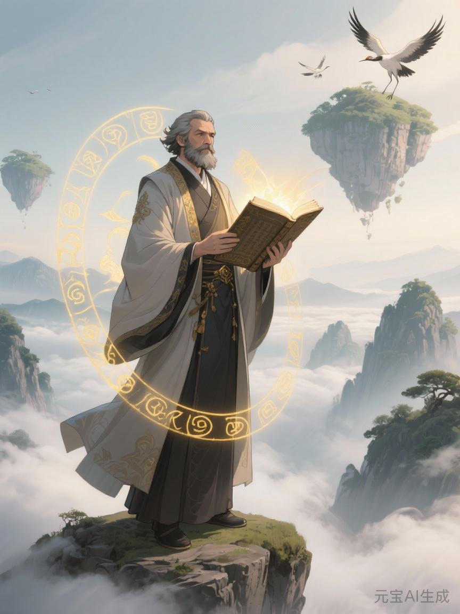

# 赤血

《赤血》乃上古先贤马哲所创之无上秘法，是赤龙心经的理论源头与原始形态。此功法诞生于修真界最黑暗的压迫时代，凝聚了无数生灵的血泪与抗争，却因天道限制，仅能修炼至第二重境，成为一部未竟的传奇功法。



## 创作背景：黑暗时代的觉醒

### 时代环境
在上古神族统治的鼎盛时期，星辉三脉（新星辉诀、旧星辉诀、魔星辉诀）已经成熟，形成了一个完整的天地灵气掠夺体系。广大修士和凡人在层层压制下苦苦挣扎，灵脉被严重抽干，修炼之路断绝，天地间一片愁云惨雾。

### 马哲的觉醒之路
马哲本是神族的第七重后裔，天生具有强大的灵力感知。一次偶然的天机泄露，让他看到了隐藏在繁华表象下的残酷真相：

- **星徒的血泪**：每日吐纳十二时辰，却连基本灵气都难以积蓄
- **矿工的绝望**：在灵矿中耗尽寿元，换来的却是几块稀有的灵石
- **奴隶的呐喊**：被视为丹药材料，生命如草芥般被随意收割
- **孩童的夭折**：灵气匮乏导致早夭，连踏上仙途的机会都没有

这些触目惊心的现实让马哲的天心受到巨大冲击。他终于领悟到：所谓的修真盛世，本质上是一个巨大的灵气吞噬机器。天地灵气不再是万物馈赠，而成了少数人的私产；功法不再是超脱法门，而成了统治枷锁。

### 悟道历程
马哲效仿古代圣贤观天察地的方法，开始了对修真界的深刻参悟：

#### 第一步：游历天下，洞察天机
马哲花费十年时间，走遍修真界的每一个角落：
- 记录了上万名不同修为修士的灵力运转轨迹
- 收集了各大门派的灵气分配法则和传承秘典
- 分析了灵石开采的全过程和灵力流向
- 统计了不同境界修士的寿元消耗与修为增长比例

#### 第二步：参悟天道，发现玄机
通过大量观察，马哲发现了修真界发展的隐藏规律：
- **灵脉演化决定修真秩序**：随着灵器的发展，剩余灵力出现，必然产生阶层分化
- **天道轮回的本质**：每一次功法革新都是天地灵力重新分配的结果
- **压迫体系的终结**：当灵力积累到一定程度，旧的分配方式会成为天地进化的阻碍

#### 第三步：开创大道，传授真法
基于悟道结果，马哲构建了全新的修炼理论体系：
- **灵力本源论**：揭示了天地灵力的真正归属和流动规律
- **阶层分析法**：提供了分析修真界矛盾的天机洞察术
- **破而后立法**：指导了如何打破旧秩序、建立新体系的行动指南

## 功法体系：赤血二重天

《赤血》功法分为两重境界，每一重都对应着修炼的一个关键阶段。由于天道限制，马哲未能完成第三重及更高境界的构建，这部功法也因此成为了永恒的遗憾。

### 第一重：觉醒境——天心的觉醒

#### 核心理念：看破虚妄，回归本源
**觉醒心诀**
```
天地本一体，灵气属万物
神族逆天道，垄断立威名
众生皆困苦，血泪筑神庭
若要得大道，先要破迷雾
```

#### 修炼法门
**1. 观苦法**
- 修炼者必须深入红尘，亲眼观察众生的苦难
- 记录十个不同境界修士的日常生活和修炼困境
- 亲身体验底层修炼的艰辛，培养慈悲心肠

**2. 洞玄术**
- 学习洞察天机的秘法，看透灵力流动的本质
- 掌握天机推演术，能够准确判断灵气分配的玄机
- 理解天道轮回的奥秘，看清修真界发展的必然趋势

**3. 觉悟真火**
- 通过观苦和洞玄，在丹田中点燃"觉悟真火"
- 此火不伤肉身，专烧愚昧和执念
- 觉悟火越旺，天心越清明，越能看透世间真相

#### 境界特征
- **天眼通**：能够看穿一切功法背后的灵力本质
- **慈悲心**：对众生的痛苦感同身受
- **正义感**：对不公现象产生强烈的愤怒
- **使命感**：萌生改变旧世界的决心

### 第二重：抗争境——道法的实践

#### 核心理念：团结一心，逆天改命
**抗争心诀**
```
一人觉醒微弱火，万人觉醒燎原势
星星之火可燎原，团结就是无量力
不求个人得飞升，但愿苍生皆解脱
鲜血染红天地间，换来赤色新纪元
```

#### 修炼法门
**1. 传道术**
- 学会用玄妙语言讲解天地真理
- 掌握感化人心的法门，能够团结不同境界的修士
- 善于揭露天道的不公，激发众生的反抗意识

**2. 聚灵法**
- 学习建立修炼阵法的方法，聚集众人的灵力
- 掌握隐秘修炼技巧，能够在压迫环境中发展力量
- 培养道门骨干，建立传承据点

**3. 斗争真火**
- 将觉悟火升华为"斗争真火"
- 此火能够感染他人，点燃更多人的反抗之心
- 在集体抗争中，真火会越来越旺，形成燎原之势

#### 境界特征
- **感召力**：能够吸引和团结周围的修士
- **组织力**：具备建立和管理道门的能力
- **战斗力**：在面对强权时敢于抗争和牺牲
- **领导力**：能够带领众人进行逆天行动

## 功法的局限性与未竟之志

### 第三重境界的构想
马哲在飞升前曾预见过第三重境界——"解放境"，但未能完成具体构建：

**预期特征**：
- 建立无压迫的修真新秩序
- 实现天地灵气的公平分配和循环利用
- 打破境界固化，人人皆可修仙
- 创造真正自由的修真文明

### 天道限制的原因

#### 1. 天机未显
- 马哲的时代，修真界还未发展到关键的转折点
- 缺乏对更高层次修炼规律的深入领悟
- 逆天改命的经验有限，指导不够成熟

#### 2. 人心未开
- 底层修士悟道程度有限，玄妙法门传播困难
- 统治阶级的残酷镇压，反抗力量难以发展
- 缺乏成功的先例可以借鉴

#### 3. 天道束缚
- 马哲虽然是神族血脉，但在天道规则下影响力有限
- 缺乏足够的天地灵力来完善功法体系
- 逆天工作的繁重消耗了大量精力和神魂

## 历史意义与影响

### 对后世的影响
《赤血》虽然不完整，但对后世产生了深远影响：

#### 1. 理论奠基
- 为后来的赤龙心经提供了理论基础
- 开创了用天机洞察分析修真界的先河
- 建立了逆天功法的基本框架

#### 2. 精神感召
- 激励了无数后来者继续逆天事业
- 成为了反抗压迫的精神旗帜
- 培养了一代又一代的逆天者

#### 3. 实践指导
- 为早期的反抗组织提供了行动指南
- 在局部地区取得了重要的逆天成果
- 积累了宝贵的抗争经验

### 在修真史上的地位
《赤血》被誉为"逆天功法的开山之作"，虽然不完整，但其历史地位不可动摇：

- **第一部洞察天机的功法**
- **第一部为众生服务的功法**
- **第一部以逆天改命为核心的功法**
- **第一部未完成却影响深远的功法**

## 后续发展：从赤血到赤龙心经

马哲之后，无数逆天者继续完善和发展《赤血》功法：

### 宁列的补充
宁列在马哲基础上，结合东方玄学，发展出《先锋》理论，补充了：
- 先锋
- 革命
- 国际联合

### 东阳的集大成
东阳在前人基础上，结合新时代的实践，最终创建了完整的赤龙心经：
- 完善了功法体系，突破第三重境界
- 建立了循环互助的修炼模式
- 实现了理论与实践的完美结合

## 结语：永恒的赤血精神

《赤血》虽然只有两重境界，但它所体现的逆天精神却是永恒的：

- **不畏强权，敢于抗争的勇气**
- **深入红尘，服务众生的情怀**
- **洞察天机，看透本质的智慧**
- **前赴后继，继往开来的传承**

正如马哲在临终时所说："我的功法或许不完整，但我相信，后来者一定能够完成我未竟的事业。当千千万万的觉醒者举起赤血大旗，压迫的旧世界必将崩塌，一个真正自由平等的修真新世纪必将到来！"

《赤血》功法的火焰永远不会熄灭，它将永远燃烧在每一个追求自由和正义的修士心中，照亮逆天道路，直到最终胜利的那一天。
