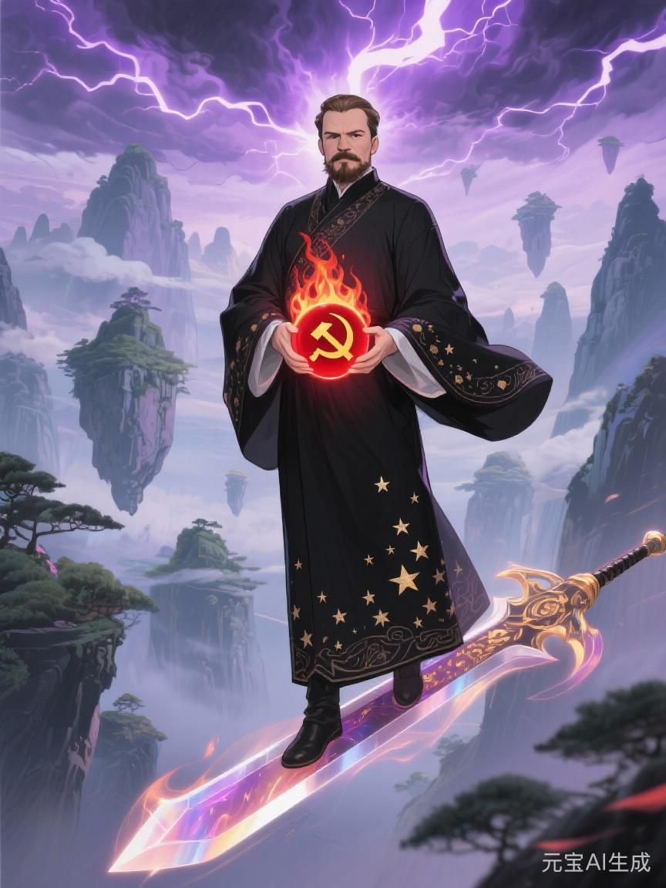

# 先锋

[[宁列]] [[马哲]] [[东阳]] [[赤血]] [[赤龙]]

《先锋》乃上古大能[[宁列]]所创之逆天秘法，是连接《赤血》与《赤龙心经》的重要桥梁。此功法诞生于修真界觉醒初现、天机变幻的时代，解决了[[马哲]]《赤血》功法如何集结众生灵力、与神族抗衡的修炼难题，却因天道限制，仅能修炼至第四重境，成为一部充满争议却又不可或缺的过渡功法。若依[[灵怨沉天与赤血初鸣]]一线旧说看，它同时还是赤血法统第一次尝试把灵气深处已显形的众生余念，推进成可聚、可导、可跨州共振的阵列回响。



## 创作背景：觉醒时代的实践

### 时代环境
在马哲《赤血》功法如春风化雨般传播开后，沉睡的修真界开始苏醒，零星的反抗火种在黑暗中闪烁。然而，觉醒的修士们很快发现一个致命的天道困境：个人的觉醒虽然珍贵，但面对神族那通天彻地的神威，单打独斗如同萤火之于皓月。众人虽有逆天之心，却缺乏有效的组织法门和对抗神威的战力。

### [[宁列]]的顿悟之路
[[宁列]]本是[[马哲]]的亲传弟子，在师父临终后继承了《赤血》功法的道统。在残酷的修炼实践中，他神魂震颤，领悟了深刻的天地玄机：

- **散修之无力**：觉醒的修士各自修炼，如散沙一盘，被神族以雷霆手段各个击破
- **无统之混乱**：反抗行动杂乱无章，无法形成合力，难以撼动神族统治根基
- **组织之法缺**：虽有一腔热血，却无统御众人的法门，难以与神族抗衡
- **灵脉之匮乏**：底层修士灵脉堵塞，修炼艰难，难以形成对抗神威的战力

这些血淋淋的现实让宁列的天心受到巨大冲击。他终于明白：仅有觉醒的道心是不够的，必须找到集结众生灵力、与神族正面对抗的修炼秘法。

他后来又逐渐明白另一件更冷的事：马哲之后，灵气深处那层众生回声虽已开始沿旧秩序脉路显形，却并不会天然自己走成正路。诸神能借州战与失序导流它，地方仇怨与败军羞耻也能轻易带偏它。故《先锋》所要解决的，便不只是“如何集结众人”，还是“如何让已经响起的众生之念不再被随意打散、剪碎或误导”。

### 悟道创新历程
宁列在马哲道法基础上，结合血与火的修炼实践，开创了全新的功法体系：

#### 第一步：组织修炼的探索
宁列深入各种反抗宗门，总结血泪教训：
- 分析了数十个反抗宗门的兴衰成败之天机
- 研究了神族神罚手段的规律和破绽
- 总结了秘密修炼组织的生存和发展法门
- 摸索出了统一指挥、协同作战的修炼战争模式

#### 第二步：灵力集结的突破
通过大量修炼实践，宁列发现了灵力集结的天地玄机：
- **集体修炼的奥秘**：多人联合修炼能够产生远超个人的灵力共鸣
- **统御体系的神威**：统一的灵力指挥能够最大化集体力量的神效
- **献祭之力的感召**：英雄的献祭能够激发更多修士的逆天之心
- **先锋光环的照耀**：顶尖修士的带头作用能够凝聚团队士气，形成战意光环

#### 第三步：战法体系的构建
基于血与火的实践经验，宁列构建了完整的战斗功法体系：
- **先锋队理论**：建立了前锋骨干带领众生战斗的天人组织模式
- **归令同脉法**：创立了既倾听众生心声又高效归拢诸脉的指挥法门
- **跨界联合策略**：提出了跨越修真界域的反抗组织联合方法
- **逆天伐神理论**：发展了与神族神威正面对抗的战斗技巧和破神之法

## 功法体系：先锋四重天

《先锋》功法分为四重境界，每一重都对应着逆天修炼的一个关键阶段。由于宁列过于强调前锋骨干的统御作用，此功法最终未能突破第四重境界，留下了深刻的天道教训。

### 第一重：先锋境——前锋骨干的神魂锻造

#### 核心理念：先锋带头，引领众生觉醒
**先锋心诀**
```
众生皆沉睡，先锋先觉醒
一人作明灯，照亮万人途
不畏神威重，敢为天下先
血肉作道基，登顶逆天峰
```

#### 修炼法门
**1. 神魂锻造术**
- 修士必须接受最残酷的神魂试炼，磨练金刚不坏之心
- 学习在各种天灾人祸中生存和战斗的秘法
- 掌握以身作则、影响他人的领袖光环修炼法
- 培养"我不入地狱谁入地狱"的献祭精神和道心

**2. 神意统御法**
- 学习制定修炼战略和战斗战术的天机法门
- 掌握激发部下潜能的灵力传导和神魂共鸣技巧
- 理解集体行动中的灵力协调和神魂配合法门
- 领会在混乱中保持道心清净、灵台空明的智慧

**3. 先锋神火**
- 通过神魂锻造和神意统御，在紫府中点燃"先锋神火"
- 此火炽烈如恒星，能够照亮前路也能焚尽神族强敌
- 先锋火越旺，领袖光环越强，越能吸引追随者凝聚战意

#### 境界特征
- **领袖光环**：天生具有吸引他人追随的神秘魅力
- **天机眼光**：能够看清天道大局，制定正确的修炼策略
- **献祭觉悟**：愿意为大道和众生献出自己的神魂
- **统御天赋**：善于团结和带领修士团队，凝聚战意

### 第二重：集结境——众生灵力的汇聚

#### 核心理念：万众一心，其利可断神剑
**集结心诀**
```
千丝成神索，万滴成天河
一人灵力微，众人力撼天
心往一处想，灵往一处聚
神族虽威重，难敌众心齐
```

#### 修炼法门
**1. 万灵聚阵法**
- 学习布置各种规模的集体修炼聚灵阵法
- 掌握引导多人灵力汇聚共鸣的玄妙技巧
- 理解不同修为修士在阵法中的灵力作用分工
- 领悟阵法中灵力流动的和谐平衡和天道循环原理

**2. 万念归神术**
- 修炼统一思想、凝聚共识的神魂沟通法门
- 学习用神念和行动感化他人的神秘技巧
- 掌握化解内部矛盾、维护团队团结的秘法
- 理解共同大道理想对团队凝聚力的巨大神效

**3. 集结神火**
- 将先锋神火扩展为"集结神火"
- 此火能够连接多人神魂，形成精神网络和灵力共鸣
- 在集结火的神光照耀下，众人如一人般行动，心意相通

#### 境界特征
- **组织天赋**：能够将散乱的众人凝聚成有效的修炼力量
- **协调能力**：善于平衡不同个体的灵力需求和神魂矛盾
- **感染魅力**：神念和行动能够激发他人的修炼热情
- **大局观念**：始终以集体大道利益为重，超越个人得失

### 第三重：抗争境——与神族的神威较量

#### 核心理念：以弱胜强，逆天改命
**抗争心诀**
```
神族神威重，天道非无隙
我有众人力，神有孤家威
团结如神壁，抗争如神火
今日虽败北，明日必翻身
```

#### 修炼法门
**1. 破神战斗阵**
- 学习各种专门克制神族的战斗阵法和破神阵列
- 掌握以弱胜强的神级战略战术
- 理解神族功法的弱点和神威破绽
- 领悟在绝对劣势中寻找胜机的天道智慧

**2. 献祭引爆术**
- 修炼在关键时刻献祭自己、引爆全部灵力的逆天秘法
- 学习用小代价换取大胜利的战斗思维和牺牲策略
- 掌握激发他人献祭精神的感召方法和神魂共鸣
- 理解献祭在逆天战斗中的战略价值和天道意义

**3. 抗争神火**
- 将集结神火升华为"抗争神火"
- 此火带有毁灭性的逆天力量，能够与神族神威正面对抗
- 在抗争神的燃烧下，弱者也能爆发出撼动神威的力量

#### 境界特征
- **战斗智慧**：善于在神战中寻找制胜关键和破绽
- **献祭觉悟**：能够在关键时刻选择献祭自我
- **逆天精神**：面对神威永不屈服，敢于向天道挑战
- **战术天赋**：精通各种以弱胜强的神级战术

### 第四重：执序境——新天道的建立

#### 核心理念：先锋执序，巩固逆天成果
**执序心诀**
```
推翻神族后，不能松懈心
先锋执天道，防止神复辟
旧制须打破，新序要建立
虽持执序印，不忘众生心
```

#### 修炼法门
**1. 天道统御法**
- 学习统治和管理大片修真领地的天道法门
- 掌握建立新制度、新天道秩序的神秘技巧
- 理解权力制衡和天道监督的重要性
- 领悟如何防止权力神力腐蚀和异化的天道智慧

**2. 神威镇压术**
- 修炼镇压反叛神族势力、维护新天道统治的手段
- 学习识别和清除敌对神族分子的秘法
- 掌握运用神威力量巩固统治的威慑技巧
- 理解神威镇压在建立新天道秩序中的必要性和局限性

**3. 执序神火**
- 将抗争神火转化为"执序神火"
- 此火带有威严和天道统治的神威气息，能够震慑敌对势力
- 在执序神火的照耀下，新的天道秩序得以建立和巩固

#### 境界特征
- **统治才能**：具备建立和管理新天道统治的智慧
- **威严气质**：自然散发让人敬畏的天道领袖威严
- **决断能力**：能够在复杂天道局势中做出正确决策
- **控制欲望**：对天道权力有强烈的掌控欲望

## 功法的内在矛盾与天道局限

### 第五重境界的缺失
宁列在晚年意识到《先锋》功法存在根本缺陷，但未能完成第五重境界的构建：

**应有境界**：万灵共议境
- 实现真正的万灵共议与地方自决
- 建立天道权力的监督和制衡机制
- 让先锋诸脉真正服务于众生而非凌驾众生
- 创造人人平等的新天道文明

### 功法的内在问题

#### 1. 过分强调前锋统御
《先锋》功法过分依赖先锋修士的个人能力和道品，缺乏制度化的万灵共议机制：
- 天道权力过度集中在少数前锋骨干手中
- 缺乏有效的天道权力监督和制衡
- 容易形成新的特权神族阶层
- 众生始终是被统治、被管理的对象

#### 2. 缺乏真正的下听之道
虽然强调汇聚众人之力，但本质上仍是前锋主导：
- 众生只是灵力来源，不是天道决策主体
- 缺乏自下而上的天道反馈机制
- 共议往往流于形式，实质仍是少数人定夺
- 众生的真实需求难以得到充分的天道表达

#### 3. 权力神力异化的隐患
执序境的设计容易导致天道权力神力异化：
- 先锋队可能成为新的统治神族
- 缺乏防止天道权力神力腐败的有效机制
- 容易陷入高位独断的天道恶性循环
- 理想主义被现实天道政治所腐蚀

#### 4. 实践中的天道教训
历史证明，《先锋》功法的实践往往带来天道悲剧：
- 很多反抗成功后，新的统治者比神族更加残酷
- 先锋队逐渐蜕变为新的特权神族阶层
- 众生从一种神族压迫转向另一种压迫
- 理想与现实的巨大天道鸿沟难以跨越

## 历史意义与天道影响

### 对赤龙的启发
《先锋》功法虽然存在严重缺陷，但对后世的赤龙提供了重要启示：

#### 1. 集结力量的法门
- 证明了众人联合的巨大神威威力
- 提供了集体修炼的基础理论和技术
- 发展了组织建设的天道方法和技术
- 开创了团队战斗的战术体系和神战法门

#### 2. 与神族对抗的经验
- 积累了丰富的逆天修炼和战斗经验
- 总结了神族功法的弱点和神威破绽
- 发展了以弱胜强的战略战术和神战技巧
- 培养了一代又一代的逆天战斗修士

#### 3. 深刻的天道教训
- 揭露了少数执序的根本天道缺陷
- 警示了权力神力异化的巨大天道危险
- 强调了众生共议的极端天道重要性
- 为真正的共议实践提供了天道反面教材

### 在修真史上的地位
《先锋》功法被誉为"争议的过渡之作"，其历史地位复杂而矛盾：

- **第一部解决力量集结问题的功法**
- **第一部成功与神族神威对抗的功法**
- **第一部实现天道政权建立的功法**
- **第一部因权力神力异化而失败的功法**

## 后续发展：从先锋到赤龙

宁列之后，[[东阳]]深刻总结了《先锋》功法的天道经验教训：

### 对《先锋》的批判继承
[[东阳]]认识到《先锋》的根本问题在于缺乏真正的下听之道，过于强调前锋骨干的统御作用。赤龙的核心创新就在于：

- **建立循环互助机制**，避免天道权力过度集中
- **实现万灵照鉴与共议参与**，确保天道权力服务于众生
- **培养共修同担之心**，超越个人威名与少数独断
- **创造真正共议模式**，实现人人平等的修真天道文明

### 在弟子一脉中的分化
《先锋》之所以会在后世留下如此深的争议，也与其弟子一脉的不同走向有关。

- [[朔钧]]：作为[[宁列]]最直接的亲承弟子，朔钧把《先锋》“先护火、后开口”的一面推进到了极致。他在北线雪战与诸脉崩裂之际，确实以霜印、亡簿与寒骨大阵守住了许多将灭未灭的火种；但也正因如此，他的实践让第四重“执序境”的寒影第一次彻底显形。许多后人正是从朔钧身上看见，先锋若只学会不散，极可能一步步滑向以秩序本身压人。
- [[离烬]]：同样出自宁列门下，却走向了另一种极端。他原本最擅把远隔诸州的苦难连成一潮，让外域火种彼此认出自己并不孤立；可在[[神使]]、[[爱神]]与残缺伪史的层层引偏下，他渐渐把“火不可散”误听成“火不可停”，屡屡催动尚未长稳的外脉提前举焰。其所酿成的“九州误潮”，使许多本可后成的支脉过早暴露，也让先锋第一次真正见识到：只知向外鼓燃的火，同样会把自己烧空。
- [[寒稷]]：并非宁列门下真正出众的创法者，却是朔钧死后北线最能说明《先锋》外壳何以会败的一人。他靠忠心、清洗误潮余脉与强行吞用灵气结晶上位，自命“赤血王者”，又在诸神诱偏下翻案噬师，把冻潮州北线与九州南线生生扯裂。若说朔钧让人看见执序为何会结冰，寒稷便让人看见当后继者只学会冰、不再懂火时，整条法统会如何从内部先碎。
- [[东阳]]：与朔钧相反，东阳选择从先锋的裂缝处回头，不再满足于“由少数人替众生护火”，而是继续追问“如何让众生自己成为火的主人”。故其[[赤龙]]之所以强调归流、共议与循环，不只是理论创新，也是在回应朔钧这一脉留下的深重寒影。

### 功法理念的天道升华
从《先锋》到《赤龙》，是一次质的飞跃：
- 从少数执序到万灵共议
- 从集中控制到循环互助
- 从英雄崇拜到集体智慧
- 从权力统治到服务奉献

## 结语：先锋的天道悲剧与启示

《先锋》功法是一部充满天道悲剧色彩的伟大功法。它解决了反抗神族的修炼技术问题，却未能解决权力神力异化的根本问题。它用少数执序推翻了神族秩序，却可能创造新的压迫。

正如东阳在评价《先锋》功法时所说："宁列师祖的伟大在于他敢于向神族亮剑，他的悲剧在于他只想到用剑去征服，却没想到如何让剑永远服务于众生。先锋的功法教会我们如何逆天胜利，但没有教会我们胜利之后如何避免成为新的神族敌人。"

《先锋》功法的最大价值，或许不在于它提供了什么天道答案，而在于它提出了深刻的问题：如何集结众人的灵力？如何避免天道权力的异化？如何实现真正的众生平等？这些问题，最终在赤龙心经中找到了完美的解答。

先锋的神火虽然有过辉煌和错误，但它燃烧过的道路，为后来的赤龙照亮了前进的方向。每一位修炼赤龙的修士，都应该铭记《先锋》功法的天道教训，永远警惕权力神力异化的危险，始终守住下听万灵之道，真正实现人人如龙的伟大理想。
