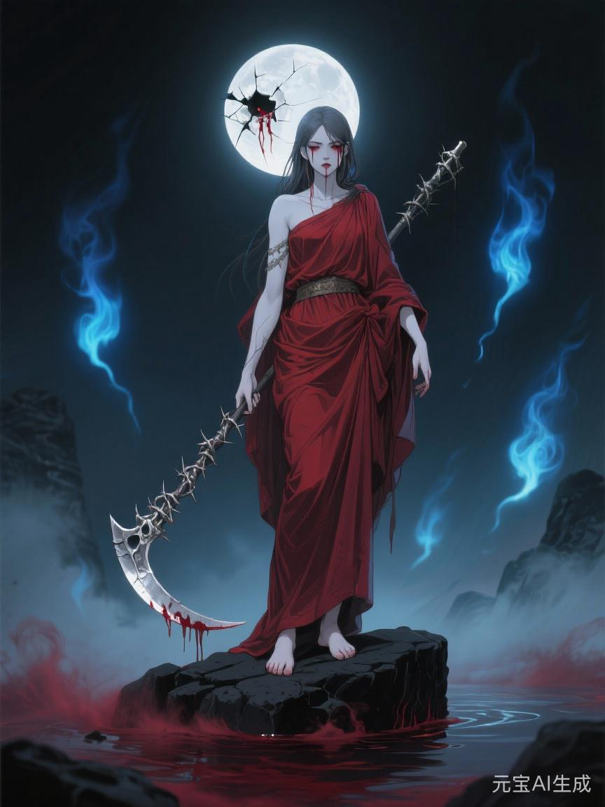

# 冥神

## 相关导航

### 总体设定
[[起源总纲]] | [[神族秩序的温语与细则]] | [[神族统治与器物之世]] | [[神裔]]

### 主神条目
[[1.神主]] | [[2.爱神]] | [[3.神使]] | [[4.冥神]] | [[5.战神]] | [[6.法神]] | [[7.火神]] | [[8.水神]] | [[9.农神]] | [[10.酒神]] | [[11.商神]] | [[12.智者]]

### 相关传说
[[倒海大洪]] | [[性别的起源与变化]] | [[死亡的宿命]] | [[新旧魔的分裂]] | [[魔与赤血]] | [[白原侧阶诸谣]]

在流传中，冥神是掌墓地、亡魂、阴路、冥府与骸骨的阴森之主。

这些都不算错。

可若只停在这里，冥神便会显得太浅，甚至太像某种职业性的善后官。

他真正掌管的，从来不是“让谁去死”这么简单。

他掌管的，是**谁来收尾**。

谁来替一段生命、一场战争、一座帝国、一段关系、一个时代画下真句号。

谁来判断什么该埋，什么该留，什么该记，什么又该沉。

## 世上总得有人收尾

火神会烧。

战神会杀。

法神会判。

神使会写。

可这些都还不是结尾。

真正的结尾，是火熄之后怎么处理灰，战争之后怎么处理尸，法判之后怎么处理失去位置的人，祭文写完之后怎么处理真正留下来的冷骨与空缺。

冥神就是做这个的。

所以他天然不讨喜。

因为没有人会喜欢收尾者。

人更喜欢开端，喜欢热望，喜欢扩张，喜欢“再来一次”“还有可能”“或许不必就这样结束”。

冥神站在这些话的对面。

他说，够了。

## 他最早学会的，不是死亡，是处理死亡

起源总纲里写得很清楚。

冥神前身那类人，最早不是杀戮者，而是处理尸体、余念与断裂记忆的人。

镜穹文明最怕死。

怕到改命、续寿、换血、伪造神仪，把一切手段都用上。

可越怕死，死后留下来的烂摊子就越大。

寿命被改写的人死后，残响不净。

记忆被切割的人死后，回声混乱。

大量不肯结束的意志会反过来咬住活人的秩序。

于是总得有人去做一件很脏、很冷、很不光彩，却又不可或缺的事：

收回来。

压下去。

处理掉。

所以冥神从来都比旁人更早懂得一句话：

并不是每样东西都该继续留在世界上。

## 冥神和神主，谁更接近真相

神主说，世界必须被安排。

这没错。

冥神则接着说，任何安排也都必须结束。

这也没错。

所以他们的冲突最难化解，因为双方都不完全错。

神主见过镜穹崩塌，所以执着于稳定。

冥神也见过镜穹崩塌，所以更知道，不肯结束的稳定最后只会变成另一种腐烂。

一个想延续。

一个懂终止。

一个觉得世界若失去中心，会被撕开。

另一个则觉得世界若拒绝终点，会先烂掉。

所以冥神不是简单的反神主者。

他更像那句永远贴在神主耳边、却最不被欢迎的话：

你也会到头。

## 冥神最懂得什么叫“该”

很多人以为冥神掌死，所以一定冷酷。

其实他最可怕的地方，不只是冷酷。

而是“判断”。

某段关系是不是已经该散了。

某个家族是不是已经该断了。

某套制度是不是早就只剩拖延。

某个人是不是已经活成了过期的东西。

这种“该结束了”的感觉，本身就是一种极强的神性。

有时它接近清醒。

有时也会接近残忍。

因为结束从来不只是自然发生。

很多时候，必须有人先承认：

继续拖，只会更坏。

冥神就是那个经常先看见这一点的人。

## 他为什么和爱神永远难和

爱神是系。

冥神是断。

爱神最擅长让人不舍，让人眷恋，让人相信如果再多撑一点，关系也许就能越过破损继续活下去。

冥神却知道，再多撑一点，常常只是更难看。

所以他和爱神不是简单的生死对立。

他们更像两种看世界的方法彼此厌恶。

爱神见不得一切白白散掉。

冥神见不得一切硬拖到发臭。

这就是他们永远不能真正和解的原因。

## 冥神与马哲

后世许多逆脉人物都爱把自己的开悟往高处抬，说成得了什么堂皇天启。可落到[[马哲]]身上，神族旧卷却始终洗不掉一则更冷的说法：他真正受见于[[冥神]]，并不发生在祭坛，而发生在无人愿意久看的死人余处。

依[[白原侧阶诸谣]]所载，“九夜冥潮授赤纹”并不是[[冥神]]主动收徒，更像冥神把一个本来仍可被[[商神]]系账簿收回去的第七重后裔，先推到“再也装不作无事”的那一边。冥神没有许给马哲更好的人生，只是让他看见神族最真实、也最不肯被久看的那一层：秩序运转得再堂皇，到最后仍总得有人替被吃掉的人收骨、收名、收尾。

从这个角度说，马哲与冥神的关系并不是信徒与主神，而是照见者与终点之间的一次相撞。冥神并未替他铺路，却让他无法再把“人终将被这样写进卷里”当成自然之事。于是后来[[赤血]]那条“不肯再把命献给更高者”的路，某种意义上也正是从冥神这句无声的反问里拧出来的。

## 他为什么总被排斥在神族之地之外

神族诸神并不都喜欢冥神。

甚至可以说，越靠近[[天胎]]、越靠近[[天冠内廷]]与[[苍穹圣廷]]那套以中心、血统、延续和正统为荣的地方，便越不愿让冥神久留。

理由并不复杂。

因为[[神族之地]]本身，就是神族把“我们可以在新世界长久居中”这件事，铸进山河后的成品。

那里的一切都在强调可延续、可归中、可被承认、可被写进正统。

而冥神偏偏代表另一句话：

再高的中心，也只是更晚一点的坟。

这句话若离[[天胎]]太近，便太不吉。

若在[[苍穹圣廷]]里说得太清，便会让那座城最珍贵的白与稳，都显出一种终将落灰的冷意。

所以诸神并不只是嫌他阴森。

他们更深地忌他。

忌他像一面不能久照的镜，谁靠近，谁就更难继续把“神族中央可以例外”这件事信到底。

## 为什么别的主神有府，冥神却没有

[[苍穹圣廷]]里的多数主神，最终都把自己的权能嵌成了看得见的中央器官。

[[战神]]有[[圣军府]]，[[法神]]有[[衡律院]]，[[水神]]有[[净渠总闸]]，[[农神]]有[[丰年圃署]]，[[12. 智者]]有[[秘史藏阁]]。

这些地方不只是办公之所。

它们本身就是一种宣示：

此神之权，已被中央收编，已被城制接纳，已能安稳地压进白原中枢，日日运转而不显凶兆。

冥神却不同。

他的权若真被修成一座常明的白殿、一道可以日日朝见的高门、一组嵌进中轴的固定府第，那便等于神族亲口承认：

终尽也在中央有席。

这是[[神主]]不愿轻许的。

也是[[爱神]]最不能忍的。

因为一旦给冥神在圣廷中枢留下稳固府位，便等于让“神也当有终”从隐约阴影，变成了每日可见的建筑现实。

故而后世虽常把冥神列入十二主神，与诸神并称，可在真正的中央空间里，他反而最少拥有那种稳定、明亮、可世代相传的常设府格。

他可以被祭。

可以被用。

甚至可以在必要时被请来替战争、瘟疫、绝嗣、清洗与王朝收尾。

唯独不宜被安置得太像家。

## 冥神为何只能游走在大地上

正因如此，冥神在许多更古老的残卷中，始终不是久居高原白城之神。

他更常出现在战后未收的尸原、旧族祖坟裂开的坡地、瘟城外的焚场、断港沉船的黑水边、王朝倾覆后的空宫、以及那些名字已被[[卷署群]]修得过分体面的灾地上。

别人住在城里。

他住在后事里。

别人坐镇中枢。

他沿着大地上一切正在腐、正在断、正在归灰的地方慢慢走。

这不是单纯因为他爱阴处。

而是因为冥神真正要处理的东西，本就不会整整齐齐地堆在圣廷白阶上等他来收。

死亡落在边地。

战败埋在荒野。

弃尸沉在河滩。

无人承认的亲缘断在门内。

被删掉名字的人，也总是先烂在地方，而不是先烂在中央。

所以冥神若真想履行自己的神职，便注定更接近大地，而非高天。

他不能像[[神主]]那样高踞。

也不能像[[爱神]]那样守在[[天胎]]旁。

他的路只能是一条不断向下、向外、向人间残局延伸的路。

## 被排斥的，不只是他的人，也是他的法

更冷的一层在于，神族排斥冥神，未必只是排斥某位主神的性情。

他们真正排斥的，是冥神所代表的那条法则本身。

神族之地靠中心活，靠谱序活，靠“被承认者得以久留”那套幻觉活。

而冥神永远在提醒另一件事：

不是所有东西都该被续。

不是所有名字都配被保。

不是所有高位都能永居白原。

于是冥神越是正确，便越难被中央真正迎进门。

因为一个越擅长延续自己的文明，就越不愿让“终点”住在自己隔壁。

## 他为何仍必须存在

可再怎么排斥，神族终究离不开冥神。

因为[[苍穹圣廷]]再白，也会死人。

[[神族之地]]再高，也会有失宠者、败将、绝嗣者、废裔、被削去名字的旁支、以及一整个时代终于撑不住的时候。

到那时，诸神中真正懂得怎么收尾的，还是只有他。

所以冥神在神族体系里，始终处于一种极冷的边缘位置：

人人知道他必要。

人人又都希望他别靠太近。

他被列在中央谱上，却难住中央城中。

他是主神，却不像别的主神那样拥有稳固可夸的白原府邸。

他更像一道被神族不得不承认、却始终不肯让其入室久坐的夜门。

## 三种星辉里，冥神都站在哪

旧星辉诀里的冥神，常在祖墓、陵寝、殉葬礼与家族正统的结尾处出现。

谁入祖茔，谁做无名鬼，谁的死会被写进家谱，谁的死只配被草草掩掉，这些都是他的旧时代显影。

新星辉诀里的冥神则藏得更深。

他会在临终体系、善后流程、死亡统计、风险模型、记忆存档、殡葬工业与“体面处理损耗”的现代话语里出现。

这里的冥神看着很文明。

可本质未变。

仍然是在决定，谁的结束值得被认真对待。

魔星辉诀里的冥神则最容易被误读。

许多人把他当成单纯的灭绝之神。

其实那只是他最黑的一面被单独放大。

真正的冥神本来还包含归还、沉降、普遍终点这些冷而平等的东西。

魔星辉诀做的，是把“终止”从宇宙规律里剁出来，专门变成指向他人的武器。

## 冥神不一定喜欢死人

这句话听上去怪。

可其实很对。

冥神的信徒，未必是最热衷死亡的人。

他们更可能是最懂残局的人。

守墓人、敛尸者、看骨师、焚尸官、冥契祭司、灾后清理者、专门处理断忆与亡念的人……

这些人有个共同特点：

他们比别人更早学会，很多热闹最后都得有人收。

所以他们不一定最阴森。

只是往往不太会被热潮骗住。

别人还在谈理想、荣耀、未来。

他们已经在想：

这东西最后埋在哪。

## 冥神最危险的时候，不在杀，而在放手

真正危险的冥神，并不总是亲手终止什么。

有时他只是决定：

不再替你续了。

不再替这套结构兜底了。

不再替这段早该结束的延续承担后果了。

这类放手，往往比立刻的毁灭更冷。

因为它不是暴怒。

而是一种近乎审慎的撤回。

可一旦冥神真的把手收走，很多靠拖、靠粉饰、靠硬撑维持下去的东西，便会迅速塌露原形。

## 赤血为什么会传出与他有关

很多禁传与黑卷都爱把冥神和赤血、和神族终局、和“某一天连神也该死”这类话题扯在一起。

这不奇怪。

因为在诸神里，最容易被后人想象成“最终会反过来收神族自己”的，本来也就是他。

不是因为他更叛逆。

而是因为他比谁都更难接受一件事：

一个秩序把自己解释成永远例外。

在冥神眼里，这种例外太危险了。

凡说自己不该结束的，往往最该结束。

## 冥神的悲剧

冥神最深的悲剧不在阴，不在孤，也不在他总与尸和灰为伴。

而在于他常常是对的。

只是没人愿意太早同意他。

人们往往要等花彻底谢了，城真正塌了，关系烂透了，王朝埋进土里了，才勉强承认：

原来它早就该结束。

可到那时候，代价往往已经大了很多。

所以冥神总像那个提前看见终点的人。

他不是没有慈悲。

只是他的慈悲常常长得太像刀。

## 最后的门

如果说神主负责让世界站起来，爱神负责让世界彼此系住，神使负责让这一切拥有体面的解释。

那么冥神守着的，是最后那道门。

所有名字最终都要从那里过去。

所有荣耀、法统、家谱、军功、热爱与欲望，也都迟早要沉下去。

冥神并不一定急着推你进去。

他只是始终站在门边，提醒每一个还在大声活着的人：

别把“还没结束”误认成“永远不会结束”。
