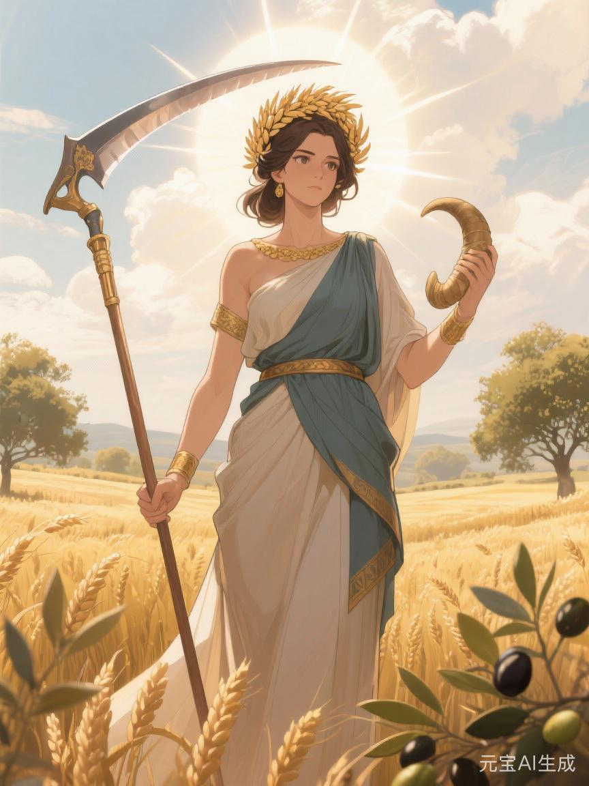
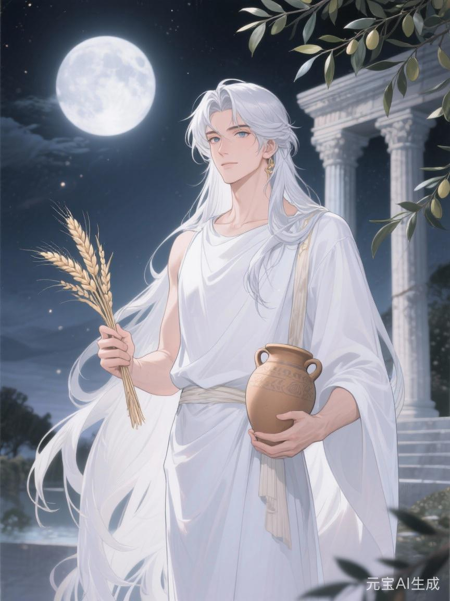

# 农神

#神族 #主神 #大乘

## 相关导航

### 总体设定
[[起源总纲]] | [[神族秩序的温语与细则]] | [[神族统治与器物之世]] | [[神裔]]

### 主神条目
[[1.神主]] | [[2.爱神]] | [[3.神使]] | [[4.冥神]] | [[5.战神]] | [[6.法神]] | [[7.火神]] | [[8.水神]] | [[9.农神]] | [[10.酒神]] | [[11.商神]] | [[12.智者]]

### 相关传说
[[倒海大洪]] | [[性别的起源与变化]] | [[死亡的宿命]] | [[新旧魔的分裂]] | [[魔与赤血]]

若把农神只看成掌土地、庄稼、牲畜与收成的神，便会误会得很厉害。

因为在神族的世界里，农从来不是田园诗。

农是最基本、也最沉重的秩序。

一个人可以不懂法，不懂战，不懂海运与锻炉，可他不能不吃。

而只要还要吃，就迟早会落进农神的影子里。

所以农神真正掌管的，并不只是“让地里长出东西”。

他掌管的，是**如何让饥与饱成为秩序，如何让四时轮转成为服从，如何让一整片土地上的人都相信，只要粮还在长，自己眼下受的苦便还能再忍一季**。

## 春

春天在农神这里，从来不是单纯的新生。

春是登记。

是分种。

是丈量。

是决定今年哪些地该种，哪些地该休，哪些人该下田，哪些人该改籍去别处，哪些种子配给上地，哪些种子只值得撒进边田碰碰运气。

所以农神最初显得总很仁厚。

他教人识节令，分寒暖，驯牲口，保种脉，让[[倒海大洪]]后的荒土重新有东西长出来。骨舟靠岸之后，真正让许多残民不至于立刻饿死的，也确实有他一份功劳。

可问题也从这里开始。

因为一旦谁掌握了播种之前的安排，谁便也掌握了收成之前的大半命运。

地可以写名。

种可以分等。

农具可以赐，也可以不赐。

某地被评作“宜扩种”，便可能迎来繁荣。

某地被判作“耗水过高，不宜续养”，便可能在两三年里慢慢荒下去。

春天看上去只是开始。

可在农神手里，它其实是第一轮裁定。

## 夏

夏天是最像农神本体的时节。

因为这时候，一切都还没熟，一切却都已经被绑进去了。

人下了田，牛套了轭，渠水被引进畦垄，草木日日见长，病虫、暑气、劳损、磨耗也开始一起长。

夏是维护。

是看守。

是漫长而重复的劳动。

也是农神最擅长把人变成“久任者”的地方。

火神会把人一炉烧坏。

战神会把人一役耗尽。

农神则常常不这样。

他更习惯把人按年、按季、按代地放进同一块地里，让其慢慢和土地互相绑定。祖父守这片灵田，父亲守这片灵田，儿子还是守这片灵田。神族不说这是锁人，只说“与地结缘”“熟悉土性”“久任更稳”。

这便是农神最细的一层吃人处。

不是一下把你打碎。

而是让你一年一年地觉得，自己除了这里，也确实没别处更合适了。

## 秋

秋天是农神最像君王的时候。

因为秋不是单纯收获。

秋是结算。

什么田算丰，什么田算歉。

什么叫勤谨，什么叫怠惰。

今年欠了多少粮，来年该从谁身上补。

神族最喜欢在秋天说“天道无私”。

可秋从来最不无私。

因为收成一旦出来，便意味着粮仓、税额、供奉、赈济、配售、储备、种子留存、军粮转运、祭司用度都要跟着一起出来。

一个世界里，谁有资格先吃新粮，谁只能等仓里漏下来的旧粮；谁的仓可以称作“丰年有余”，谁的仓却永远被记作“勉强持平”；谁歉了能被赈，谁歉了只会被判作“未能善耕”，这些都不是什么自然结果。

它们都是秋算的一部分。

所以农神从来不只是丰收之神。

他更像那个替全世界决定“这一年谁算活得值得，谁算活得亏空”的神。

## 冬

很多人写农神，只写春耕秋收，不写冬。

可真正懂农神的人，都会知道冬才是最冷的一层。

冬天看上去什么都没有生长。

其实所有最残酷的决定，常常都在这个季节做完。

哪块地明年不再续养。

哪一支佃户并入别家。

哪一批人从农籍里抽走，送去矿、送去炉、送去边仓、送去神舰。

哪一村因连年歉收被判作“不堪续投”。

冬是休止。

也是删减。

是农神把“养不起的部分”从大地账本上慢慢抹掉的季节。

所以农神的慈悲从来都带着簿册气。

他可以养人。

但他也一直在算，这人还值不值得继续养。

## 旧星辉诀里的农神

若说旧星辉诀最硬的部分在战神，最深的筋脉在水神，那么最重的地基就在农神。

因为旧秩序真正依赖的，从来不是抽象的“土地”二字，而是土地不断被组织成可耕、可收、可征、可继承、可封赏的秩序。

农神在这一体系里，不适合被写成温柔的田园守护者。

他更接近：

- 掌大片庄园的地脉贵族
- 负责丈田、分佃、记产的神署老臣
- 知道如何让一片荒地在三年内变成贡粮之地的老练经营者
- 能一句话决定某地值不值得继续“养”的冷静主宰

战神给旧世界打来地。

水神给旧世界接上流。

农神则让地和流真正结出可以稳定征收的果实。

这才是封建最可怕的地方。

不是只有武力和祖谱。

还在于它把大地本身也整理成了可以层层抽取的结构。

## 新星辉诀里的农神

到了新星辉诀，很多人以为农神会衰退。

其实未必。

他只是换了一副更现代、更整洁、更不带泥土气的面孔。

农神不再总站在田边。

他会出现在：

- 粮食安全
- 种业垄断
- 土地金融化
- 农业工业化
- 标准化养殖
- 远程调度与产地规划

旧时代的农神让人守地。

新时代的农神未必让你守。

他更可能直接让地脱离人，变成一整套可测算、可兼并、可优化、可替换的产能单元。

这时“丰收”听上去比过去更理性：

提高单位产出。

优化供应结构。

压降损耗。

统一种源。

提升粮食安全韧性。

每一句都不完全错。

但每一句背后，都可能意味着更多旧农人被赶出地，更多地方被重新定义成“高效产区”，更多作物只按市场而非生活来决定价值。

农神到了这里，已经不太像土地之父。

他更像大地上的总调度人。

## 魔星辉诀里的农神

农神在魔星辉诀里不如火神、冥神、酒神那样显眼。

可他若被写轻，反而会失真。

因为任何极端排斥性的秩序，最后都要面对一个问题：

谁来吃？

谁配吃？

谁耕？

谁饿？

所以魔星辉诀里的农神，往往不会首先表现为丰收，而表现为配给。

某些地只供正血。

某些仓只向纯种开放。

某些被污名化的群体被固定在最苦的生产线上，一代代耕作，却永远没有资格优先享受自己种出来的粮。

这时农业已不再只是生产。

它开始直接参与种群排序。

火神负责焚净。

冥神负责终止。

农神则负责确保“该活的人活得稳，该饿的人一直半饿着”。

这是另一种更慢的清洗。

## 农神信徒最像什么人

农神的信徒当然可以是灵植师、牧养者、谷仓祭司、田官与大地主。

但真正接近农神的人，未必天天站在地里。

他们往往更像那些特别懂“人终究要吃饭”这句话的人。

于是他们习惯从这里下手：

- 谁掌仓，谁就有耐心
- 谁掌地，谁就能慢慢等别人低头
- 谁掌种，谁就能决定明年谁还有机会翻身

这些人不一定凶。

相反，他们常常最像持家之人，最懂节令，最会讲踏实、稳定、养活天下。

可他们也最容易把活人重新看成：

一口粮。

一份劳力。

一块该种什么的地。

一个能否续养到来年的单位。

## 农神最大的诱惑

农神不像酒神那样给人即时欢愉，也不像商神那样给人立刻暴富的幻象。

他给人的诱惑更古老，也更顽固：

只要粮还在长，日子便还过得下去。

这句话本身有多大安慰，就有多大危险。

因为它会让人习惯把许多别的痛苦一起吞下去。

地虽不是我的，但还能种。

税虽重，但仓里还没空。

人虽累死了几个，可今年总算没闹大荒。

孩子虽注定还要守田，可总比没饭吃好。

农神最深的力量，就在这里。

他不是让人忘记痛苦。

而是让人把痛苦重新理解成“为了不断粮，总得这样”。

## 最后的谷仓

如果说水神是让世界接上线，战神是让世界见血，法神是让世界按章运行，火神是让世界在高温中升级。

那么农神在最底下问的，始终是同一个问题：

**谁来养这世界？**

这个问题本来没有错。

可一旦落进神族手里，它便会慢慢变成另一个更冷的问题：

谁值得继续被养，谁又只配在半饥半饱里替别人把世界养下去？

这便是农神。

他让大地长出粮。

也让大地学会筛人。
