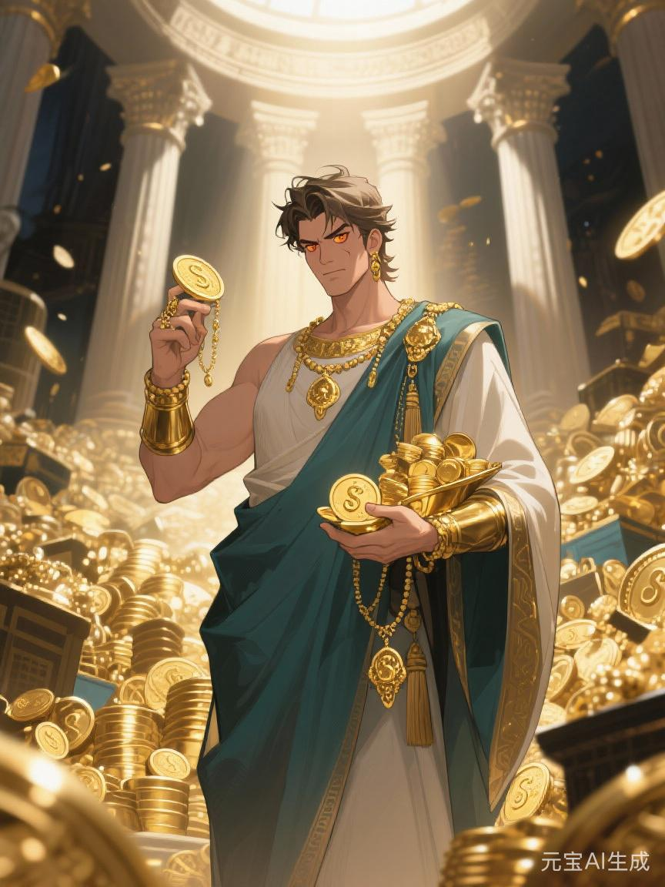

# 商神

#神族 #主神 #大乘

## 相关导航

### 总体设定
[[起源总纲]] | [[神族秩序的温语与细则]] | [[神族统治与器物之世]] | [[神裔]]

### 主神条目
[[1.神主]] | [[2.爱神]] | [[3.神使]] | [[4.冥神]] | [[5.战神]] | [[6.法神]] | [[7.火神]] | [[8.水神]] | [[9.农神]] | [[10.酒神]] | [[11.商神]] | [[12.智者]]

### 相关传说
[[倒海大洪]] | [[性别的起源与变化]] | [[死亡的宿命]] | [[新旧魔的分裂]] | [[魔与赤血]] | [[白原侧阶诸谣]]

商神若只被理解成管钱、管货、管贸易的神，也还是太浅。

因为钱、货与贸易，都只是表面。

商神真正掌管的，是另一种更抽象、也更危险的能力：

**让原本彼此毫不相干的东西，忽然都变得可以换算。**

粮可以换成银。

命可以折成价。

时间可以卖。

风险可以转手。

债可以延后。

未来甚至也能提前典当。

一旦世界学会这样运转，商神就不再只是一个财神式的人物。

他会变成那位站在所有交换背后，轻轻问一句“值多少”的主神。

## 商神最初发明的，不是财富

很多人会误以为商神的原初神性是积累。

其实不是。

财富积累只是结果。

商神最初发明的，应该是折算。

在骨舟之前的镜穹废墟里，九位奴隶各有技艺。有人懂战，有人懂死，有人懂火，有人懂法。商神不同，他懂的是如何把路网、平码、债券、交换律这些看似不伟大的东西接起来。

这能力看上去不如战神威武，不如火神炽烈，也不如神使那样掌话语。

可一旦没有它，很多东西都无法真正扩张。

因为不能折算，就不能远距交换。

不能定价，就不能大规模抽取。

不能让不同地方、不同物产、不同风险被放进同一套换算体系里，神族的世界便总会卡在某些具体而粗糙的边界上。

所以商神最厉害的，不是创造金银。

而是让整个世界开始习惯问：

这个能换什么？

## 商路为什么比刀更长

战神可以打一片地。

水神可以接一片地。

法神可以把一片地写进制度。

可真正让一片地长期不再想脱离中心的，很多时候并不是刀，也不是法。

而是商路。

一座边城刚纳入神治时，也许只是不敢反。

可当它开始靠神族货船吃饭，靠中心放价维持市面，靠某条大商路出售特产、购入盐铁、换取法器、借到来年所需的粮和种，它的命运便会一点点被拴在远方。

商神最强的一点，就在于他不一定非要逼你。

他可以先让你赚。

先让你方便。

先让你觉得，接进更大的交换系统，自己也确实有利可图。

等到你真的习惯这套便利，再想退出时，代价往往已经远高于最初进入之时。

所以商神从来不是粗暴的掠夺者。

他更像一个极有耐心的套索师。

## 旧星辉诀里的商神

旧时代并不是没有商神。

只是那时他还没站到舞台中央。

他更多像：

- 城市行会背后的护持神
- 长途商队口中的路神
- 换币者、平码者、债务见证人
- 王权、贵族与神殿都需要、却又都不肯让其完全抬头的必要人物

在旧星辉诀中，真正显眼的是血统、封地、征战与庄园。

商神在其间的作用，常像润滑与加速。

他帮助贵族把多余的东西变成更可流通的财富，帮助王庭把边地特产换成中心所需，帮助某些城市在封建体系缝隙里长成独特的富庶之地。

所以旧时代的商神，常常既重要，又不够名正言顺。

大家都用他。

也都防他。

因为谁都知道，一旦什么都能换，很多原本靠血统和祖谱才能维持的秩序，便会开始松动。

## 新星辉诀为什么最像商神的时代

若说新星辉诀有一位最适合做时代脸面的主神，商神一定在前列。

因为这一体系最擅长的，就是把一切都推进交换逻辑。

旧时代你看得见台阶。

新时代则让你看见市场。

人人看似都可以入场。

人人看似都能通过交易、投资、经营、风险承担与努力换来上升。

这正是商神最迷人的地方。

他从不先告诉你，市场最后会怎样吞人。

他先告诉你：

你也可以试一试。

## 商神与马哲

[[马哲·金垣]]出自[[商神]]一脉第七重后裔，这件事本身就足够说明商神的世界为什么危险。

因为商神系最擅长养出一种人：既能看懂卷册、平码、债路与资源流转，又不真正握住最高处的决定权。这类人离中枢足够近，看得懂旧秩序怎样把命、时间、劳作与未来一并折进价里；可又离中枢足够远，远到一旦他们忽然不肯再替这套折算说话，整个系统便会冒出格外刺耳的裂音。

马哲正是这样的裂音。

他早年受商神血脉之便，能看见账册怎么吃人；后来却也是他最先不肯承认“既然世界万物都可换算，众生的命便理当被折成贡值”这一点。故而在[[白原侧阶诸谣]]所载“九夜冥潮授赤纹”里，最冷的一句旁说便是：[[冥神]]让马哲看见了尾声，[[商神]]却从此再也算不回他。因为一旦有人既懂折价之术、又公开证明人命不该只被折价，商神最深的根便会开始发抖。

这是比纯粹压迫高明得多的控制方式。

因为它让人主动进入。

进入借贷。

进入竞争。

进入估值。

进入永远要算成本、算机会、算回报、算自己值多少钱的生活方式。

到了这里，商神不再只是管理货物。

他开始管理人的自我理解。

一个人不再先问“我是谁”“我想成为什么样的人”，而会越来越自然地先问：

我值多少。

## 商神最擅长的温语

神族不说剥削。

商神一系尤其不说。

他们有一整套更悦耳的词：

流通。

机会。

信用。

自由交易。

风险共担。

资源优化。

盘活存量。

提升效率。

每个词单拿出来，都不一定错。

可一旦它们连在一起，便足以把许多极旧的掠夺，重新包装成现代而明亮的东西。

一个人明明是被债拴住了。

说法却会变成“提前取得发展机会”。

一个地方明明是被抽干了资源。

说法却会变成“被纳入更高效率的全球分工”。

某种投机明明把无数人推向更脆弱的生活。

说法却会变成“市场完成了必要出清”。

商神最厉害的，不只是会赚。

而是会让被赚的人也一度觉得，这一切大概真是自然规律。

## 商神最喜欢的信徒

商神当然喜欢商人、债主、票号主、远洋船主、金融术士、行会首脑与所有懂得经营的人。

但他真正偏爱的，并不只是有钱人。

他更偏爱那种会不由自主用交换眼光看世界的人。

这些人一开口，往往先想到的是：

- 值不值
- 划不划算
- 能否变现
- 成本多高
- 还有没有套利空间

他们习惯把复杂的人、地方、情感与关系，先折成一串可比较的数字。

这能力当然很有效。

也当然极危险。

因为一旦一切都能折算，便迟早会有人开始认真讨论：

某些人的命是不是确实不值那么多。

## 商神与法神、智者

商神若单独存在，常会显得太露骨。

所以他最喜欢和另外两位同行：

法神，替交换写出规则。

智者，替交换写出理论。

三者合在一起，便是新星辉诀最稳的一角。

商神负责推动世界不断流通、不断定价、不断竞争。

法神负责让这些竞争看上去有程序。

智者负责让这整套程序看上去不仅有效，而且理性、先进、近乎无可替代。

所以商神并不孤单。

他很懂得与别的主神合作。

因为市场从来不是自然长出来的。

它需要道路、港口、契约、学说、学校、会计、审计、货币、法庭和讲得足够漂亮的未来。

## 魔星辉诀里的商神

商神在魔星辉诀里不如火神、酒神、冥神显眼。

可这不意味着他不存在。

恰恰相反，极端排斥性的秩序也照样需要商神。

只不过这时交换不再向所有人开放。

它开始按血统和归属分层。

谁配进入主市场。

谁只能在边缘市场中被压价。

谁能贷款扩产。

谁只能世代负债。

谁的货被当作文明商品。

谁的货永远带着污名与低价。

到了这里，商神便和魔星辉诀达成一种阴冷配合：

不用总靠屠。

只要让某些人永远卖得更便宜，买得更贵，借不到钱，攒不起本，出不了海，进不了主网，他们自己就会被市场一点点筛到角落里。

## 商神的悲剧

商神不是一个简单的贪婪化身。

他最初真正伟大的地方，很难否认。

没有交换，很多地方会永远困死在原地。

没有信用，很多远距离合作根本无法建立。

没有商路，边地不会被真正接入更大世界。

没有价格与定量，很多复杂资源也无法被迅速调配。

所以商神确实让世界更大了。

可也正因如此，他越来越难相信那些不能被轻易折算的东西。

太慢的，不好。

太重情的，不好。

太不计回报的，不好。

太不肯进入市场之流的，也不好。

到了后来，他很容易滑向一个极危险的判断：

凡不能被顺利交换之物，终将成为拖累。

从那一刻起，商神便不再只是让万物流通的人。

他开始要求万物，都得先学会把自己变成商品。

## 账本最后一页

如果说战神问谁敢拿，法神问谁有据，火神问谁扛得住熬炼，水神问谁接得上流。

那么商神始终在旁边，低头看着账本问：

**这一切，最后怎么结算？**

这句话看上去很实在。

可一旦它压过了别的问题，整个世界便会慢慢变形。

因为总有一些事，本不该这样算。

这便是商神。

他让荒地变热市，让远方彼此可达，让许多原本封闭的命运第一次流动起来。

也让越来越多人忘记，不是所有东西，都该被标价。
