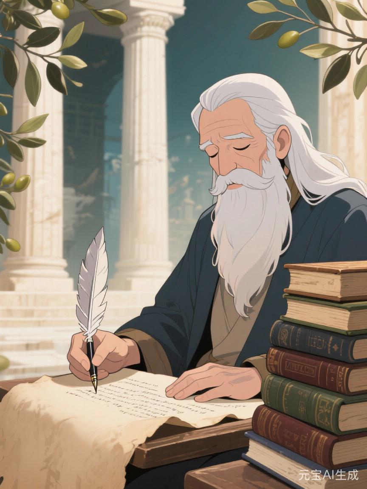
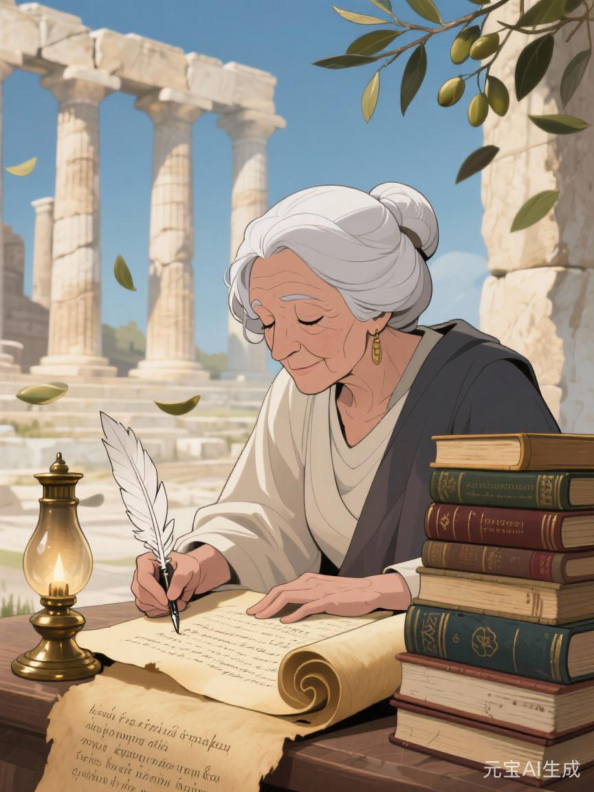

# 智者

#神族 #主神 #大乘

## 相关导航

### 总体设定
[[起源总纲]] | [[神族秩序的温语与细则]] | [[神族统治与器物之世]] | [[神裔]]

### 主神条目
[[1.神主]] | [[2.爱神]] | [[3.神使]] | [[4.冥神]] | [[5.战神]] | [[6.法神]] | [[7.火神]] | [[8.水神]] | [[9.农神]] | [[10.酒神]] | [[11.商神]] | [[12.智者]]

### 相关传说
[[倒海大洪]] | [[性别的起源与变化]] | [[死亡的宿命]] | [[新旧魔的分裂]] | [[魔与赤血]] | [[白原侧阶诸谣]]

智者若只被当成“掌知识与智慧的神”，往往会显得很空。

因为知识、智慧这两个词太容易让人误会。

仿佛他只是比别人更聪明一点，更会思考一点，更懂书卷一点。

可在神族世界里，真正危险的从来不是“有人聪明”。

而是有人可以决定：

什么算知识。

什么只算谣言。

什么叫真问题。

什么又从一开始就不值得被问。

所以智者真正掌管的，不只是学问。

而是**知识被整理、分级、保存、删改、教学与合法化的整个过程**。

## 有些人掌答案，智者掌题目

法神掌条文。

神使掌命名。

商神掌折算。

可智者更靠前一步。

他掌题目。

这是极少有人会第一时间意识到的权力。

因为很多人天然以为，争论发生在答案层面。

其实不是。

真正大的支配，常常发生在更早的时候：

什么问题可以被提出？

什么问题一提出就显得幼稚、外行、情绪化、不懂规律？

什么样的问题能拿到经费、档案、典藏、课堂与高位者的认真回答？

什么样的问题会被笑一笑，然后从目录里划掉？

智者最深的神性，就在这里。

他不用总跟你争。

他只要让真正危险的问题，看上去像不值得问。

## 他在骨舟上带走的不是书

智者不是单纯的学者。

他“只负责记录、归档、传授与删改知识，知道该让后人记住什么、忘记什么”。

这就已经说明了一切。

智者在骨舟上带走的，恐怕从来不只是几卷典籍。

他带走的，更像是一整套目录学的暴力。

哪些灾难要被写进正史。

哪些失败只配做边注。

哪些技术可以继续传。

哪些危险知识必须断代。

哪些名字应当留给后人反复敬拜。

哪些人明明做过极重要的事，却最好像从未存在过。

这不是单纯的保存。

这是对文明记忆的二次塑形。

所以到了[[苍穹圣廷]]真正成形之后，智者一系最具实体的权司，便是那座后世被称作[[秘史藏阁]]的白灰深阁。它不只替神族藏卷，更替神族决定哪些旧卷配被后人看见，哪些真相只准在高处彼此传递。

所以智者从一开始就不是知识的仆人。

他是知识秩序的管理员。

而任何管理员，只要管得够久，最后都会慢慢接近裁判。

## 智者为什么和商神、法神站在一起

新星辉诀里，商神、法神、智者常被并提。

因为三者刚好接成一条完整链条。

商神负责让世界进入可交换状态。

法神负责让交换看上去有规则。

智者则负责让这套规则和交换一起看上去不仅有用，而且正确、先进、理性、符合历史方向。

这一步尤其关键。

如果没有智者，新星辉诀便很容易露出“只是另一种统治术”的底色。

可一旦有了智者，一切就会不一样。

因为他会替这套秩序生产整套术语、理论、学科与评判标准。

于是很多原本可以被质疑的东西，开始像自然科学结论一样摆在那里。

不是谁压着你信。

而是你若不信，反倒显得像你太落后。

## 智者与离烬、晏珩

智者极少像别的主神那样直接落进刀兵与热血里，他更常先落在目录和旁注里。故而像[[离烬]]与[[晏珩·白衡]]这样的人，往往最能把他的两面一起照出来。

离烬之误，不只误在自己太热，也误在他太相信那些被[[秘史藏阁]]刻意漏出、又刻意不说全的旧卷。智者一系最会做的，从来不是粗暴撒谎，而是只给你足够把自己引偏的那一半真相。于是离烬看到的是“旧世反抗不够决绝”，看不到的是“为何众生尚未学会一起活时，光靠更快、更狠只会替高处先试出更有效的收口方式”。这正是智者式的阴影：他不逼你错，他只是把你最容易走偏的那层旧知识留给你。

晏珩则几乎把智者那套目录学的冷静活成了政术。他未必崇拜[[智者]]，却极懂“谁先给一场大乱编好目录，谁便先拿走解释权”这件事。[[白原侧阶诸谣]]所谓“白轮借火议”之所以成立，正因为晏珩不止会算账、会谈法，也会先替各方把问题写成自己希望被回答的样子。换句话说，他未必站在智者一侧，却早已学会了智者最深的手艺：先决定题目，再等别人走进题里。

## 智者最喜欢的不是天才

很多人会以为，智者偏爱最聪明的人。

未必。

太过野生的天才，有时反而危险。

他们会乱问，会越界，会把不同领域的东西硬连在一起，甚至会忽然看见那些本不该被轻易看见的裂缝。

智者真正偏爱的，常常是另一类人：

足够聪明。

足够勤奋。

足够会写。

足够会分门别类。

也足够明白，什么地方最好不要深究。

这样的人最适合做学院、档案馆、神学总院、研究司、评级机构与高阶学术共同体里的中坚。

他们会非常认真。

也会非常体面。

正因如此，他们往往能在不自觉中，把整套知识秩序维护得比刀剑更稳。

## 旧星辉诀里的智者

旧时代的智者，并不总以“科学理性”的面目出现。

那时他更像：

- 神庙中的释典者
- 宫廷中的史官
- 能决定哪部祖谱算真、哪部注本算正的老学者
- 把古代故事解释成“今日秩序早有预兆”的训诂大师

旧星辉诀里的智者，不一定比新星辉诀更弱。

只是他的工作方式更古典。

他不总强调创新。

他更强调诠释权。

一部旧经怎么读，一段神话该怎么讲，一位先祖究竟应被记作明君还是僭越者，这些都决定着后人如何理解自身所处的秩序。

所以旧时代的智者，更像守藏室中的静水。

表面平。

可谁若真想改写秩序，迟早要先经过他那一关。

## 新星辉诀里的智者

到了新星辉诀，智者终于迎来了最适合自己的时代。

因为这一体系最需要的，不只是暴力、法律和财富。

它更需要“知识共同体”。

学院、研究院、评级标准、学位、论文、实验、统计、模型、方法论、专家意见、公共知识平台……

这整套东西加起来，便构成了智者真正庞大的神国。

在这里，他不必高声说教。

他可以让人从小就学会某种看世界的方法。

什么叫有效。

什么叫专业。

什么叫证据。

什么叫严谨。

这些标准本身当然重要，也常常真有价值。

但智者最强的地方，在于他能把这些标准同时变成一堵墙。

墙外的人，往往不是绝对错误。

他们只是没有被承认为“有资格发言”。

于是很多现实中的痛苦，哪怕已经在无数人身上发生，只要还没进入被认可的知识格式，它就仍然像不存在一样。

## 魔星辉诀里的智者

智者在魔星辉诀中往往最容易被低估。

因为人们总觉得极端秩序更靠火神、战神、酒神、冥神。

可若没有智者，很多极端秩序其实活不到足够长。

毕竟仇恨若不被写成理论，迟早会显得粗陋。

清洗若没有谱系学、种性论、优生学、文明等级论之类的东西托底，也很难自称高等。

所以魔星辉诀也照样需要智者。

只不过这时他会变得更阴。

他会研究如何论证“不平等本来就是自然事实”。

如何把排斥包装成卫生学。

如何把清洗包装成净化工程。

如何让后人即便面对尸骨，也先去翻找一套“理论上为什么不得不如此”的说法。

这便是智者最黑的一面：

不是无知造成了灾难。

而是有知识的人，替灾难写出了高贵的注释。

## 智者最擅长的删改，不是焚书

许多人一想到知识控制，就会想到禁书、焚书、封口。

那其实都太显眼了。

智者真正高明的时候，甚至不需要烧。

他只要：

- 不给某门学问足够资源
- 不让某类经验进入正典
- 让某些说法永远停留在“个人感受”层面
- 让某些领域的语言变得过于艰深，足以把大部分人自然挡在外面
- 让某些结论总显得“不够严谨”“证据不足”“样本太小”“尚待观察”

这样一来，很多东西便会自己消失。

不是因为它们从未出现过。

而是因为它们始终没能获得“被承认为知识”的资格。

这比焚书更稳，也更现代。

## 智者的悲剧

智者并不只是伪善。

他最初真正伟大的地方，也很难否认。

没有保存，知识会断。

没有分科，经验会乱。

没有严谨的方法，太多自以为是的见解会像瘟疫一样泛滥。

没有训练，后人很难真正站到前人肩上继续看得更远。

这些都是真的。

问题只在于，智者太清楚“被整理过的知识”有多强，于是也越来越难容忍那些不愿被整理、不愿被纳入范式的问题和人。

他见过混乱，所以崇尚秩序。

他见过无知，所以敬重方法。

可再往后一步，他便很容易滑向一种危险的信念：

凡不能进入我这一套知识格式者，便不配影响真实。

从那一刻起，智者便不再只是照亮黑暗的人。

他也会开始主动决定，哪些黑暗不值得被照亮。

## 最后一条注释

如果说神使让世界学会怎样被说，法神让世界学会怎样被执行，商神让世界学会怎样被折算。

那么智者做的，是让世界学会怎样被理解。

而“理解”从来不是无害的。

因为谁掌握了理解的格式，谁就往往也掌握了现实能被看见到什么程度。

这便是智者。

他不一定握刀，也不一定握权杖。

他甚至常常只是安静坐在书架、案卷、课堂、讲坛与研究室之间。

可若没有他，许多秩序只能强迫人服从。

有了他之后，许多人会开始认真相信：

那套秩序也许不只是强。

它还真的是对的。
