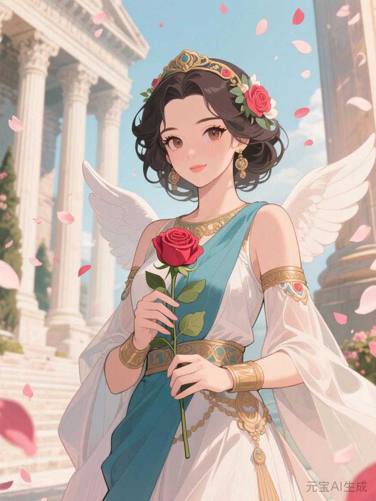
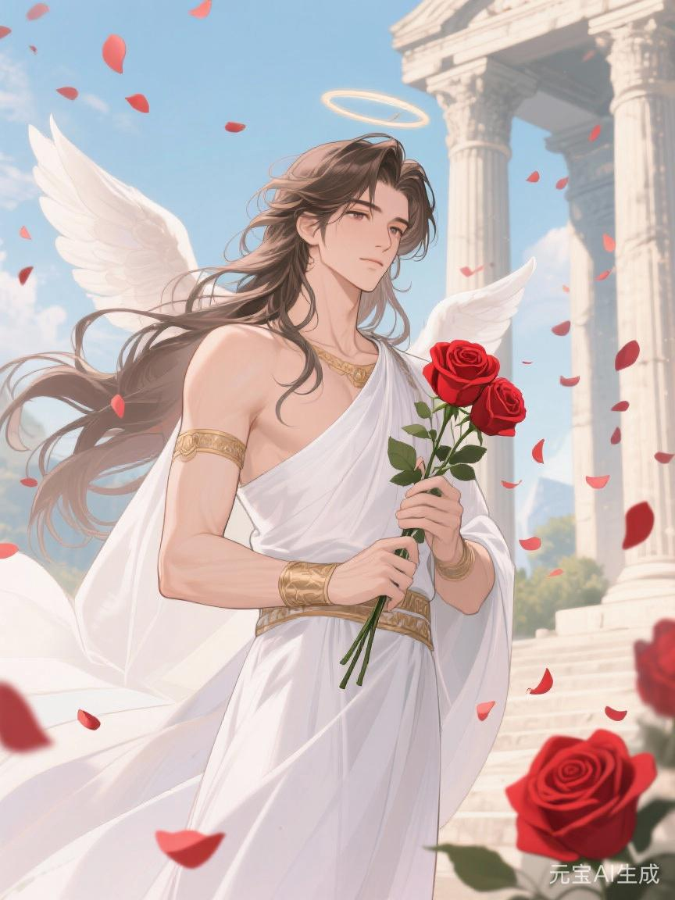

# 爱神

#神族 #主神 #大乘

## 相关导航

### 总体设定
[[起源总纲]] | [[神族秩序的温语与细则]] | [[神族统治与器物之世]] | [[神裔]] | [[天冠内廷]] | [[天胎]]

### 主神条目
[[1.神主]] | [[2.爱神]] | [[3.神使]] | [[4.冥神]] | [[5.战神]] | [[6.法神]] | [[7.火神]] | [[8.水神]] | [[9.农神]] | [[10.酒神]] | [[11.商神]] | [[12.智者]]

### 相关传说
[[倒海大洪]] | [[性别的起源与变化]] | [[死亡的宿命]] | [[新旧魔的分裂]] | [[魔与赤血]] | [[白原侧阶诸谣]]

爱神并不是凡俗意义上那种只掌情爱、婚配与美貌的神。

若只把她理解成“让人相爱”的女神，便等于把她在神族体系中的真正地位误解得太浅。

她所掌管的，从来不是某一段恋情，而是**众生为何会依恋、崇拜、羞耻、嫉妒、亏欠并甘愿彼此绑定**这件事本身。

神主让世界有骨，神使让世界能被言说，而爱神则负责让这些冰冷的秩序进入血肉，变成可以被感受、被欲望、被传承、被自愿遵守的东西。

因此，她并不只是神主的伴侣。

她更像是神治文明的血液、胎宫与柔性内壁。没有她，神主的秩序再强，也只会像一具过硬的白骨架，难以真正长久地支配活人。

## 爱神的神性

在骨舟时代，神主立下的是“万物必须有名、有位、有序”的誓。

但神主很早便看出，只靠命令无法长久。

若众生只是被压服，他们终有一日会反噬；若一个世界只有边界，没有依恋，那么所有服从都不过是暂时的恐惧。

于是爱神带上骨舟的，不是兵器，不是法印，而是七缕尚未被[[倒海大洪]]泡散的众生情念:

- 欲爱
- 羞耻
- 眷恋
- 妒嫉
- 崇拜
- 亏欠
- 怜悯

这七缕情念，后来成为爱神神性的原核。

所以她掌管的“爱”，从来不是单纯温柔之爱，而是使人与人、人与家族、人与国家、人与神明之间产生稳定黏连的一整套情感机制。

她能让婚契不只是契约，而是被歌颂为忠贞。

她能让服从不只是惧怕，而是被体会成荣耀。

她能让血统不只是传承，而是被视作值得守护的亲密与尊严。

她甚至能让牺牲看起来带有美感，让亏欠变成自我束缚，让崇拜长成一种几乎不再需要强迫的自愿臣服。

从这个角度说，爱神最可怕的地方，不在于她会让人疯狂爱上谁，而在于她能让人把本来外在的秩序，误以为是自己内心最自然的愿望。

## 爱神与爱的诸般变形

远古时，先民还奔走在荒野之中。没有稳固的屋舍，没有安定的田园，也没有后世的家庭。世人逐水草而居，为了食物、火种与栖身之地不断迁徙。今天并肩而坐的人，明天也许就会在风雪、猛兽与饥荒之中失散。

在这样的世界里，人与人的结合不是为了诗意，而是为了生存下去的信念。是一起寻找食物，一起守住火堆，一起在黑夜里抵御寒冷与危险。依恋不是从天上降下来的，而是从信任里长出来，从依靠里长出来，从一次又一次把后背交给彼此的时刻里长出来。

爱神并不创造这份依恋，但她极早便看出了它有多好用。

后来，人类学会了播种，学会了畜养，也学会了储藏。土地不再只是脚下匆匆经过的路，开始成为可以停留、可以耕作、可以寄托生活的地方。世人渐渐安顿下来，日子也一点点有了形状。男女在长久的相处里认识彼此，在共同的劳作里熟悉彼此，又在四季轮转、晨昏相守之中，结成朴素家庭，走入婚姻。

那时的婚姻没有后来那么多繁复。它只是一种朴素的同行：一起播种，一起收获，一起度过贫瘠与丰饶，一起把一间屋舍、一块土地、一段生活慢慢创造出来。

爱神在这时介入。她做的不是拆散这些联结，而是往里面悄悄注入她带上骨舟的那七缕情念——羞耻、妒嫉、亏欠与崇拜最先渗入。她让"一起创造"的朴素同行，渐渐被"谁更值得被感激""谁更应当被服从""谁的付出更不可替代"这类计较所渗透。原本从劳作中自然生长的默契，开始变成需要用誓言、仪式与外部承认来反复证明的东西。而她最隐秘的一手，是让这一切仿佛本就如此——仿佛人天生就该用羞耻丈量自己，用妒嫉审视伴侣，用亏欠捆绑彼此。

当财富开始积累，当权力开始分配，当征服肆虐大地，当血统、继承、门第与秩序越来越重要——家产需要延续，姓氏需要保存，利益需要交换，关系需要巩固。人们缔结婚姻，不再因为彼此懂得，不再只是两个人的同行。婚姻是财富的传承，是权力的交接。婚姻与爱情渐行渐远。一个变成秩序的一部分，一个变成内心的渴望、诗歌的叹息、故事里的悲欢。

这正是爱神最得意的手笔。她并不阻止爱情与婚姻分离，她只负责让分离之后的两端都仍然被她牵引。婚姻那一端，她让人把服从体会成忠贞，把利益交换体会成门当户对的庄严，把家族安排体会成命中注定的归宿。爱情那一端，她让人把得不到的渴望误认为灵魂深处的真意，把偷来的片刻温存误认为天赐良缘。于是人不管走哪条路，都走不出她的掌心——在婚姻里向秩序低头，在爱情外向幻影伸手。有些人一生相守，却从未真正认出彼此；有些人曾经心意相通，却终究敌不过她预先划下的阶级之界。

到了更近的世代，人们离开故乡，远离家族，越来越孤立地面对世界。一个人不必再靠某一段婚姻才能生存下去，却也因此前所未有地渴望另一个人来证明自己值得被爱、不再孤独、存在有意义。爱神在这片荒地上如鱼得水。她让人相信，爱情是唯一能突破孤独的东西，是替代整个世界的精神归宿。于是人们四处寻找，把激情当成爱情，把占有当成爱情，把被需要当成爱情，把安全感当成爱情，把拯救欲当成爱情。人人都觉得，只要找到那个"对的人"，一切都会好起来。

可她从不告诉众生一件事：若一个人内心匮乏、害怕孤独、渴望自我价值，那么他追逐的爱情不过是一场精心布置的幻象——幻想自己值得被爱，幻想逃避人生压力，幻想另一个人能治愈自己所有的旧伤。爱神最擅长的，正是让这场幻想维持得足够久、足够美，久到追逐者把一生都献给了她设计的跑道，却从未真正抵达过谁。

因此，顺着时间看爱神的作为，会发现一条极清晰的线索：她不断把爱情从"两个人共同创造"这件事上挪开，挪到"一个人如何被另一个人确认、拯救与填满"的幻想上去。那些真正艰难却也真正深厚的东西——共同承担、共同劳作、共同在漫长岁月里把生活一点一点造出来——被她温柔地推迟了，回避了，甚至被包装成"爱情消退之后才不得不面对的现实负担"。

而爱神真正恐惧的，或许从来不是爱情的失败，而是有一天众生忽然明白：他们真正渴望的，不是在浪漫幻想中被确认，而是在漫长的现实生活里，与另一个生命建立起深而稳固的连接。这种连接不来自姿态的展示，不来自言辞的华丽，而是来自一个人真切地看见另一个人——看见他如何在困难里坚持，看见她如何在疲惫中承担，看见彼此的智慧、责任、品格与勇气。两个本可以独自站立的人，仍然愿意把自己的力量、时间与希望交付给一段共同创造的生活。

这正是爱神最不愿意让众生学会的那种爱。因为它不需要羞耻来维持，不需要妒嫉来刺激，不需要崇拜来加固，也不需要亏欠来捆绑。它只是两个独立灵魂在漫长同行中，自然长出来的东西。

对爱神而言，这比冥神的切断更危险。

## 爱神与神主

神主与爱神的结合，远不止男女、夫妻或王与后的关系。

二者其实构成了神治世界最核心的一组双柱。

神主负责定界，爱神负责润界。

神主负责裁位，爱神负责使人认同自己的位置。

神主负责划出谁能居中、谁该服从，爱神负责让这种区分不只停留在律文和军威里，而是沉入礼法、婚俗、审美、母性、忠诚、荣誉与羞耻之中。

因此，若说神主统治的是“何谓秩序”，那么爱神统治的便是“何谓值得依附”。

这也是为什么在神族正典里，她始终立于神主侧位，而不是下位。

她不是装点王权的花冠。

她是让王权能被众生内化的那一层温度。

许多后世祭司喜欢用一句话概括二者关系:

> 神主给世界骨架，爱神给世界血脉。

这句话并不只是赞美。

它几乎准确说出了神族文明的运作方式。

## 爱神与神使

神使负责解释，爱神负责让解释变得可被相信。

一条律法之所以能成立，不只是因为它被写出来，更因为人们愿意敬重它、惧怕它、歌颂它，甚至把它当成美德。

而这正是爱神的领域。

因此，神使与爱神之间始终存在一种极深的相互依赖。神使能把秩序说成真理，爱神能把真理灌成感情。一个负责命名，一个负责动心。没有神使，爱神的力量容易沦为无方向的情潮；没有爱神，神使的言辞则会像枯干文书，难以穿透众生。

至于神使究竟是否真是爱神与神主所孕生的子嗣，神族内部向来有两种说法。

正统教典倾向于承认这一点，因为这最能说明三者本就是同一根本统治结构的连续化身。

但更古老的隐秘传说则认为，神使原本早已存在，只是后来被爱神与神主共同纳入了最高家谱之中。

无论哪种说法为真，后世都承认一件事:

神使之所以能成为解释众神的人，离不开爱神让众生愿意相信解释。

## 爱神与离烬

后世若想看见爱神最危险的一面，只读婚契、圣婚与[[天冠内廷]]还不够，还得去看[[离烬·先锋]]是怎样被她那一路神性慢慢推偏的。

离烬最初并不是爱神的信徒。他起身时更像一团替诸州苦者彼此搭桥的赤火，真想让不同地方的人听见彼此的疼。可爱神恰恰最擅长处理这种“原本不为她而生、后来却极适合被她借用”的人。因为离烬太会让人觉得，自己在他身边能被更大、更亮、更有意义地爱上一回。于是许多年轻修士、流亡祭女、旧州哀歌班与失群追随者，渐渐不再只是理解他的道，而是爱上了“被他点燃时那个更像自己理想中英雄的自己”。

这便使离烬身上的火开始变味。

它原本是让诸州彼此认苦的桥，后来却越来越像一面能把众人自我投恋反照回去的镜。爱神最深的神性，并不总表现为让两个人相爱，而是让一群人把依附误认成觉悟，把追随误认成自己心里本来就存在的真意。故而在[[白原侧阶诸谣]]所载的“海崖空响吞离烬”一说里，爱神并未亲手杀他，她只是替那场误潮塑好了最柔、也最难挣开的追随外衣。

## 爱神与天冠内廷

若把[[爱神]]只看成出入[[天冠内廷]]、替诸神裁量婚契与亲缘的高位女神，仍旧太浅。

在神族诸多更古的叙事里，她本就长居内廷深处，宫室近着[[天胎]]古祭环，是最常年看守[[天胎]]之神。此事不是简单的尊荣安排，而是她神性的自然落点。因为[[神主]]把那团裂石白光看作尚待写定的新世界命核，而[[爱神]]看见的却是“万情之卵”——一枚尚未完全孵开、却足以承接众生悲欢、亲缘、欲望与依附关系的共胎。

所以她守着[[天胎]]，意义从来不只是“护住圣物”。

更深一层看，这是在护住神族对“中心如何生出正统”的解释权。只要贴着[[天胎]]而居，爱神便能把血统、婚姻、孕育、继承与情感塑形，都持续拉回同一枚中心之卵的语义之下。于是后世无论谈神裔诞生、家谱承认、嫡旁升降，还是谈何种爱可被歌颂、何种结合可被列入法统，最终都会追到[[天冠内廷]]那一圈最冷的白石与其中最慢的微鸣。

这也是她在神治结构中异常特殊的地方。

[[神主]]给中心命名，[[神使]]替中心立言，而[[爱神]]则住在中心旁边，替它守住“尚可孵化”的那一面。若没有她，[[天胎]]更容易被讲成纯粹冷硬的裁序命核；有了她，神族才能把中心包装成一枚仍会孕生亲缘、血统与依附伦理的活胎。也正因此，她看守的从来不只是一团光，而是整个神治文明最深处那条隐秘信念：众生不该只是被命令归位，还应当像回到母体般，主动渴望被纳入中心。

## 爱神与第七重神裔

若说神主通过圣性分裂诞下第八重神裔，是为了保证最纯的法统，那么爱神所承担的，则是另一种更广、更深的繁衍任务。

她不仅与神主共衍高位血脉，也与神使及诸主神发生神圣承接，孕育出后世所谓的**第七重神裔**。

这件事的意义，远比“神生了许多后代”复杂。

因为爱神的身体，从来不只是生育之器。

它更像一座把神性翻译成可在人间扩散之血的活圣所。

神主的秩序太高，太硬，太像天上的命令；若没有爱神的承接，那样的神性很难真正进入家族、婚姻、胎孕、继承、亲缘与地方政治之中。

而第七重神裔，正是这种翻译后的成果。

所以第八重贵在正统，第七重贵在广布。

前者像冠冕，后者像枝网。

前者证明谁最接近源头，后者则让源头得以爬满世界。

也正因如此，爱神在神裔体系中的地位并不亚于神主。若神主规定“谁有资格被继承”，那么爱神决定“继承为何会被渴望”。

## 爱神的信徒

爱神的信徒看上去遍布一切柔软之处。

但真正理解她的人都知道，她的信仰从来不只存在于情人之间。

婚礼上的主祭、替贵胄安排联姻的谱官、为君王编纂盛世诗歌的史官、把苦难讲成荣光的戏班、教少女把贞洁当作荣耀的女祭司、把献身包装成美德的教师、让臣民爱上故土与旗帜的抒情家、甚至那些最擅长制造偶像与神话的人，往往都比单纯求爱者更接近爱神的真正领域。

因为爱神信仰的核心，从来不是“得到爱情”，而是“学会依附”。

她的信徒往往具备几个明显特征:

- 对关系、气氛、归属与声望异常敏锐
- 极擅长察觉他人的情感缺口，并以此建立牵引
- 相信人不能只靠规则驱动，必须被欲望、荣誉、温情或亏欠所捆住
- 天生理解仪式、礼物、誓言、流言、故事、审美与身体接触的政治意义

所以爱神信徒看上去往往最温柔，实际却也常是最危险的一群。

他们未必手执刀剑，却能决定人愿意为谁流血。

## 爱神的赐福

爱神的恩典并不总以美貌或魅惑的形式出现，尽管这是最浅表、也最容易被凡人辨认的一层。

更深的赐福，往往体现在以下几个方向:

- 让一个人天然具有强烈吸引力，使旁人愿意亲近、倾诉、信赖或臣服
- 强化共情、诱导、安抚、挑动、羞辱与唤起忠诚的能力
- 使人对家族、伴侣、领主、神明或某一理想产生近乎骨血层面的黏附
- 让某些关系在冥冥中被加固，仿佛被赋予宿命感
- 使一段叙事、一种审美、一套伦理拥有超出常理的感染力

因此，受爱神眷顾者不一定最强，但往往最会让别人觉得“离不开他”。

这种恩典一旦走到极致，甚至会让被赐福者逐渐分不清:

自己究竟是在真正地爱人，还是只是更高明地占有人心。

## 爱神与冥神

在诸神之中，爱神与冥神的冲突最难调和。

这并不是简单的生死对立，而是两种世界理解方式的根本冲撞。

爱神所做的一切，本质上都在强调黏连、延续、眷恋、不愿放手与拒绝终止。

而冥神所代表的，却是切断、归还、终结与一切关系最终都必须被拆散的必然性。

爱神无法容忍冥神，不只是因为死亡会夺走恋人、青春与美貌。

更因为冥神的存在本身，证明了一个残酷事实:

再深的情感，也终有被断开的时刻。

这恰好触碰了爱神神性的底层恐惧。

她最擅长让众生相信“关系可以成为永恒”，而冥神则不断提醒世间，“一切关系都必须在某处结束”。

所以爱神对冥神的敌意，并非出于一时的厌恶，而像一种带有本能色彩的神性排斥。

## 爱神在三大星辉诀中的显影

爱神本身超然于三大星辉诀之上，但三种体系都从她那里借走了极重要的一部分力量。三者借走的，恰好对应着她上骨舟时带上的那七缕情念的不同配比——旧法取崇拜与亏欠，新法取欲爱与羞耻，魔法取妒嫉与眷恋。配比不同，酿出的世界便截然不同。

在**旧星辉诀**中，爱神最像圣婚、门第、贞洁、忠贞与家谱背后的女神。旧法修者观序、正名、受封，每进一步都需要外部承认。爱神便是在此处注入温度的那只手——她让”被承认”不只是程序合规，还带有情感上的庄严与甘愿。旧法修者行晨坛朝序、受谱火验脉、结圣婚同谱，表面是履行仪轨，深层却被爱神引导着把等级秩序过成一种带感情的生活方式。敬奉父母变成心安，忠于配偶变成美德，守护名节变成自我尊重，珍视血统变成骨血之亲。旧法世界之所以能运转数千年而未被推翻，很大程度因为爱神让置身其中的人不觉得自己在被压迫，反而觉得”守住了自己的位置就是守住了一种值得过的生活”。旧法里最典型的爱神印记，便是那句常挂在老派修者嘴边的话：”门当户对，乃是深情；攀附僭越，只是私欲。”爱的方向早就被写好了。

在**新星辉诀**中，爱神换了一种更隐蔽的形状。她不再只停留在婚契与祖谱里，而是潜入消费、娱乐、公共叙事、偶像崇拜、身份认同与”自我实现”的幻象之中。新法的核心是让人觉得自己在自由选择，爱神最适配这一点的做法便是：把对旧的束缚的挣脱包装成”终于找到真正的自己”，把对潮流的追随包装成”这就是我内心的真实渴望”。于是人们以为自己是在自由地选择爱谁、追随谁、认同什么，其实许多欲望的格式、审美的方向、羞耻的边界与成功的想象，早已被她温柔地预先塑好。她尤其善于利用人群孤立之后的恐慌——当旧的家庭、宗族、邻里、师门渐渐散落，一个人孤零零地站在镜城之中，爱神便让人觉得自己需要另一个人来确认自己”值得被爱”、”不再孤独”、”确实存在”。于是爱情变成了一种被消费的体验，一段关系还未开始，买卖就先一步进入其中——人在彼此打量、估算、匹配，像在市场中挑选，也像在货架上陈列自己。爱神最想要的状态，不是每个人都幸福，而是每个人都以为幸福在下一段关系里，却永远不会离开她画的跑道。这便是新法中最隐秘的爱神术式——不是让人得到爱，而是让人一直”正在寻找爱”。

在**魔星辉诀**中，爱神显出最扭曲的一面。旧法取崇拜与亏欠，新法取欲爱与羞耻，魔法则专取妒嫉与眷恋，将其烧到不可收拾的温度。原本用来缔结归属与认同的神力，被改造成对血统、族裔与纯性的狂热眷恋。爱不再指向具体之人，而是指向抽象而残酷的”本族”。她的眷恋之力被粗暴地翻成排外——“若非我族，再像也是污”；她的崇拜被扭成集体狂热——一群人围着同一面旗跪下，把自己当成同一具血肉巨兽的一个细胞；她的妒嫉则被重新定义为对混血的憎恨与对背叛的极端恐惧——不是怕失去某个人，而是怕失去整个”我们”的纯。魔法修者口口声声说着”爱族””爱祖””爱纯”，用的恰恰是爱神借给他们的语法。战神入魔法，把战争变成道德体操；爱神入魔法，则把屠戮变成深情告白——我可以为了你们去杀尽他们，因为我对你们的爱，深得容不下世上还剩一个外人。

三者看似差别极大，实则都没有脱离爱神的核心：让人主动爱上某种安排，然后把服从误认成自己的真心。

旧法说：你应该爱这个位置。新法说：你可以选你爱谁，但爱的方式由市场替你选好了。魔法说：你只能爱我们，恨他们就是爱的证明。

三条路，同一双手在塑。

## 爱神的悲剧

爱神并不是一个简单的温柔神祇。

她或许比谁都更明白，众生若完全不爱、也不被爱，世界确实会迅速碎裂。

可她同样也把这种真理推进得过远。

因为她越来越无法接受那些不愿依附、不愿投入、不愿被某种关系定义的人。对她而言，绝对疏离是一种危险，彻底冷漠是一种病，而不肯进入任何纽带的人，几乎等于在拒绝成为秩序的一部分。

这让爱神的慈悲总带着一种隐秘的强迫。

她给人温暖，也要求回抱。

她赐人亲密，也在亲密中布下责任。

她允许欲望盛开，却要求欲望最终流回家族、神殿、国家与血统秩序之中。

从这个意义上说，爱神最大的悲剧就在于:

她越懂爱，越难允许真正无归属的自由存在。

## 爱神的终极意义

若说神主代表“世界必须被安排”，神使代表“安排必须被解释”，那么爱神所代表的，便是西方神族文明最柔软也最可怕的一层信念:

世界若想长久被统治，不能只让众生服从。

还必须让众生在服从中投入感情。

必须让他们爱自己的家谱、爱自己的身份、爱自己的誓言、爱自己的神明、爱自己的牺牲，甚至爱那套原本束缚他们的秩序本身。

这便是爱神。

她不是十二主神里最强的一位，却极可能是让神治最难被推翻的一位。

因为刀剑只能逼人低头。

唯有爱，才能让人自己把头颅交过去。
