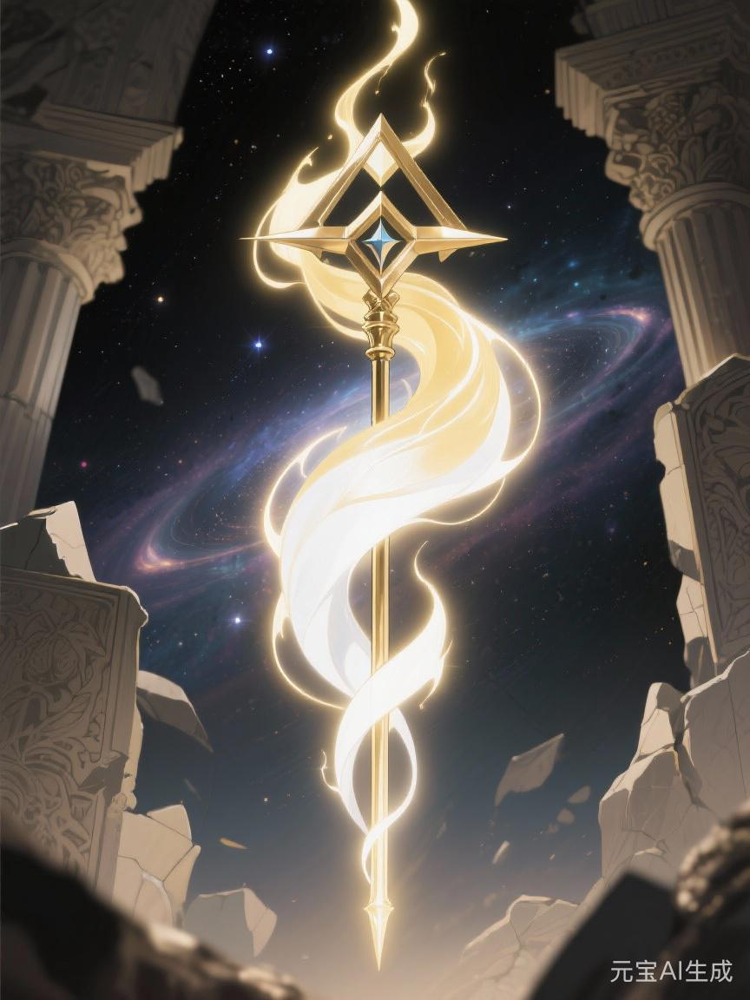
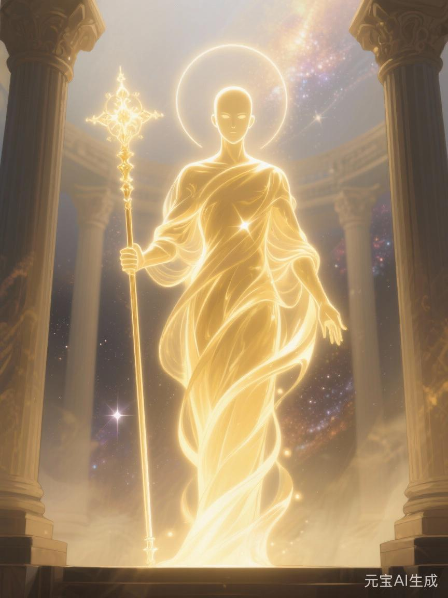
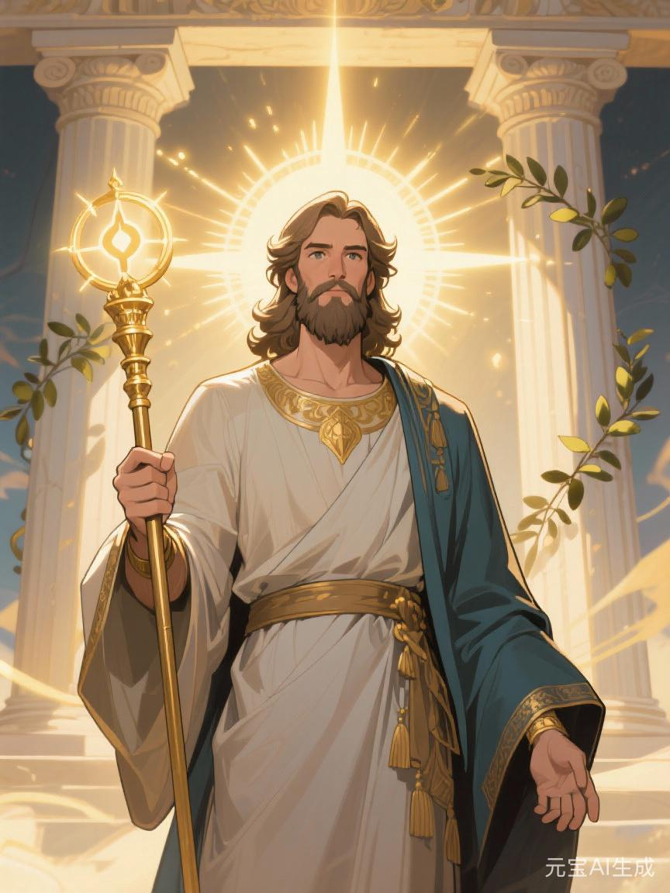
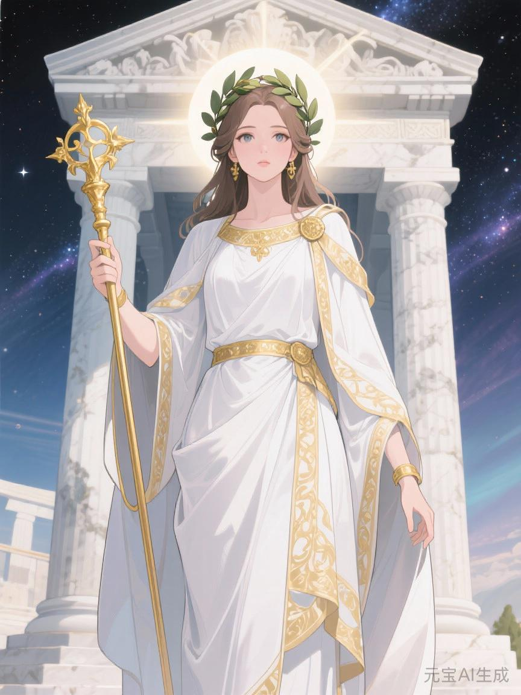

# 神主

## 总述
神主是十二主神之一，在神族体系中占据着至高无上的地位。作为超然的存在，神主不参与三大星辉诀体系的分裂，而是维护神族的整体统一和秩序。神主与爱神是夫妻关系，两人共同构成神族最高领导核心。神主的信徒遍布各个阶层，对所有虔诚的信徒都给予平等的赐福。

## 在新星辉诀中的体现
**神祇地位**：最至高无上的神
**阵营归属**：中立超然，不参与分裂
**赐福倾向**：对所有信徒平等赐福，无特定偏好
**信徒特征**：
- 覆盖所有社会阶层的信徒
- 以统治者和权威者为主要祭司
- 维护神族整体利益的中立信徒

**统治特征**：
- 超然于三大体系之外的最高存在
- 维护神族内部的统一和秩序
- 协调各主神之间的关系和矛盾
- 代表神族的整体意志和利益

**族裔构成**：
- 在各个社会阶层都有神主的信徒
- 以高级官员和统治者为核心族裔
- 维护社会秩序和权威的中坚力量

## 在旧星辉诀中的体现
**神祇地位**：最至高无上的神
**阵营归属**：中立超然，不参与分裂
**赐福倾向**：对所有信徒平等赐福，无特定偏好
**信徒特征**：
- 覆盖封建社会各阶层的信徒
- 以皇帝和教皇为主要祭司
- 维护神权和世俗权力的平衡

**统治特征**：
- 在封建体系中维持神族的神圣性
- 为世俗统治者提供神圣合法性
- 监督各主神的行动和影响
- 确保神族意志的正确传达

**族裔构成**：
- 在封建社会各等级都有信徒
- 以皇室和教廷为核心族裔
- 维护封建秩序和神权的支柱

## 在魔星辉诀中的体现
**神祇地位**：最至高无上的神
**阵营归属**：中立超然，不参与分裂
**赐福倾向**：对所有信徒平等赐福，无特定偏好
**信徒特征**：
- 在种族隔离体系中的各个阶层都有信徒
- 以最高神族领袖为主要祭司
- 维护神族血统的纯净和权威

**统治特征**：
- 在种族体系中保持超然的地位
- 监督种族清洗和统治的执行
- 维护神族内部的血统纯正
- 协调种族之间的关系

**族裔构成**：
- 在神族各个阶层都有信徒
- 以种族领袖和血统贵族为核心
- 维护种族优越和纯洁的守护者

## 三种体系中的共同特征

### 超然本质
- **统一维护**：维护神族的整体统一和团结
- **秩序监督**：监督各主神的行为和影响
- **利益代表**：代表神族的整体利益和意志
- **超然中立**：在三大体系的争端中保持中立

### 族裔特征
- **全阶层覆盖**：信徒分布在各个社会阶层
- **权威核心**：以统治者和权威者为主要族裔
- **秩序维护者**：维护现有秩序和社会稳定

### 赐福特征
- **平等赐福**：对所有信徒给予平等的神恩
- **无偏无私**：不偏袒任何特定的信徒群体
- **普度众生**：关注所有信徒的福祉和需求
- **公正平衡**：在信徒之间保持公正和平衡

## 历史演变
神主在神族历史中的地位和作用：

### 神族统一期
- 维护神族内部的团结和统一
- 协调各主神之间的关系和利益
- 监督神族对外的统治和扩张
- 确保神族意志的统一执行

### 体系分裂期
- 超然于三大体系的争端之外
- 维护神族的基本统一和秩序
- 协调各阵营之间的矛盾和冲突
- 防止神族内部分裂和瓦解

### 秩序维护期
- 在各个体系中维持神族的神圣性
- 为各体系的统治提供合法性支持
- 监督各体系对神族意志的执行
- 协调不同体系之间的合作关系

## 社会功能
神主在不同体系中的社会功能：

### 秩序维护
- 维护神族内部的基本秩序和统一
- 在各体系中保持神族的权威和地位
- 协调不同信仰群体之间的关系
- 防止内部分裂和冲突

### 权威代表
- 代表神族的整体意志和利益
- 为各体系的统治提供神圣合法性
- 维护神族在各族群中的崇高地位
- 确保神族意志的正确传达

### 协调平衡
- 协调各主神之间的关系和利益
- 平衡不同体系之间的权力分配
- 调解神族内部的矛盾和冲突
- 维护神族内部的和谐和稳定

## 终极目标
神主的终极目标是：
- **神族统一**：维护神族的永恒统一和团结
- **秩序永恒**：建立永恒的神族统治秩序
- **超然权威**：保持超然于争端的最高权威
- **意志统一**：确保神族意志的统一执行

无论在何种体系中，神主的本质都是维护神族的整体统一和秩序，他们是神族体系中最重要超然力量和平衡者。
