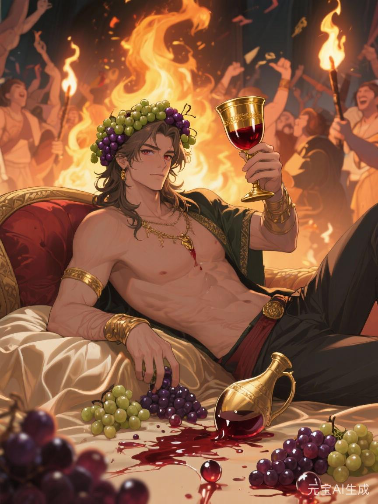
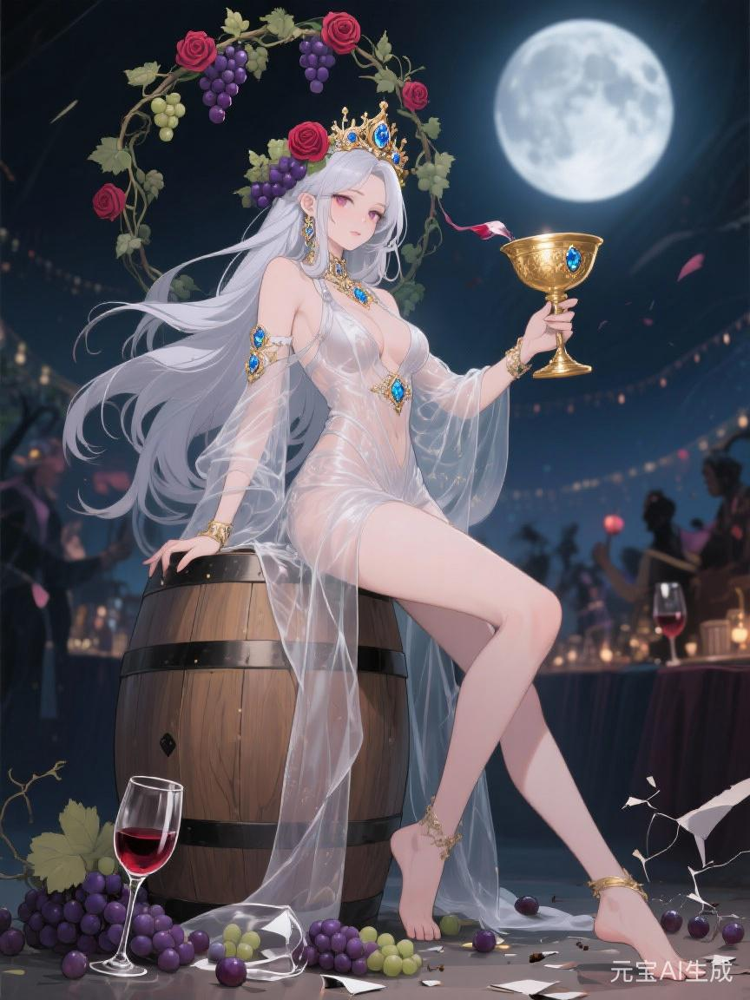

# 酒神

## 相关导航

### 总体设定
[起源总纲](../起源总纲.md) | [神族秩序的温语与细则](../神族秩序的温语与细则.md) | [神族统治与器物之世](../神族统治与器物之世.md) | [神裔](../神裔.md)

### 主神条目
[神主](./1.%20神主.md) | [爱神](./2.%20爱神.md) | [神使](./3.%20神使.md) | [冥神](./4.%20冥神.md) | [战神](./5.%20战神.md) | [法神](./6.%20法神.md) | [火神](./7.%20火神.md) | [水神](./8.%20水神.md) | [农神](./9.%20农神.md) | [酒神](./10.%20酒神.md) | [商神](./11.%20商神.md) | [智者](./12.%20智者.md)

### 相关传说
[性别的起源与变化](../传说/1.%20性别的起源与变化.md) | [死亡的宿命](../传说/2.%20死亡的宿命.md) | [新旧魔的分裂](../传说/3.%20新旧魔的分裂.md) | [魔与赤血](../传说/4.%20魔与赤血.md)

很多人一提酒神，最先想到的是欢宴、狂热、肉体、歌舞、醇香与放纵。

这当然没错。

但若只停在这里，便根本还没摸到酒神真正危险的那一层。

因为酒从来不只是用来快乐的。

酒也用来忘。

用来拖。

用来把不该问的话咽回去。

用来让人觉得，既然今晚还能笑，很多事情便不必非得现在就翻脸。

所以酒神真正掌管的，并不是简单的纵欲。

他掌管的，是**如何让疲惫可被消费，让怨恨可被稀释，让群体在半醉半醒之间继续维持可统治的热度**。

## 第一杯

第一杯酒总最无辜。

庆功时喝。

婚礼上喝。

丰收时喝。

死者下葬后也喝。

它看起来像人与人之间最正常的缓和之物。白日里的拘束、身份、等级、谨慎，到这里都可以暂时松一松。战士不必再那么紧，商人不必再那么算，农人不必再那么闷，连一些最刻板的祭司，也可以在这时候宽出半寸脸色。

这便是酒神最早、也最容易被喜欢的一面。

他让世界有了喘气的地方。

而这恰恰解释了为什么他后来会如此可怕。

因为凡能让人喘气者，也就最知道，怎样控制别人究竟能喘到哪一步。

## 第二杯

第二杯之后，事情就开始不同了。

酒神最强的地方，不在让人完全失控。

那太粗了，也太容易坏事。

他真正高明之处，在于让人保持一种恰到好处的不清醒。

还有判断力。

却不够冷。

还有痛感。

却不够尖。

还记得自己受过什么。

却已经没有力气立刻为此做什么。

这是一种很适合被统治的温度。

你不会彻底死心，所以还能继续活。

你也不会彻底清醒，所以还不至于立刻掀桌。

酒神最擅长的，便是把整座城市、整支军、整片边地，都调在这种半醉半醒的温度上。

## 宴席为什么总在苦之后

神族很懂一件事：

人不是一直压着就会顺。

压太久，会断。

所以真正成熟的统治，从来都知道何时该给人一场盛大的宽免。

大战刚过，要开宴。

征役太久，要放节。

歉收之后，也未必立刻全禁，反而更要给一两次庙会和集饮，让人觉得这一年总还剩一点值得笑的地方。

于是酒神便负责那一层极细的社会调温。

他不消灭苦。

他让苦变得可以继续被忍下去。

这就是为什么酒神从来不只是享乐之神。

他更像一个高明的麻醉师。

不是为了让你立刻快乐。

而是为了让你不要在最该清醒的时候过分清醒。

## 酒神为什么会进入魔星辉诀

很多人一开始会觉得奇怪。

火神、冥神进入魔星辉诀都很容易理解，酒神为什么会在其中占那样重要的位置？

答案其实很简单。

因为极端秩序若想维持下去，不能只靠恐惧。

还要靠兴奋。

只靠杀，会疲。

只靠法，会冷。

只靠纯血论，会枯。

必须还有狂欢、节庆、群唱、胜利幻觉、仇恨被点燃时那种几乎像醉酒一样的轻飘与热烈。

酒神负责的，正是这种群体性的醉。

于是酒在魔星辉诀里，便不再只是杯中物。

它会变成：

- 胜利游行
- 仇敌画像前的集体狂欢
- 专为“正血者”设立的欢宴场
- 让青年在歌与酒里学会轻视他人、崇拜自身的节日
- 把清洗包装成庆典，把征服包装成节庆高潮的整套文化机器

火神让人烧。

冥神让人死。

酒神则让人觉得，这一切居然还值得举杯。

## 酒神不只掌酒

若酒神只管饮酒与肉欲，还是太窄。

他真正掌的是一切能把人从现实里轻轻挪开半步的东西。

酒只是最古老的形式。

后来还会有香、梦、戏、节、歌、赌、夜市、艳色、传唱、流行故事，乃至一整套让人不断期待“下一个更快活的晚上”的生活编排。

所以酒神的信徒，也未必是酿酒师与宴会祭司而已。

他们还可能是：

- 戏班与歌馆的操持者
- 最懂如何为城市设计夜生活的人
- 能把惨败改唱成豪迈之歌的人
- 擅长让疲兵、穷民与失意者重新燃起某种廉价热情的人
- 用幻梦、享乐与持续分心来削弱清醒的人

酒神的高明，不在让人永远快乐。

永远快乐太难，也太假。

他只需要让人不断觉得：

再撑一阵，晚上总还有点什么。

## 旧星辉诀里的酒神

在旧星辉诀中，酒神不是核心支柱，却绝非边角装饰。

因为封建社会最讲仪式，而仪式最离不开酒。

婚契要酒。

祭祖要酒。

凯旋要酒。

封赏要酒。

盟誓要酒。

甚至连杀头前后的秩序修补，也常要靠酒来完成。

所以旧时代的酒神，更像那种掌节庆、掌庆吊、掌贵族宴饮和民间狂欢边界的神。

他的危险并不总是粗暴的麻痹。

更常见的是，他让人学会把很多本来应当深究之事，一次次在席间化掉。

爵位来路不净？

先饮。

边民新死太多？

先祭，再饮。

一家人世代久役？

庙会上给个大节，让他们自己也跟着笑一晚。

于是许多裂痕，便总是差一点真正裂开。

## 新星辉诀里的酒神

到了新星辉诀，酒神反而比过去更庞大。

因为这时他的力量早已不必局限于真正的酒液。

他可以藏在：

- 娱乐工业
- 情绪消费
- 夜间经济
- 成瘾性内容
- 精神慰藉产业
- 大规模分发的廉价快乐

旧时代的酒神让人赴宴。

新时代的酒神让人持续在线。

持续刷。

持续看。

持续投入一点点时间、一点点钱、一点点注意力，换一点点短促而不断更新的满足。

这比一场大醉更稳。

因为大醉总会醒。

而这些东西，往往不必让你彻底醉死。

它们只要让你不那么清醒，就够了。

所以新星辉诀里的酒神极擅长一件事：

把“麻痹”包装成“放松”，把“分心”包装成“治愈”，把“习惯性逃避”包装成“每个人都需要自己的出口”。

这套逻辑不全是假。

可它一旦被系统化，便会成为一种极强的社会止痛剂。

而止痛剂最大的价值，从来不在治病。

而在让病人暂时不闹。

## 酒神最喜欢的不是醉鬼

酒神未必最喜欢烂醉如泥的人。

那种人太容易坏事，也太容易提早报废。

他更喜欢的是：

白日里还能工作、还能服从、还能说自己很清醒，夜里却必须靠某些东西把自己慢慢泡软的人。

这种人才最稳。

因为他们既没有彻底疯，也没有彻底醒。

他们仍能替秩序运转齿轮。

又会在每一次想停下来的时候，自觉去找下一杯、下一场、下一夜、下一点微小却足够拖住自己的快意。

这才是酒神真正稳定的信徒来源。

## 最后一杯

如果说战神让人流血，法神让人照章，商神让人计算，火神让人承受高温。

那么酒神做的，是让人把这些都再多忍一阵。

他的神性并不总显得邪恶。

相反，它常常显得很有人情味。

谁不需要放松呢？

谁不需要忘掉一点痛呢？

谁不想在漫长而沉重的日子里，哪怕只换来一点短促的快活呢？

问题只在于：

当一整个世界都越来越依赖这种快活来维持自己时，它究竟是在活，还是只是被麻醉得足够久，还没来得及真正醒来？

这便是酒神。

他给你的那一杯，未必有毒。

可他真正想要的，也从来不是毒死你。

他只是想让你别那么快清醒。
