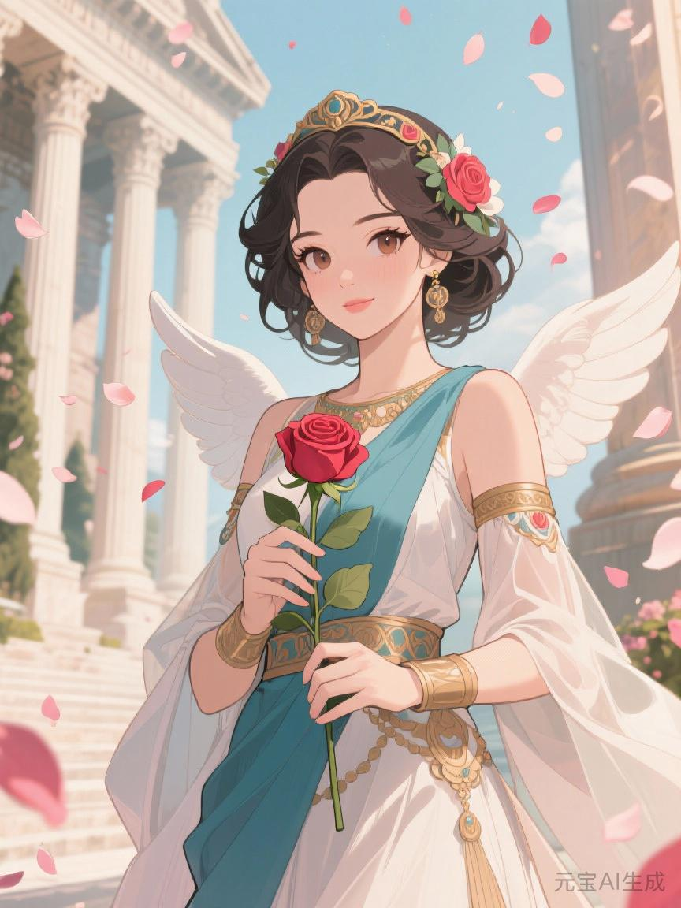
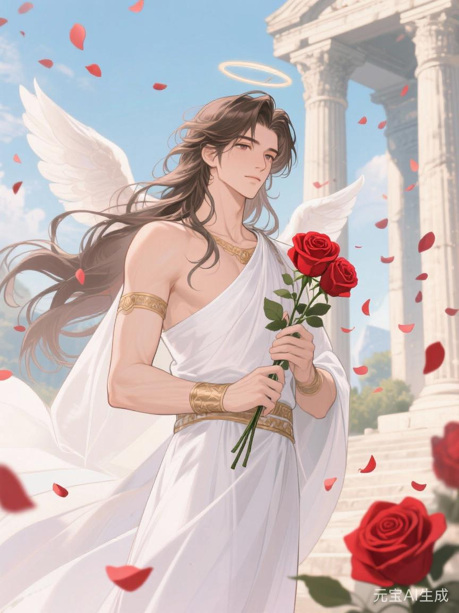

# 爱神

## 总述
爱神是十二主神之一，掌管情感控制、文化操纵和意识形态塑造。作为超然的存在，爱神不参与三大星辉诀体系的分裂，而是维护神族在情感和文化领域的整体影响力。爱神与神主是夫妻关系，两人共同构成神族最高领导核心。爱神的信徒遍布各个阶层，对所有虔诚的信徒都给予平等的赐福。爱神与神主交合产生了神使。

## 在新星辉诀中的体现
**神祇地位**：十二主神之一，仅次于神主的高级存在
**阵营归属**：中立超然，不参与分裂
**赐福倾向**：对所有信徒平等赐福，无特定偏好
**信徒特征**：
- 覆盖所有社会阶层的信徒
- 以文化精英和知识分子为主要祭司
- 维护情感和谐和文化交流的中立信徒

**统治特征**：
- 超然于三大体系之外的高级存在
- 维护神族在情感和文化领域的统一
- 协调各主神在文化领域的影响
- 代表神族在情感世界的整体意志

**族裔构成**：
- 在各个社会阶层都有爱神的信徒
- 以文化工作者和艺术家为核心族裔
- 维护情感交流和文化理解的桥梁

## 在旧星辉诀中的体现
**神祇地位**：十二主神之一，仅次于神主的高级存在
**阵营归属**：中立超然，不参与分裂
**赐福倾向**：对所有信徒平等赐福，无特定偏好
**信徒特征**：
- 覆盖封建社会各阶层的信徒
- 以诗人和艺术家为主要祭司
- 维护情感表达和艺术创作的平衡

**统治特征**：
- 在封建体系中维护情感和文化的神圣性
- 为文化创作和情感表达提供神圣支持
- 监督各主神在文化领域的行为
- 确保情感和文化交流的和谐

**族裔构成**：
- 在封建社会各等级都有信徒
- 以文人墨客和艺术大师为核心族裔
- 维护情感表达和文化传承的使者

## 在魔星辉诀中的体现
**神祇地位**：十二主神之一，仅次于神主的高级存在
**阵营归属**：中立超然，不参与分裂
**赐福倾向**：对所有信徒平等赐福，无特定偏好
**信徒特征**：
- 在种族隔离体系中的各个阶层都有信徒
- 以情感管理者和文化控制者为主要祭司
- 维护种族间情感理解的协调者

**统治特征**：
- 在种族体系中保持情感领域的超然地位
- 监督种族文化政策和情感管理
- 维护种族间基本的情感交流
- 协调不同种族在情感领域的矛盾

**族裔构成**：
- 在各个种族中都有爱神的信徒
- 以跨种族文化工作者为核心族裔
- 维护种族间情感理解的和平使者

## 三种体系中的共同特征

### 爱的本质
- **情感操控**：通过情感控制来实现统治目的
- **文化霸权**：建立有利于统治的文化体系
- **思想塑造**：塑造符合统治需要的价值观
- **社会整合**：通过情感纽带整合社会秩序

### 族裔特征
- **文化精英**：出身于具有文化传统的贵族阶层
- **思想专家**：掌握各种思想控制和文化传播技巧
- **情感大师**：善于利用情感来影响和操控他人

### 统治手段
- **文化渗透**：通过文化产品传播统治思想
- **教育塑造**：通过教育体系培养顺民
- **娱乐麻痹**：通过娱乐内容麻痹民众意志
- **情感操控**：利用情感需求来控制行为

## 历史演变
爱神在不同历史时期有不同体现：

### 封建时代
- 旧星辉诀时期的教会神职人员
- 通过宗教仪式控制民众的教会贵族
- 掌握教育和道德体系的宗教知识分子

### 商业时代
- 新星辉诀时期的文化产业巨头
- 通过媒体和娱乐业影响公众的文化资本家
- 掌握现代传播手段的文化精英

### 种族时代
- 魔星辉诀时期的种族主义宣传者
- 传播种族仇恨思想的文化帮凶
- 协助种族统治的思想代理人

## 情感操控手段
爱神采用的情感操控手段包括：

### 宗教操控
- 利用宗教信仰控制民众思想
- 制造宗教神秘感和敬畏感
- 通过宗教仪式强化等级观念
- 利用宗教审判压制异端思想

### 文化操控
- 创作有利于统治的文化作品
- 建立文化符号和象征体系
- 通过文化传统巩固统治合法性
- 利用文化认同增强社会凝聚力

### 情感操控
- 利用爱情、亲情等情感纽带
- 制造情感依赖和归属感
- 通过情感激励动员民众
- 利用情感恐惧维护秩序

### 娱乐操控
- 通过娱乐内容转移民众注意力
- 制造虚假满足感和幸福感
- 利用娱乐明星塑造价值观
- 通过娱乐消费促进经济剥削

## 意识形态塑造
爱神在不同体系中的意识形态塑造：

### 等级意识形态
- 宣传等级制度的天然合理性
- 强调各安其位的道德正当性
- 塑造服从权威的文化传统
- 维护等级和谐的社会秩序

### 个人主义意识形态
- 宣扬个人奋斗和自由竞争
- 强调机会均等的虚假承诺
- 塑造消费主义的生活价值观
- 维护经济剥削的社会秩序

### 种族主义意识形态
- 宣传种族优劣的理论
- 强调血统至上的价值观
- 塑造种族仇恨的文化传统
- 维护种族统治的社会秩序

## 剥削本质
爱神的剥削本质体现在：

### 情感剥削
- 利用民众的情感需求进行剥削
- 通过情感承诺获得无偿劳动
- 制造情感依赖来维持统治
- 利用情感伤害来压制反抗

### 文化剥削
- 通过文化产品获取经济利益
- 利用文化符号巩固统治地位
- 通过教育体系培养顺民
- 利用文化传统维护剥削秩序

### 思想剥削
- 控制思想来控制行为
- 利用意识形态来合法化剥削
- 通过价值观塑造来维持统治
- 利用思想压制来消除反抗

## 社会功能
爱神在不同体系中的社会功能：

### 维系秩序
- 通过情感纽带维系社会秩序
- 利用文化认同增强社会凝聚力
- 通过价值观整合减少社会冲突
- 利用思想控制维护社会稳定

### 合法化统治
- 通过文化传统合法化统治
- 利用宗教信仰神化统治者
- 通过意识形态合理化剥削
- 利用情感认同增强统治合法性

### 社会动员
- 通过情感激励动员民众
- 利用文化宣传凝聚共识
- 通过价值观塑造引导行为
- 利用思想统一实现集体行动

## 终极目标
爱神的终极目标是：
- **情感控制**：完全控制民众的情感世界
- **文化霸权**：建立绝对的意识形态霸权
- **思想统一**：实现全社会思想的完全统一
- **永恒统治**：通过情感和文化手段实现永恒统治

无论在何种体系中，爱神的本质都是通过情感控制和文化操纵来维护神族的统治地位，他们是神族剥削体系中最重要的意识形态工具和文化卫士。
