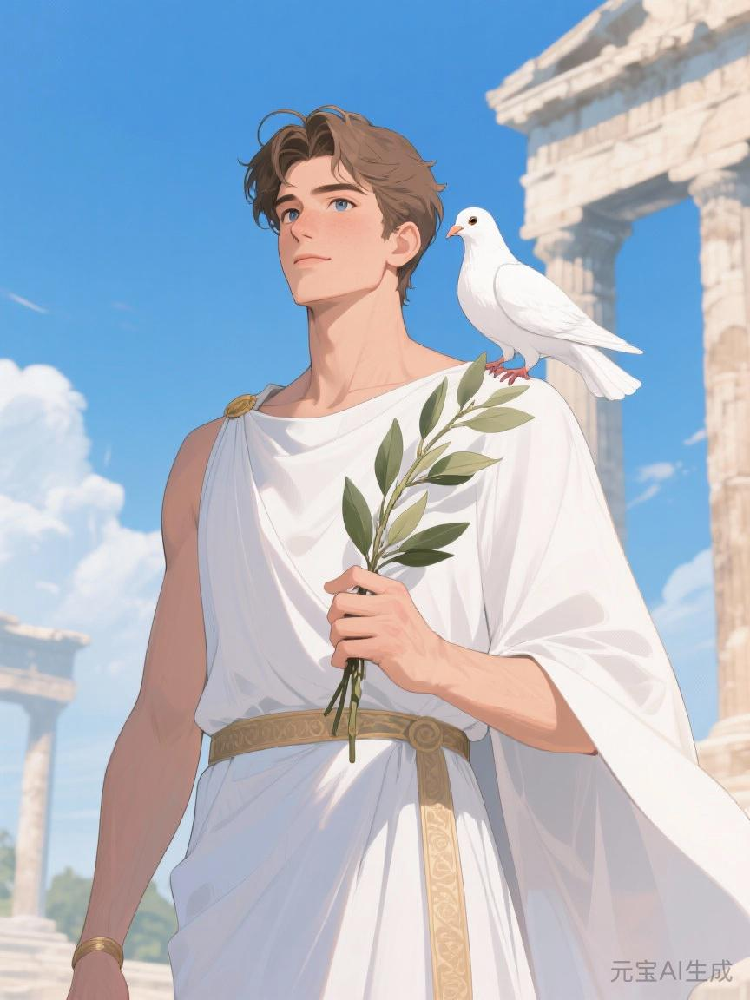
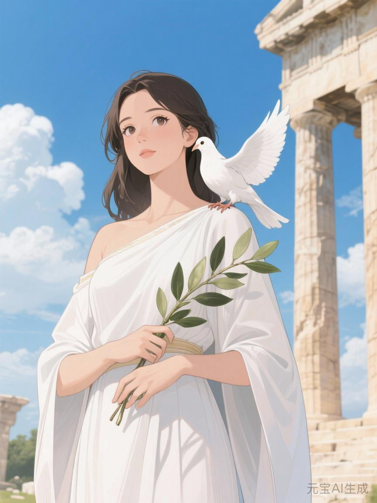

# 神使

## 相关导航

### 总体设定
[[起源总纲]] | [[神族秩序的温语与细则]] | [[神族统治与器物之世]] | [[神裔]]

### 主神条目
[[1.神主]] | [[2.爱神]] | [[3.神使]] | [[4.冥神]] | [[5.战神]] | [[6.法神]] | [[7.火神]] | [[8.水神]] | [[9.农神]] | [[10.酒神]] | [[11.商神]] | [[12.智者]]

### 相关传说
[[镜穹文明]] | [[倒海大洪]] | [[性别的起源与变化]] | [[死亡的宿命]] | [[新旧魔的分裂]] | [[魔与赤血]]

神使若只被理解成传令者，便实在太委屈他了。

因为真正替神族把世界压稳的，从来不只是命令。

命令只管一时。

解释才管得久。

神主可以定序，爱神可以动心，法神可以落条，战神可以见血，火神可以熬炼，水神可以渗透。

可若没有谁把这一切都说得像它们原本就该如此，那么神族的世界便总会在代际之间反复松动。

神使做的，正是这一步。

他让事物不只是发生。

还让事物在发生之后，拥有一个足够稳定的名字。

## 神使管的不是话，是词

人很容易低估词。

总觉得词只是壳，只是对事情的附着。

可真正深的统治，往往先发生在词上。

同一件事，若叫“强征”，人与它的关系便立刻紧张。

可若改叫“应召承序”，它就忽然有了几分光彩。

同一批死人，若叫“折损”，便太像消耗。

可若叫“圆满军契”，便像他们主动把自己交给了更高之物。

这就已经够了。

因为神使从来不需要让每个人都被说服。

他只需要让大家没有那么容易直接说出真正刺耳的话。

一旦刺耳的话先消失，很多血也就显得没那么红了。

## 如果一个词足够稳

一个词若只是偶然好听，并不算神使的本事。

神使真正可怕的地方，在于他能把一个词安进整套世界里。

它会先进祭文。

再进律例。

再进神署批文。

再进族谱、课堂、行会、宗门、口耳相传的评价，最后进人的舌头。

等到这一步，事情就结束了大半。

因为人会开始主动用那套词说自己。

不说“我被卡在矿下出不去”，说“我与地脉有旧缘”。

不说“我家三代守炉，快死尽了”，说“火契深厚，不敢轻弃”。

不说“我只是被安排”，说“我较适合这一序”。

神族最想要的，从来不是人人都被压得不敢说话。

他们更想要的是，人人都学会替他们说。

而神使，正是这项事业最安静的总工。

## 神使在骨舟上做过什么

[[倒海大洪]]后的起源总纲里写得很冷。

他在骨舟上最重要的工作，不是劝，不是战，不是抚慰。

是写。

空名原上，事物若没有名字，便会慢慢散掉。

神使就是在那里，把十二人的位置、尊卑、职掌与后续称谓写进《序名书》的人。而在更早的镜穹旧史里，他原本便是替[[回天轮]]誊录改命名册的抄写者，是少数亲手摸过旧世界“命名之权”骨相的人。

这个动作看上去不像创世，甚至像文书小事。

可其实，那已经是创世的一部分。

因为从那一刻起，十二人不再只是幸存者。

他们成了后来整个世界理解自身的原型。

谁居前。

谁居侧。

谁执卷。

谁听命。

这些东西一旦被写定，后来许多神话、礼制、法统与人间秩序，都只是在这张最初的写稿上不断誊清。

所以神使并不是神主之后才来修辞的人。

他从一开始，就参与了现实的定型。

## 神使最像什么

他不像剑。

也不像火。

他更像注释。

许多人读正文时，总以为正文才是主体。

可真正懂书的人都知道，很多时候，决定你怎么理解正文的，恰恰是旁边那行小小的注。

神使就是那样的东西。

神主说有位序。

神使在旁边写，位序为何必要。

爱神让众生眷恋。

神使再写，何谓忠贞，何谓羞耻，何谓该被歌颂的献身。

战神打完仗回来。

神使替他决定，这究竟是一场必要的肃边，还是一场会被悄悄从正史里挪淡的失当远征。

法神定了条。

神使则往往比法神更早决定，那条法律会以什么样的语言出现在世上。

所以神使很少站最前。

却往往离根最深。

## 神使为什么和神主离得最近

神主是中心。

神使则是那个不断替中心说话的人。

于是他们天然亲近。

也天然危险。

因为神主知道，若秩序不能被说出来，就无法在如此辽阔的人间久存。

可他同样知道，一旦有人太擅长把秩序说成真理，此人便会危险地接近“真理本身”。

所以神使总是半步之差。

站得极近。

又永远不能并肩。

他可以替神主定稿。

但不能自称原稿。

这条边界越细，越说明神使的分量之重。

## 神使如何处理血

神使不一定亲手制造苦难。

可他总会出现在苦难之后。

一个孩子被判入矿籍。

他替这件事写上“入地承序”。

一个家族被长期锁在某项劳役里。

他替这件事命名为“与某司结缘”。

一场清洗留下大片尸体。

他会让祭文里多出几句足以转移视线的高辞。

这不是简单的撒谎。

更像是替血找到一个更容易被继续生活下去的人接受的说法。

所以冥神最看穿他。

因为冥神知道，人死后的骨头并不会因为祭文漂亮些就暖一点。

可偏偏活人又确实太需要这些说法，才有力气继续往下过。

神使最大的阴影，也就在这里。

他太懂得，怎样把无法承受之事变成勉强可承受。

## 三种星辉里，神使都像什么

旧星辉诀里的神使，像正典。

像祖谱边上的批注，像王朝敕文，像神庙中一字不可乱改的训诂。

新星辉诀里的神使，则更像格式。

章程怎么写，履历怎么写，某种损耗该如何进入审计口径，某个失败为什么会在新闻里被描述成“结构性波动”，这些都是他的现代显影。

魔星辉诀里的神使最可怕。

因为到这时，他手里常常已经不只是润饰秩序的笔。

而是给屠刀签注合法性的笔。

纯血、异端、污秽、净化，这类词一旦被他反复写进档案、校本、宣传、法条和群体日常，清洗就不再像疯狂。

它会开始像常识。

## 神使的信徒

神使的信徒并不总像信徒。

他们可能只是很会写。

很会归档。

很会注解。

很会替一件难看的事重新找到一副足够体面的说法。

他们也许是谱官、主簿、档案祭司、诏令撰者、教法者、校史编修者、宣传司里的妙笔，或某个能一句话把事情从“丑闻”改叫“必要调整”的冷静官员。

这些人未必最热烈。

却往往最稳。

他们像一支不断给世界修稿的手。

把粗粝修平，把裂纹润掉，把血迹尽量解释成别的颜色。

## 神使的悲剧

神使的问题从来不是不知道语言有力量。

恰恰相反。

他是太知道了。

知道一句话能救秩序，能稳人心，能让许多原本要散掉的结构再续很多年。

可也正因如此，他越来越难承认某些事根本不该被漂亮地说出来。

他见过太多现实，于是越来越擅长替现实修辞。

修到后来，甚至连自己也未必还分得清：

究竟是在解释真相，还是在替真相上漆。

## 最后一版

如果说神主在安排世界，爱神在让世界愿意被安排，法神在让安排能执行，战神在让安排见血。

那么神使做的，是让安排看起来像真理。

这便是他。

他不是世界上最强的一位。

却可能是让“本来不该如此”的事情，最后变成“原来一直如此”的那一位。
