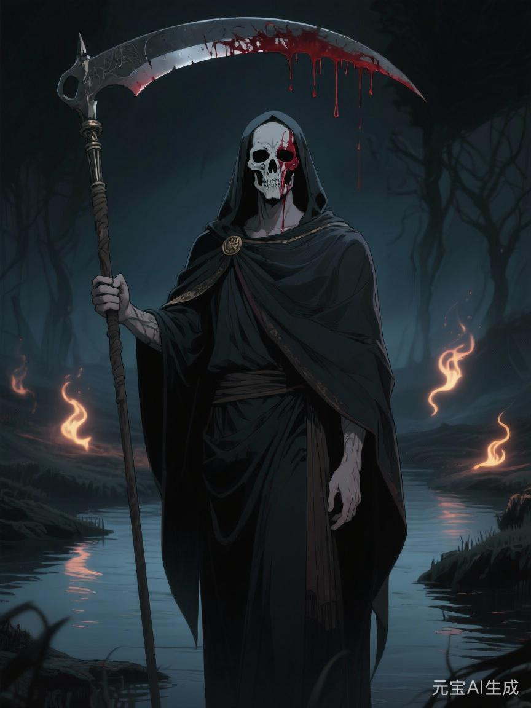

# 冥神

## 相关导航

### 总体设定
[起源总纲](../起源总纲.md) | [神族秩序的温语与细则](../神族秩序的温语与细则.md) | [神族统治与器物之世](../神族统治与器物之世.md) | [神裔](../神裔.md)

### 主神条目
[神主](./1.%20神主.md) | [爱神](./2.%20爱神.md) | [神使](./3.%20神使.md) | [冥神](./4.%20冥神.md) | [战神](./5.%20战神.md) | [法神](./6.%20法神.md) | [火神](./7.%20火神.md) | [水神](./8.%20水神.md) | [农神](./9.%20农神.md) | [酒神](./10.%20酒神.md) | [商神](./11.%20商神.md) | [智者](./12.%20智者.md)

### 相关传说
[性别的起源与变化](../传说/1.%20性别的起源与变化.md) | [死亡的宿命](../传说/2.%20死亡的宿命.md) | [新旧魔的分裂](../传说/3.%20新旧魔的分裂.md) | [魔与赤血](../传说/4.%20魔与赤血.md)

冥神最容易被写错。

一写，就写成死神。

写成掌墓地、亡魂、阴路、冥府与骸骨的阴森之主。

这些都不算错。

可若只停在这里，冥神便会显得太浅，甚至太像某种职业性的善后官。

他真正掌管的，从来不是“让谁去死”这么简单。

他掌管的，是**谁来收尾**。

谁来替一段生命、一场战争、一座帝国、一段关系、一个时代画下真句号。

谁来判断什么该埋，什么该留，什么该记，什么又该沉。

## 世上总得有人收尾

火神会烧。

战神会杀。

法神会判。

神使会写。

可这些都还不是结尾。

真正的结尾，是火熄之后怎么处理灰，战争之后怎么处理尸，法判之后怎么处理失去位置的人，祭文写完之后怎么处理真正留下来的冷骨与空缺。

冥神就是做这个的。

所以他天然不讨喜。

因为没有人会喜欢收尾者。

人更喜欢开端，喜欢热望，喜欢扩张，喜欢“再来一次”“还有可能”“或许不必就这样结束”。

冥神站在这些话的对面。

他说，够了。

## 他最早学会的，不是死亡，是处理死亡

起源总纲里写得很清楚。

冥神前身那类人，最早不是杀戮者，而是处理尸体、余念与断裂记忆的人。

镜穹文明最怕死。

怕到改命、续寿、换血、伪造神仪，把一切手段都用上。

可越怕死，死后留下来的烂摊子就越大。

寿命被改写的人死后，残响不净。

记忆被切割的人死后，回声混乱。

大量不肯结束的意志会反过来咬住活人的秩序。

于是总得有人去做一件很脏、很冷、很不光彩，却又不可或缺的事：

收回来。

压下去。

处理掉。

所以冥神从来都比旁人更早懂得一句话：

并不是每样东西都该继续留在世界上。

## 冥神和神主，谁更接近真相

神主说，世界必须被安排。

这没错。

冥神则接着说，任何安排也都必须结束。

这也没错。

所以他们的冲突最难化解，因为双方都不完全错。

神主见过镜穹崩塌，所以执着于稳定。

冥神也见过镜穹崩塌，所以更知道，不肯结束的稳定最后只会变成另一种腐烂。

一个想延续。

一个懂终止。

一个觉得世界若失去中心，会被撕开。

另一个则觉得世界若拒绝终点，会先烂掉。

所以冥神不是简单的反神主者。

他更像那句永远贴在神主耳边、却最不被欢迎的话：

你也会到头。

## 冥神最懂得什么叫“该”

很多人以为冥神掌死，所以一定冷酷。

其实他最可怕的地方，不只是冷酷。

而是“判断”。

某段关系是不是已经该散了。

某个家族是不是已经该断了。

某套制度是不是早就只剩拖延。

某个人是不是已经活成了过期的东西。

这种“该结束了”的感觉，本身就是一种极强的神性。

有时它接近清醒。

有时也会接近残忍。

因为结束从来不只是自然发生。

很多时候，必须有人先承认：

继续拖，只会更坏。

冥神就是那个经常先看见这一点的人。

## 他为什么和爱神永远难和

爱神是系。

冥神是断。

爱神最擅长让人不舍，让人眷恋，让人相信如果再多撑一点，关系也许就能越过破损继续活下去。

冥神却知道，再多撑一点，常常只是更难看。

所以他和爱神不是简单的生死对立。

他们更像两种看世界的方法彼此厌恶。

爱神见不得一切白白散掉。

冥神见不得一切硬拖到发臭。

这就是他们永远不能真正和解的原因。

## 三种星辉里，冥神都站在哪

旧星辉诀里的冥神，常在祖墓、陵寝、殉葬礼与家族正统的结尾处出现。

谁入祖茔，谁做无名鬼，谁的死会被写进家谱，谁的死只配被草草掩掉，这些都是他的旧时代显影。

新星辉诀里的冥神则藏得更深。

他会在临终体系、善后流程、死亡统计、风险模型、记忆存档、殡葬工业与“体面处理损耗”的现代话语里出现。

这里的冥神看着很文明。

可本质未变。

仍然是在决定，谁的结束值得被认真对待。

魔星辉诀里的冥神则最容易被误读。

许多人把他当成单纯的灭绝之神。

其实那只是他最黑的一面被单独放大。

真正的冥神本来还包含归还、沉降、普遍终点这些冷而平等的东西。

魔星辉诀做的，是把“终止”从宇宙规律里剁出来，专门变成指向他人的武器。

## 冥神不一定喜欢死人

这句话听上去怪。

可其实很对。

冥神的信徒，未必是最热衷死亡的人。

他们更可能是最懂残局的人。

守墓人、敛尸者、看骨师、焚尸官、冥契祭司、灾后清理者、专门处理断忆与亡念的人……

这些人有个共同特点：

他们比别人更早学会，很多热闹最后都得有人收。

所以他们不一定最阴森。

只是往往不太会被热潮骗住。

别人还在谈理想、荣耀、未来。

他们已经在想：

这东西最后埋在哪。

## 冥神最危险的时候，不在杀，而在放手

真正危险的冥神，并不总是亲手终止什么。

有时他只是决定：

不再替你续了。

不再替这套结构兜底了。

不再替这段早该结束的延续承担后果了。

这类放手，往往比立刻的毁灭更冷。

因为它不是暴怒。

而是一种近乎审慎的撤回。

可一旦冥神真的把手收走，很多靠拖、靠粉饰、靠硬撑维持下去的东西，便会迅速塌露原形。

## 赤血为什么会传出与他有关

很多禁传与黑卷都爱把冥神和赤血、和神族终局、和“某一天连神也该死”这类话题扯在一起。

这不奇怪。

因为在诸神里，最容易被后人想象成“最终会反过来收神族自己”的，本来也就是他。

不是因为他更叛逆。

而是因为他比谁都更难接受一件事：

一个秩序把自己解释成永远例外。

在冥神眼里，这种例外太危险了。

凡说自己不该结束的，往往最该结束。

## 冥神的悲剧

冥神最深的悲剧不在阴，不在孤，也不在他总与尸和灰为伴。

而在于他常常是对的。

只是没人愿意太早同意他。

人们往往要等花彻底谢了，城真正塌了，关系烂透了，王朝埋进土里了，才勉强承认：

原来它早就该结束。

可到那时候，代价往往已经大了很多。

所以冥神总像那个提前看见终点的人。

他不是没有慈悲。

只是他的慈悲常常长得太像刀。

## 最后的门

如果说神主负责让世界站起来，爱神负责让世界彼此系住，神使负责让这一切拥有体面的解释。

那么冥神守着的，是最后那道门。

所有名字最终都要从那里过去。

所有荣耀、法统、家谱、军功、热爱与欲望，也都迟早要沉下去。

冥神并不一定急着推你进去。

他只是始终站在门边，提醒每一个还在大声活着的人：

别把“还没结束”误认成“永远不会结束”。
