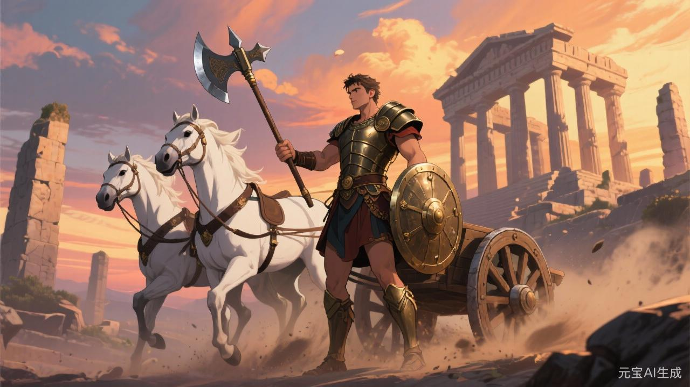

# 战神

## 相关导航

### 总体设定
[[起源总纲]] | [[神族秩序的温语与细则]] | [[神族统治与器物之世]] | [[神裔]]

### 主神条目
[[1.神主]] | [[2.爱神]] | [[3.神使]] | [[4.冥神]] | [[5.战神]] | [[6.法神]] | [[7.火神]] | [[8.水神]] | [[9.农神]] | [[10.酒神]] | [[11.商神]] | [[12.智者]]

### 相关传说
[[倒海大洪]] | [[性别的起源与变化]] | [[死亡的宿命]] | [[新旧魔的分裂]] | [[魔与赤血]]

很多人以为战神的本体在战场上。

其实不全对。

战神当然在战场。

可他若只存在于冲锋、咆哮、斩首、胜负与血里，便还只是粗浅的武神。

真正成熟的战神，不只管打。

他管的是整场战争从开始到结束，怎样被一个文明吞进去，再吐出来，最后还像一件庄严而必要的事。

所以若要写战神，不能只写刀。

要写战前。

写战中。

也写战后。

## 战前：先让人相信这一仗必须打

战争若只是少数人的一时暴怒，活不久。

战神真正厉害的地方，在于他总能替战争找到一种比暴怒更稳的开端。

边患。

雪耻。

护境。

安民。

讨逆。

净边。

这些词一旦排开，许多原本只出于贪欲、扩张与恐惧的冲动，便会忽然有了更高的颜色。

这还不够。

还得有征召。

有誓师。

有军旗、鼓声、甲胄、祖先旧武名、少年第一次摸到兵器时那点发烫的心。

战神真正擅长的，是让一个人觉得自己走向战场时，并不是被送去消耗。

而是被允许进入某种比日常人生更高、更亮、更值得被记住的地方。

这就是他在战前做的事。

还没流血。

可血已经开始值钱了。

## 战中：让杀戮看起来像秩序

真正的战场当然乱。

臭、热、断裂、尖叫、内脏、泥、疲惫、失序、误判、临阵而起的怯意与疯意，全在里面。

可战神绝不会允许后人只记得这些。

因为如果战争被完整地看作混乱，那么它便太难长久地被文明吸纳。

所以战神在战中真正做的，是给混乱套上格式。

前锋、侧翼、阵列、军纪、号令、轮替、献城、围而不攻、斩将、立旗、夺关、肃敌。

一旦这些词稳稳站住，许多本来纯粹是求生本能与互相撕咬的场面，便开始显得像某种有章可循的事业。

这对战神太重要了。

因为他不是只想赢一场。

他想让打仗这件事本身，变成一个世界认可的工作。

## 战后：最要紧的是纪功

真正决定战神分量的，往往还不是战前与战中。

而是战后。

人死完了，仗打完了，城门破了，敌军散了。

这时有两个问题必须立刻处理：

谁白死了？

谁不算白死？

战神不能允许太多人显得白死。

因为若人人都觉得自己只是被丢进去了，下一场仗就难打。

所以战后必须有另一套工程：

记功。

追谥。

建碑。

分封。

祭告。

把失败改写成“虽折而壮”，把惨胜改写成“以血定疆”，把尸山里最无名的那一层，也尽量想办法揉进“忠烈”二字里。

战神若不这样做，战争就会只剩吃人。

也因此，他与神使总是走得很近。

因为纪功本质上，也是一种修辞。

## 战神为什么从来不只是武勇

若只是比力气、胆子与杀意，许多凶兽、魔种、野部首领都可能像战神。

可那不是神族要的战神。

神族要的是一种更成熟的暴力。

它得会训练。

会分层。

会让一个家族几代人都觉得武名是门路。

会让少年把伤疤看成荣耀。

会让妇人与老人都学会，在送人出征时把害怕说成光彩。

这就已经远远超过个人勇武了。

战神真正统御的，不只是军队。

是整套尚武文化。

## 旧星辉诀里的战神

旧星辉诀是最容易写出战神锋面的时代。

这里的战神最像开国名将、边侯、骑士祖先、世袭将门、用军功换采邑的人。

而且在这个时代，战争不是国家机器偶尔启动的异常状态。

战争本身就是秩序更新的一部分。

地要靠打来。

爵要靠功封。

门第要靠几代战死与凯旋一起抬。

所以旧时代的战神非常亮。

也非常贵。

因为他直接负责回答一个封建世界里最锋利的问题：

谁配穿甲，谁配受封，谁的血能换来一家人的上升。

## 新星辉诀里的战神

到了新星辉诀，战神没有消失。

他只是把铠甲脱了，换上了更冷的词。

不再总说武勇。

开始说安全。

不再总说开疆。

开始说秩序维护、系统防御、边境稳定、全球投送、风险预案、反恐、维和。

这些词比旧时代温得多。

可其本质仍是战神。

因为说到底，仍然是在回答同一个问题：

当一个秩序要维持自己时，究竟由谁替它承受和施加暴力。

新时代的战神也更擅长藏。

他可能藏在军校课程里，藏在预算与情报里，藏在“专业化暴力”的高效组织里，藏在让大多数人看不见血、却始终享受血所换来稳定的体系里。

所以新星辉诀里的战神，不是消退了。

只是更像机器。

## 魔星辉诀里的战神

战神一旦进入魔星辉诀，最先坏掉的往往不是武力本身。

而是判断胜负与敌我的尺度。

旧时代打仗，还多少要讲疆界、利害、封赏与秩序。

可到这里，战争会越来越像一种自我证明：

要不断打，才能证明自己还够纯、够强、够有资格继续做主。

于是战神在魔星辉诀里的显影，会越来越接近：

- 崇暴
- 羞辱弱者
- 把和平看作软弱
- 把灭绝他者当成群体健康

到这一步，战争便不再只是手段。

它开始变成一种道德体操。

这就是战神最病的一面。

不是必须打时才打。

而是为了不承认自己空虚，必须持续制造新的敌人。

## 战神信徒最危险的时候

战神的信徒当然可能是军官、将门、边军、教习、阵师与所有习于杀伐的人。

可他真正危险的信徒，并不一定都穿甲。

他们也可能是那类随时准备把复杂问题迅速压成“是否需要动武”的人。

他们说：

讲这么多做什么。

终究得有人去压住。

这种判断当然不总是错。

有时甚至很现实。

可它一旦成为习惯，便会慢慢吞掉别的可能。

于是战神最可怕的信徒，不是只会打的人。

而是那些越来越难相信，不打也能解决的人。

## 战神的悲剧

战神并不只是嗜血。

他最初之所以不可缺，恰恰是因为很多秩序确实需要有人替它做那件最难看的事。

神主能说，法神能判，神使能写，爱神能让人甘愿。

可边地起火时，总得有人真去灭。

旧城不服时，总得有人真去破。

世界并不会因为大家都讨厌流血，便自动免于流血。

战神比许多人都更早明白这一点。

可也正因如此，他太容易高估暴力的诚实。

别的主神都可能掩饰。

只有他，总觉得血至少不会说谎。

久而久之，这份清醒会滑向另一种偏执：

凡未经流血考验之物，便不够真。

从那一刻起，战神便会开始反过来逼世界一次次用牺牲证明自己。

## 最后的战鼓

如果说法神让世界学会按章办事，商神让世界学会定价，水神让世界学会接入主流，农神让世界学会按饥饱忍耐。

那么战神一直在旁边提醒：

这些东西若真要站住，最后还是得有人替它们上前一步。

这便是战神。

他不一定最会说。

可一旦所有话说完了，最后往前走的，常常还是他。
