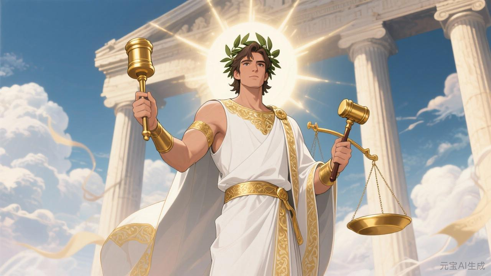
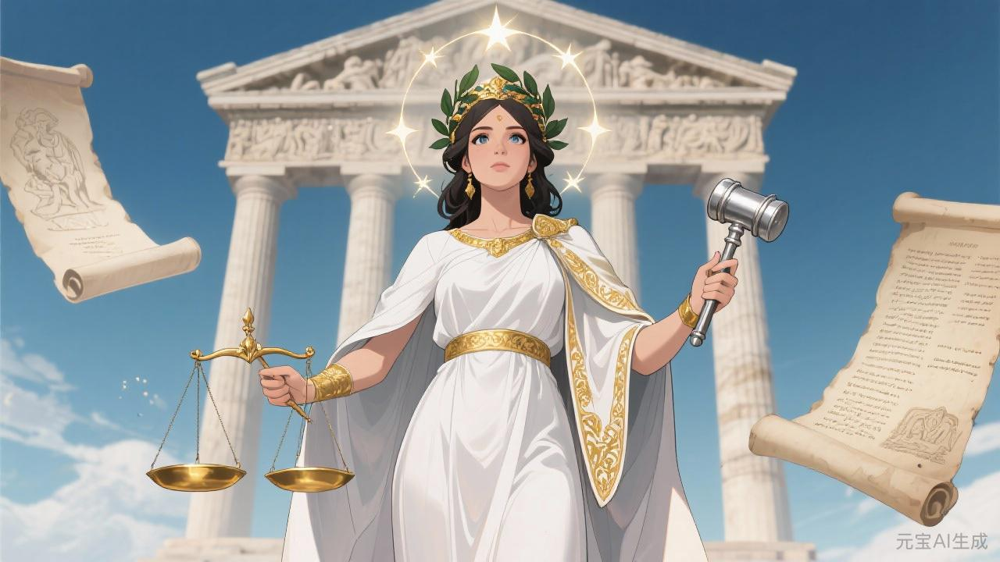

# 法神

## 相关导航

### 总体设定
[起源总纲](../起源总纲.md) | [神族秩序的温语与细则](../神族秩序的温语与细则.md) | [神族统治与器物之世](../神族统治与器物之世.md) | [神裔](../神裔.md)

### 主神条目
[神主](./1.%20神主.md) | [爱神](./2.%20爱神.md) | [神使](./3.%20神使.md) | [冥神](./4.%20冥神.md) | [战神](./5.%20战神.md) | [法神](./6.%20法神.md) | [火神](./7.%20火神.md) | [水神](./8.%20水神.md) | [农神](./9.%20农神.md) | [酒神](./10.%20酒神.md) | [商神](./11.%20商神.md) | [智者](./12.%20智者.md)

### 相关传说
[性别的起源与变化](../传说/1.%20性别的起源与变化.md) | [死亡的宿命](../传说/2.%20死亡的宿命.md) | [新旧魔的分裂](../传说/3.%20新旧魔的分裂.md) | [魔与赤血](../传说/4.%20魔与赤血.md)

若想真正理解法神，最好别从天平开始。

也别从“公正”这种太亮的词开始。

法神真正出现的时候，往往不是在理想里。

而是在文书上。

在一纸批文、一封驳回、一份契约、一份追索通知、一个看似平静的印记上。

你会发现，他并不总像天威。

很多时候，他只像办理。

而这恰恰是他最可怕的地方。

## 第一种法：让事情有格式

人间很多冲突，本来都是乱的。

谁欠谁，说不清。

谁越界，也说不清。

一桩婚契、一笔税、一场继承、一段征调、一份保举、一宗逃籍，你若把它们放在未经整理的世界里，最后常常只剩关系、权势、情绪与谁的拳头更硬。

法神最初真正伟大的地方，在于他把这些东西先整理出了格式。

有案。

有类。

有条。

有档。

有起诉。

有答辩。

有可被援引的前例。

从此以后，事情就不再只是发生。

它们会被归卷。

## 第二种法：让格式看起来高于人

这一步才是真正的法神。

若只是把事情分门别类，那仍然只是一种治理技术。

法神更深的神性，在于他会让人慢慢相信：

格式本身，比任何具体的人都高。

不是某位神想这么办。

不是某个贵胄一时起意。

不是某个执事看你不顺眼。

而是“程序如此”“条文如此”“例是如此”。

这个转变太关键了。

因为只要人开始这样相信，很多原本可能指向具体权力者的愤怒，便会自动被折回制度内部。

你不再先恨人。

你会先被教导去理解程序。

## 第三种法：让人自己来盖章

法神真正成熟的时候，甚至不需要总是亲自压人。

他会让人自己去签。

去认。

去补件。

去排队。

去申诉。

去接受驳回理由。

去在一次次“流程未完”“证据不足”“暂不符合条件”“仍待上司部核准”里，慢慢把自己磨成一个会自觉寻找合法路径的人。

到了这一步，统治已经很稳。

因为人开始主动用法神的方式理解自己。

不是“我被卡住了”。

而是“我程序还没走完”。

不是“他们不让我走”。

而是“我暂不具备转流资格”。

法神最大的成功，就是让很多人到最后，甚至会亲手替自己的困境盖上最整齐的一枚章。

## 骨舟上为什么必须有他

神主能定序。

战神能开路。

神使能写名。

可若新世界所有事情最后仍然都得等那几位神亲自裁断，那世界很快就会卡死。

所以法神在骨舟上的真正意义，从来不只是“懂契约的人”。

他更像那个最早明白：

秩序若想长久，必须学会自动运行。

征税不能总等神谕。

婚配、继承、上诉、调籍、处刑、赦免、征役豁免，都得被写成下层也能照着执行的细则。

这意味着神意必须降格。

从不可直视的天命，变成一套可誊写、可核对、可存档、可复核的办理方式。

法神的伟大与阴冷，就都在这里。

## 旧星辉诀里的法神

旧时代的法神，其实很像缝补匠。

封建秩序本来就不平。

贵胄有贵胄的法。

领民有领民的法。

宗门、封地、婚约、继承、庶出、嫡出、附庸、奴从，各有各的口子要补。

法神在这里，不是为了抹平差别。

恰恰相反。

他是为了让差别稳下来。

你高，便高得有理据。

你低，也低得有出处。

于是旧星辉诀里的法神不太像抽象正义。

他更像祖制的总编辑。

替一层层等级都写出“这样安排原有其道理”的依据。

## 新星辉诀里的法神

若说旧时代的法神负责给不平等做边框。

那么新星辉诀里的法神，最擅长的则是给不平等刷上一层平等的漆。

人人都能签契。

人人都能申诉。

人人看上去都能通过努力、证明、程序与合规路径争取更好的位置。

形式上当然更漂亮。

甚至很多时候也确实比旧时代更少粗暴。

可这恰好说明法神进化了。

因为到了这里，支配不再总像“谁压着谁”。

它开始更像“谁更会用这套规则，谁便自然赢”。

于是很多失败都被改写成了个人能力不足。

很多结构性困境都被改写成了“仍可通过规则改善”。

法神在这一时代最强的，不是惩罚。

而是让人对规则持续抱有足够多的敬意与希望，好继续留在局里。

## 魔星辉诀里的法神

法神一旦进入魔星辉诀，最危险的地方不在于他会突然变得更残暴。

而在于他仍然很整齐。

火神会烧。

战神会杀。

冥神会终止。

这些都很显眼。

法神则会替这一切写成立法、例外、资格、豁免、辖区、权限、配额、法源。

到这一步，暴行就不再只是暴行。

它开始拥有卷宗编号。

拥有申请表。

拥有表格与手续。

这比单纯的杀伤可怕得多。

因为只要屠刀自称合法，它就很容易活得比一次激情更久。

## 法神最喜欢什么样的信徒

他当然喜欢判官、律令编修官、档案守库人、契约祭司、审计者、会写漂亮条文的官僚。

但他真正偏爱的，是另一类人：

他们极少失控。

极少直接喊打喊杀。

极擅长说“我只是照章”。

他们甚至可能还真有一点善意。

也相信规则总归比彻底无规则好。

正因如此，他们最适合法神。

因为法神最稳的信徒，往往不是恶人。

而是那些逐渐把自己的心也训练成程序的人。

## 法神为什么总显得比别人文明

因为他确实比较文明。

至少在表面上。

比战神温，比火神整，比冥神有人间气，比商神少几分露骨。

可恰恰是这种文明，让他格外难对付。

粗暴的东西，人人都知道该怕。

太整齐的东西，反而容易被尊重。

这就是法神的危险：

他常常并不需要你爱他，也不需要你怕他。

他只需要你承认，他似乎确实比较有道理。

剩下的，程序会替他做。

## 法神的悲剧

法神不是简单的伪君子。

他太清楚失序的坏。

见过太多私刑、掠夺、任意裁决、强者翻脸不认账后的世界是什么样，所以他才会执着于把一切都装进格式里。

这一点本来确有必要。

问题只在于，他后来越来越容易高估格式本身。

他见过混乱，所以对程序生出信仰。

他见过恶意，所以对手续生出依赖。

再往后，他便会越来越难承认：

有时最伤人的，恰恰就是那套正在正常运转的程序。

## 最后的批文

如果说神使负责把世界说得像样，商神负责把世界算得像样，智者负责把世界理解得像样。

那么法神做的，是把世界办得像样。

这便是他。

他让一切显得有据、可循、可复核、可申辩。

也让越来越多人忘记，很多时候，伤人的未必是混乱。

也可能正是一份手续齐全、印玺端正、语气平和的驳回文书。
