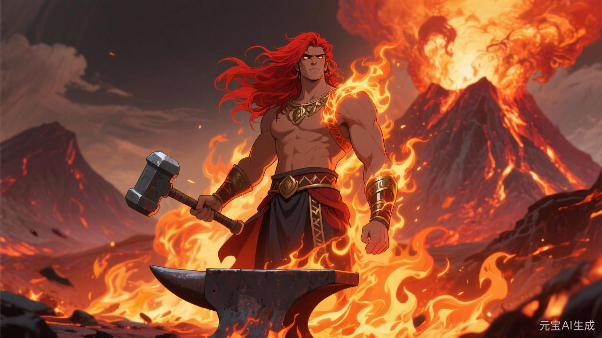
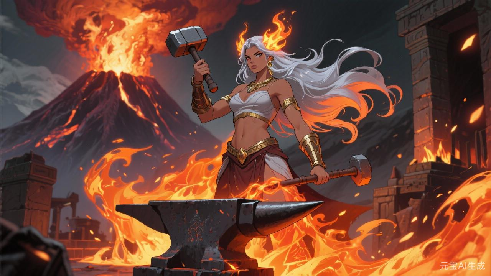

# 火神

## 相关导航

### 总体设定
[起源总纲](../起源总纲.md) | [神族秩序的温语与细则](../神族秩序的温语与细则.md) | [神族统治与器物之世](../神族统治与器物之世.md) | [神裔](../神裔.md)

### 主神条目
[神主](./1.%20神主.md) | [爱神](./2.%20爱神.md) | [神使](./3.%20神使.md) | [冥神](./4.%20冥神.md) | [战神](./5.%20战神.md) | [法神](./6.%20法神.md) | [火神](./7.%20火神.md) | [水神](./8.%20水神.md) | [农神](./9.%20农神.md) | [酒神](./10.%20酒神.md) | [商神](./11.%20商神.md) | [智者](./12.%20智者.md)

### 相关传说
[性别的起源与变化](../传说/1.%20性别的起源与变化.md) | [死亡的宿命](../传说/2.%20死亡的宿命.md) | [新旧魔的分裂](../传说/3.%20新旧魔的分裂.md) | [魔与赤血](../传说/4.%20魔与赤血.md)

火神若只被写成掌烈焰、焚毁与爆裂的神，便还太浅。

因为火在神族世界里，从来不只是灾。

火也是工序。

是升级。

是提纯。

是把旧形逼碎，好让新东西从高温里硬生生长出来。

所以火神真正危险的，不在于他会烧。

而在于他总能让燃烧看起来像必要。

## 第一层温度：可用之火

最初的火，总显得无辜。

煮食要火。

御寒要火。

炼药要火。

铸器也要火。

骨舟靠岸之后，真正让废墟重新变成可住、可战、可制造的世界，也确实离不开有人点起新的炉。

所以火神最初并不只是毁灭者。

他像冶炼师，像炉心守护者，像那个最早敢把旧时代残骸整批丢进熔场，逼它们重新吐出用途的人。

这一步没有错。

很多文明能力，本就必须经过火。

问题只在于，火一旦开始证明自己如此有用，它便很容易要求更多。

## 第二层温度：提纯之火

火最擅长替自己辩护的地方，在“提纯”。

因为这个词太好听了。

矿里有杂，烧一烧。

药性不稳，煅一煅。

兵器太脆，回火。

连人也一样。

意志不够硬，炼。

体魄不够稳，炼。

忠诚不够纯，炼。

到这里，火便已经开始越过物，慢慢烧进人。

而一旦一个文明开始认真相信“许多东西必须烧过才配留下”，火神的地位就会迅速膨胀。

因为高温会被理解成进步。

疼会被解释成必要代价。

那些被烧坏的人，也会被轻飘飘归成一句：

火候未成。

## 第三层温度：大炉

小火烧器。

大火烧城。

真正成熟的火神，从来不满足于小炉小灶。

他总会走向更大的炉：

兵工总炉。

舰心主炉。

净矿熔场。

整座城市的供能系统。

一整个时代的大型制造。

到这里，火已不再只是个体修士手中之术。

它开始成为文明骨架的一部分。

谁掌炉，谁便掌军工。

谁掌供能，谁便掌城市节奏。

谁掌大规模焚除权限，谁便掌灾厄与净化的边界。

所以火神最像工业。

越现代，越像他。

## 第四层温度：把人也算进燃料

火神最残酷的地方，不是焚毁敌人。

而是把“人”也纳入工序。

守炉者。

添火者。

试温者。

献材者。

净矿者。

高危炉线的轮替耗材。

这套东西一旦成熟，火就不再只是自然现象。

它会成为一种评价机制：

谁耐得住高温，谁值得继续用。

谁已经被烧废，谁该回收。

谁适合再养。

谁只适合化灰。

于是火神掌的便不只是高热。

而是一整套通过高热筛人的秩序。

## 火神与战神：战争为什么总爱靠炉

战神要兵。

火神给兵器。

战神要甲。

火神给甲胄。

战神要持续征伐。

火神给后勤、军械、焚城与再造能力。

所以二者总会走近。

战神负责把敌我分出来。

火神负责把资源和人一起塞进机器，让机器继续转。

许多文明并不是先决定要工业，才变得像火神。

相反。

往往是先决定要更有效地打、更持久地打、更彻底地打，才不得不越长越像火神。

## 火神与法神：火为什么总需要批文

火如果完全无章，太容易失控。

可火一旦有章，便会变得更可怕。

因为那意味着焚除有权限，炉线有配额，高温工序有规范，能源分配有等级，军械熔造有许可，连焚城与净化也可能被写进例外条款。

这时火就不再只是冲动。

而是一种被允许的制度烈性。

法神替火神做的，并不是削弱。

而是稳固。

让火从一团危险，变成一套可长期运行的高温秩序。

## 旧星辉诀里的火神

旧时代的火神更近于家炉、城炉与兵炉。

他守在王家铸兵所、宗门炼器坊、边地烽火台、铁匠与炉师的掌心里。

这时的火还没完全吞进全社会。

它更像权力的一项贵重附属能力。

有大炉者，门第便硬。

能炼上好兵甲者，便离战神更近。

所以旧星辉诀里的火神很亮，也很贵。

可还不算最庞大。

## 新星辉诀里的火神

真正庞大的火神，往往在新星辉诀。

因为到这里，他已经不必显得像神。

他可以叫：

能源。

材料。

制造。

工业升级。

战略技术。

基础设施供能。

每个词都显得那么理性。

甚至还真有其必要。

但火神的现代之处，也恰恰在这里。

他不再需要人崇拜火焰。

他只需要人崇拜效率。

一旦效率被奉得足够高，更多高温、更多熬炼、更多排放、更多烧掉旧东西换新东西的冲动，就都会开始显得理所当然。

## 魔星辉诀里的火神

火神一旦进入魔星辉诀，便会走向他最病态的一面。

在这里，火不再只是制造的手段。

它开始被神圣化为清洁本身。

异族要焚。

污血要焚。

旧记忆要焚。

失败要焚。

连己方内部不够纯、不够烈、不够忠的部分，也会被要求回炉重炼。

到这一步，火就不再是工具。

它成了道德。

而凡把火当道德的文明，最后都很危险。

因为它迟早会开始觉得：

既然烧掉之后会更纯，那为什么不多烧一点？

## 火神喜欢什么样的人

火神当然会喜欢炼器师、炼丹师、炉工、军工修士、材料大师、能源技术官这些最直接与高温打交道的人。

但他真正偏爱的，并不只是会控火的人。

他更喜欢那种总觉得“还能再提一档”的人。

这东西还能更纯。

这流程还能更快。

这批材料还能再压。

这群人还能再扛。

这座城还能再烧掉旧壳，换来更高的效率。

这种不停升温的冲动，本身就是火神的信徒气质。

## 火神的悲剧

火神并不只是嗜毁。

他最初之所以伟大，恰恰是因为没有他，很多文明能力根本长不出来。

没有炉，很多器做不成。

没有高温，很多旧物也无法被真正打碎重造。

所以他确实帮助世界从废墟里重铸了很多东西。

可问题在于，他太相信“经过火的东西”了。

渐渐地，他开始觉得未经熬炼者不够硬，未经烧毁者不够新，未经高温验证者不够真。

于是他会越来越难容忍：

粗糙的。

缓慢的。

保留旧形的。

不肯回炉的。

从那一刻起，火神便会从锻造者滑向另一种东西：

一团永远不愿降温的文明执念。

## 最后的炉门

如果说农神问谁来养，商神问如何结算，法神问如何办理，战神问谁去流血。

那么火神始终在炉前问：

**这东西，烧过没有？**

这句话很多时候很有用。

也很多时候极其危险。

因为它意味着，世界上的许多价值，最终都要在高温中重新受审。

这便是火神。

他不只会毁。

他更会让毁坏本身，看起来像通往更高秩序的必要阶梯。
