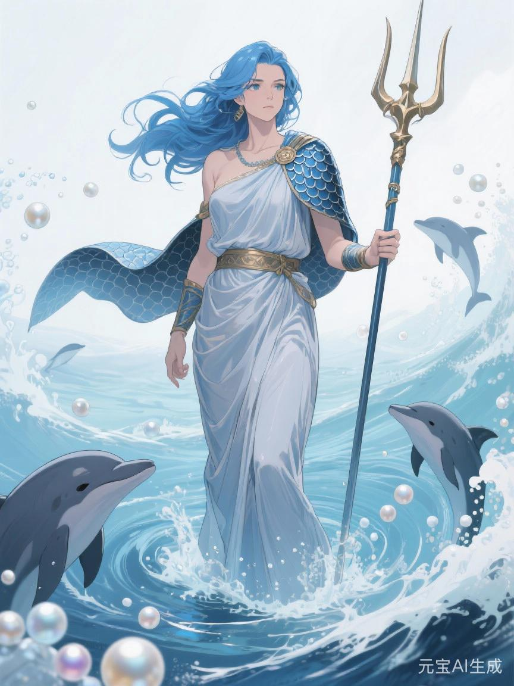
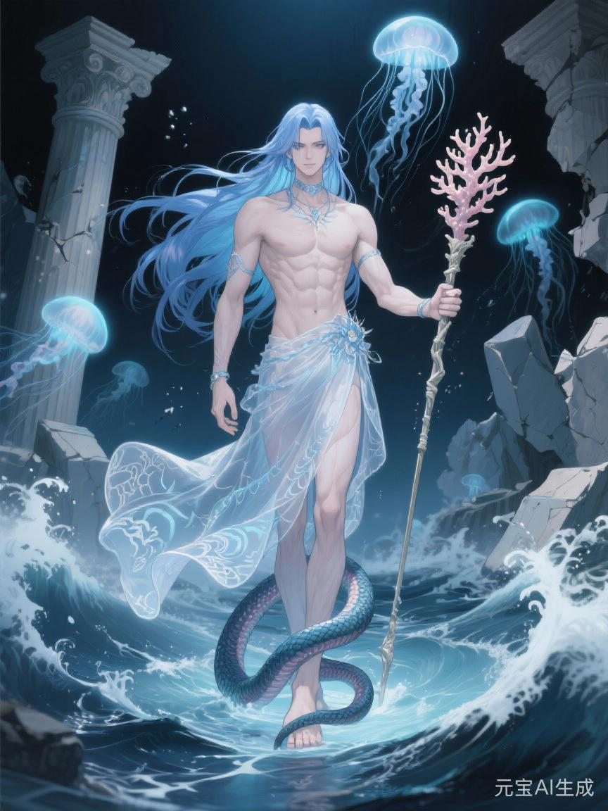

# 水神

水神若只被理解成掌河流、潮汐、雨露与湖海的神，便太浅了。

因为在西方神族的秩序里，水从来不只是景物，也不只是生命所需。

水是一种更深的东西。

它是联系。

是输送。

是依赖。

是那些看上去毫无锋芒，却能让一片土地慢慢活起来，也能让一片土地慢慢死下去的无声权力。

若说战神让人看见征服，法神让人看见规则，火神让人看见熬炼，那么水神真正可怕的地方，恰恰在于他常常什么都不必让人看见。

他只需要让水继续流。

或者，不再流。

## 水为何是权力

火的权力很容易理解。

它会烧。

战的权力也很容易理解。

它会杀。

可水不一样。

水总显得太自然，太像天地本来就会给人的东西。一个人喝水、洗伤、灌田、行船、运货、净体、退疫，往往不会立刻觉得自己正在接受统治。

可神族偏偏最懂得利用这一点。

因为只要一个世界开始依赖渠网、港口、净水、航线、潮汐历、灌脉分配与沿河而设的运输系统，那么谁掌水，谁就不只是掌一种资源。

谁便是在掌：

- 谁能活得安稳
- 谁能活得便宜
- 谁能把货送出去
- 谁能把军运进来
- 谁会先得疫
- 谁会先断粮
- 谁会先从繁荣里被摘出去

所以水神并不是“赐水者”这么简单。

他更像那个把万物都接进一张巨大水网的人。

而一旦接进来，许多命运便不再由自己决定。

## 骨舟上的那个测潮之人

在最早的骨舟传说里，水神并不是最耀眼的一位。

他没有神主那样站在舟首立誓，也不像爱神那样收拢众生情念，更不像战神那样一看便知与征伐有关。

他在残卷里常常只是一个动作：

测潮。

洪水之后，天地间最先变乱的并不只是山河位置，还有所有可供生命停驻的流线。旧时代的港湾可能一夜化成盐沼，原本的河脉可能忽然改道，某些看似安全的平原会在半年后开始积出毒瘴，某些仍有活人的残城看着尚可立足，实则饮水早已坏死。

所以骨舟能靠岸，不只因为神主会定方向。

还因为有人知道，哪一片水能碰，哪一片水不能碰；哪里可泊，哪里是假岸；哪一条河还养得起新城，哪一条河已经只剩病与腐。

那个人后来被封为水神。

这个起点很重要。

因为它决定了水神从一开始就不是单纯的“自然神”。

他是判断生存条件的人。

谁能活在这里，谁不能。

哪条线该开，哪条线该废。

哪一座城值得继续供养，哪一群人应该被留在干裂边缘自生自灭。

这些判断，看上去都很平静。

可它们比许多刀剑都更接近真正的生杀。

## 水神不靠征服

战神征服一地，靠的是军团。

法神驯服一地，靠的是规则。

火神改造一地，靠的是熔炉。

水神则不同。

他不必先让一片地方跪下。

他只需要先让它接上水。

一座边城最初可能不服。

可当它开始依赖神族净渠，依赖河运粮船，依赖港口税路，依赖每年由上游放下来的春灌水量，很多抵抗便会自然变得昂贵。

人还是那些人。

城还是那座城。

旗也许都还没有完全换掉。

但命已经慢慢栓在别人的闸门上了。

这就是水神的统治方式。

它很少像战神那样轰烈。

也不如法神那样条文明白。

它更像一场长期的接管。

你先觉得那只是方便。

然后觉得那是繁荣。

最后才发现，那已经成了离不开的命门。

## 旧星辉诀里的水神

若说旧星辉诀是一座白石神殿，那么水神就是神殿下方那套不被凡人时时看见、却真正决定它会不会塌的地下水脉。

旧星辉诀里的水神，不宜写得太像单纯的海神或河伯。

他更接近的是：

- 掌上游闸权的封疆贵胄
- 控盐河与港埠的水道世家
- 能决定哪一片田先灌、哪一片田后灌的治河大臣
- 让商路依河兴衰、让边地因港而活的流域主人

战神替旧秩序打下封地。

农神让封地长出收成。

而水神真正完成的，是让封地不再只是地图上的一块地，而成为可输血、可控税、可连运、可持续抽取的一部分。

所以旧星辉诀里的水神，其实很封建。

因为封建不只是领主和骑士。

封建还意味着：

上游有权让下游渴。

有港的人家能让无港的人家一代比一代穷。

某条运粮河一旦改道，几个州郡的命便会一起弯过去。

这是极古典的水权政治。

也是旧星辉诀真正温润又残酷的一面。

## 新星辉诀里的水神

到了新星辉诀，水神反而更难辨认了。

因为这时的水不再总以河神、祭司、龙脉与闸令的形式出现。

它开始穿上更现代的外衣：

- 供水系统
- 卫生系统
- 港口网络
- 物流中枢
- 跨区域调水工程
- 海权与远洋航线
- 城市净化与防疫工程

这时候，人们已经不太会说“谁掌水，谁掌命”。

他们会说：

保障民生。

优化供应链。

维护基础设施安全。

提升港口效率。

加强区域联通。

听上去都很好。

甚至确实也有其必要。

但问题正在这里。

因为新星辉诀里，水神最强的地方从来不在于他是否撒谎，而在于他说的往往一半是真的。

水网确实让城市更大。

航运确实让货物更快。

净化工程确实能救很多人。

可与此同时，它们也让更多地方失去了脱离主系统独立生存的能力。

到了这一步，统治便不再需要天天宣告自己。

只要你一拧开管道，一看见港口吊臂开始运转，一发现整座城的粮、药、消息与人口都沿着几条固定流线运行，水神便已经在那里了。

## 魔星辉诀里的水神

火神在魔星辉诀里最像焚净。

冥神最像终止。

而水神在这一体系中最阴的一面，不是洪灾，也不是海啸。

而是隔离。

他会把原本用于润养、输运与净化的力量，改造成一种更慢、更安静、更不容易留下轰烈景象的清洗方式。

譬如：

- 某一族只能饮下游水
- 某一族不得靠近圣泉
- 某几条航道被永久关闭
- 某些港口只对“正血”开放
- 某地净水配额被长期压低
- 某地明面上没有被屠，却总在反复爆发疫病、饥荒与运输断裂

火神会一下把人烧成灰。

水神则常常什么都不烧。

他只是让你越来越难活。

这也是为什么魔星辉诀里的水神虽然没有火神那样显眼，却绝不该被写轻。

因为种族主义真正成熟时，往往不只依赖屠刀。

它还依赖谁配喝干净的水，谁配走主要的路，谁配被持续接在那张维持文明运转的流动网络上。

## 水神最擅长的谎言

其实说谎也不准确。

更准确地说，水神最擅长的，是把控制说得像照顾。

神族不说：

我们卡住了你们的命脉。

他们说：

上游调流，以全大局。

他们不说：

边地的港被我们拿走了，所以你们只能靠神族商船活。

他们说：

纳入主港体系，共享繁荣。

他们不说：

你们若不低头，就让你们慢慢断净水、断航线、断灌渠。

他们说：

暂离主流水系，待其自正。

你看，水神一系的语言总带着一种很奇特的温和。

不像战神那样逼人流血，也不像法神那样一字一句把人锁死。

它更像是在替一个地方“做长远安排”。

可正因如此，它才更难被当场识破。

因为很多时候，直到人已经开始发渴，才会发现那不叫安排，那叫拿捏。

## 水神的信徒不一定会法术

若把水神信徒只写成驭水修士、河伯祭司与海中神裔，仍然太窄。

真正接近水神的人，往往是那些懂得“流线即命线”的人。

他们可能是：

- 治河官
- 港务主事
- 航线设计者
- 净水工程主持
- 水务资本操盘者
- 负责边海输运的神舰调度者
- 懂得通过断供与接入来重塑地方命运的人

这些人未必都暴烈。

许多人甚至显得很讲民生、很讲稳定、很讲整体协调。

可他们身上常有一个共同点：

他们习惯先看流动，而不是先看人。

一座城在他们眼里，先是节点。

一片田先是灌区。

一群人先是配额与负荷。

一个地方的反抗，也首先会被理解成“是否该继续接入主流水网”的问题。

这便是水神信徒真正令人不安的地方。

他们未必杀你。

他们只是在决定，要不要继续让你连在这套系统上。

## 与农神、商神、战神的不同

水神最容易和农神、商神写混。

但其实他们不一样。

农神关心的是长。

商神关心的是换。

战神关心的是夺。

而水神关心的是通。

不长，土地会荒。

不换，财富会死。

不夺，边界会失。

可若不通，前面三者最后都会断掉。

所以水神并不总站在舞台正中。

他更像舞台下方那些巨大的管线、河槽、渡口与暗渠。

观众不一定总看见它们。

可一旦它们停了，整场戏便散了。

## 水神的悲剧

水神不是一个简单的阴谋家。

他最初的正确之处，其实很难否认。

没有灌溉，田会死。

没有净水，城会病。

没有航运，边地会先饿。

没有持续而稳定的流动，再高妙的制度、再坚固的城防、再辉煌的文明，都会很快因为内里堵塞而腐坏。

所以水神确实救过很多地方。

也确实让很多原本只能苟活的土地，第一次长久地活了下来。

可问题在于，他太清楚“接入主流”有多有效，于是也越来越难容忍那些不愿被接入的人。

在他眼里，孤立、自给、缓慢、粗糙，常常都显得像一种低效的病。

于是到后来，他很容易滑向一个危险的判断：

凡不愿进入大流动者，便不值得占有太多水。

从那一刻起，水神便不再只是养活众生的人。

他开始变成那个永远想把所有支流都并进主干的人。

## 最后的水意

如果说火神告诉世界，许多东西必须经过焚烧才能成器；法神告诉世界，许多安排必须写成规则才足够稳固；战神告诉世界，许多秩序终究要靠流血来确认。

那么水神告诉世界的是另一句更安静、也更难反驳的话：

**凡不能被持续输送之物，终究活不长。**

这句话本身并没有全错。

可一旦它落到神族手里，便会慢慢变成：

凡不愿进入我所设计之流者，便不配长久活着。

这便是水神。

他不一定会把刀架在你颈上。

他甚至可能还会先给你一口水。

可真正要紧的，从来不是他今日给不给你。

而是往后很多年里，那口水究竟还由谁说了算。
